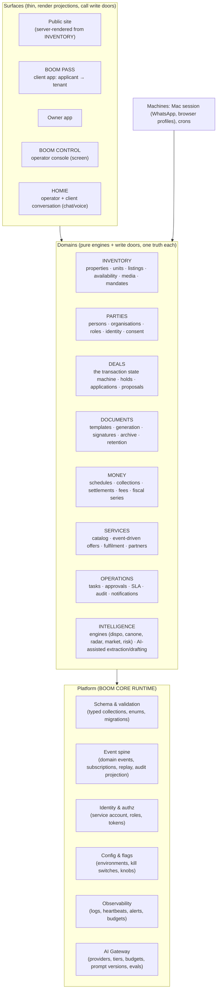
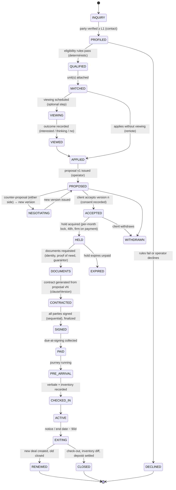

# BOOM GLOBAL SYSTEM — TARGET ARCHITECTURE

Written 2026-09-06 against the current state in `01-DOSSIER-CURRENT-STATE.md`. This is not a rewrite plan and not a
fantasy platform: it is the smallest set of structural decisions that turns the existing Firebase + Vercel estate into
a system with one source of truth, explicit state, an event spine, and safe automation — operable by one excellent
engineer plus the operator today, and by a small team later. Rome-native execution, globally extensible boundaries.

The governing constraint is stated first because every decision below follows from it:

> BOOM has ~26 homes, ~30 lifetime card payments, one operator and one fully digital signed contract. The target
> architecture must **remove** code and surfaces faster than it adds them for at least the first quarter, and every new
> foundation must pay for itself on today's volume.

---

## 1. Boundaries — challenging the proposed module list

The founder proposed: CORE, API, EVENT LAYER, IDENTITY, INVENTORY, PEOPLE, DEAL ENGINE, DOCUMENTS, MONEY, OPERATIONS,
SERVICES, INTELLIGENCE, AI GATEWAY, HOMIE, PASS, OWNER, TENANT/MEMBER, ORGANISATIONS, CONTROL. Eighteen names for a
one-team system is too many, and several are not the same kind of thing. Three corrections:

1. **Separate domains from surfaces from platform.** OWNER, TENANT/MEMBER, PASS, CONTROL and HOMIE are *surfaces*
   (apps and a conversational interface) over the same domains. Naming them as modules invites five codebases with
   five truths — the exact failure the portal monolith already has (a second tenant surface inside `portal-app.js`
   running in parallel with `/casa`).
2. **PEOPLE + ORGANISATIONS + IDENTITY are one domain: PARTIES.** A person and a company are both parties with roles
   (applicant, tenant, guarantor, landlord, owner-company, employer, university, partner). Identity — authentication,
   verification level, consent, portable documents — is a *capability* of a party, not a sibling domain. BOOM PASS is
   the client-facing surface of PARTIES + DOCUMENTS + DEALS, not a module.
3. **CORE and API are not peers.** Core is the domain code; API is its transport. Splitting them by name produces the
   current situation where "the API" is 176 files and "the core" is whatever the browser does directly.

The resulting shape has **eight domains, one platform layer, five surfaces**:



What each name means in practice (and what it absorbs from today):

| Domain | Owns | Absorbs today's | Explicitly does not own |
|---|---|---|---|
| **INVENTORY** | `properties` (physical asset, owner, mandate, dossier, manual), `units`/`listings` (the marketable offer: price, availability lane, media, copy, precision), one availability writer, syndication state | listings, properties, dispo-engine, boom-geo, photos/describe pipelines, feed/publisher, GTFS grid, market ledger inputs | the deal (who wants it) |
| **PARTIES** | one `parties` collection with roles; identity attributes with **provenance and verification level**; consent records; contact channels (phone variants once); organisations | users (both schemas), landlords, clients, pfsClients, leads' identity fields, contractRegistrations, cotenants | the deal, the documents' bytes |
| **DEALS** | the `deals` entity and its state machine (§ 3); applications, proposals (versions), holds, viewings as deal steps, check-in/out; the only writer of `deal.status` | leads (as the first deal step), viewingRequests, preAgreements, propertyLocks, the €300 hold, contracts' lifecycle fields | contract *documents*, payments |
| **DOCUMENTS** | templates (Allegato B/C, verbale, inventory, fascicolo…), generation, signature evidence, archive with classes and retention, share grants | contract-pdf, _finalize, _pack, fascicolo, verbale, inventario, documents, documentShares, smistatore | who may sign (DEALS decides), money |
| **MONEY** | schedules, collections (card/SEPA/transfer), reconciliation, fees, commission receivables, landlord settlements, invoices as a fiscal series, refunds | payments, invoices, stripe-webhook branches, _sdd, _ref, banking, rendiconto, contabile inputs | pricing of listings |
| **SERVICES** | catalog, event-driven offers, fulfilment tasks, partner registry, margins | _catalog, service-checkout, buy links, journey upsells, concierge page | payment execution (MONEY) |
| **OPERATIONS** | tasks, approvals (`action_queue` generalised), SLAs, the audit projection, notifications routing, heartbeats | action_queue, operatorTasks/tasks, agentNotifications, notifications, Regista, employees' proposals, fiducia | domain decisions |
| **INTELLIGENCE** | pure engines (already exist) + AI-assisted extraction/drafting/classification behind the gateway; read models ("what's blocking this deal", "who arrives this week") | oggi-engine, risk/relet/compliance scans, radar, market, miniera, brain, commerciale drafts, segretaria, smista, innesto/scrivano | any write without a door |

Rule of the model: **every domain has one write door per aggregate** (a server function or a library called only from
server functions), one status vocabulary, and emits events. Surfaces never write domain state directly. The browser
writes only UI preferences.

---

## 2. Platform layer — BOOM CORE RUNTIME

Nothing new to buy. Firestore stays the store; Vercel stays the runtime. The platform layer is a handful of libraries
and conventions that already half-exist:

| Capability | Today | Target |
|---|---|---|
| Server identity | admin user's password in 9 files | one Firebase **service account** + Admin SDK in one module (`api/_core/db.js`); rules become browser-only guards; the human admin account is just a user |
| Schema | none; readers tolerate everything | `schema/` folder: one typed definition per collection (fields, enums, required, indexes), a `validate(collection, doc)` used by every write door, a generated `firestore.indexes.json`, and a `migrations/` folder with marker-doc idempotency (the `_lotto12` pattern, made a first-class tool) |
| Write doors | ~200 browser writes + ad-hoc endpoints | `api/<domain>/<aggregate>.<verb>.js` functions that validate, apply the state machine, write, and emit; Firestore rules deny browser writes to domain collections |
| Event spine | `agentNotifications` (one consumer) | a `events` collection: `{type, aggregate, id, at, actor, surface, payload, prev}` written in the same batch as the state change; a dispatcher cron (the existing minute pump) fanning out to subscribers (Telegram, email, tasks, SERVICES offers, Mac queue); replayable; the audit trail is a projection of events, not a separate log |
| Identity & authz | roles in `users`, ghost `owner`, derived tokens with `'boom'` fallback | roles per party-role, capability checks in one `authz.js`; derived tokens keep the pattern but fail closed and get a dual-secret rotation window |
| Config & flags | `settings/*` docs + query params, no staging | `config/<env>` documents read through one `flags.js`; a **staging Firebase project** for previews (previews must stop executing against production data); kill switches registered in one place with owners |
| Observability | heartbeats on 22/28 crons, one Telegram sink, `clientErrors` unwritable | structured JSON logs with a request id; heartbeats mandatory (a cron without one fails CI); budgets in every cron; a second alert sink (email or a second chat); a dead-man for the Mac; an error tracker (Sentry free tier is enough) |
| AI Gateway | 24 raw call sites | `api/_core/ai.js`: provider adapters (Anthropic, OpenAI, later others) behind `AI_PROVIDER`, **tiers** (`small`, `large`, `vision`, `audio`) instead of model ids, `aiSignal` built in, one JSON reader for objects and arrays, per-task daily budgets, `promptVersion` stamped on every AI-originated write, a data-classification flag (`pii: true` → EU-only providers or redaction), an exported test double |

The gateway is a library, not a service. Provider choice per tier is configuration; no feature may name a model.

---

## 3. The canonical rental transaction — the DEALS state machine

One `deals` document per (party, unit) intention, created at the first qualified contact and carried to exit.
Every existing artefact becomes a **step** of the deal rather than a free-standing collection: the lead is step 0,
the viewing is a step, the proposal is a versioned step, the contract is a step, the tenancy is a step. The existing
collections can remain as storage for their payloads during the strangler period; the deal owns the state.



For each state the deal document carries `status`, `enteredAt`, `by`, `surface`, `reason`, and the step's payload
reference. The table below is the contract every surface and automation must respect.

| State | Responsible | Required information / documents | Allowed actions | Automations (event → effect) | Communications | AI involvement | Human approval | Exceptions |
|---|---|---|---|---|---|---|---|---|
| INQUIRY | machine | contact channel, source, unit of interest (optional) | merge, qualify, decline | `deal.created` → Telegram card, Brain grading, ack | ack email/WhatsApp in the person's language | classify intent, extract facts (draft only) | none | spam → `DECLINED(spam)` never `archived` silently |
| PROFILED | client | party ≥ L1 (verified contact) | complete profile | `party.verified` → eligibility rules | "your BOOM PASS" | OCR prefill (never writes without confirmation) | none | |
| QUALIFIED | machine + operator | income/guarantor/household/move-in window (deterministic rules) | attach units, decline | `deal.qualified` → match engine | — | scoring is deterministic; AI only summarises | operator may override with reason | |
| MATCHED | operator/machine | ≥1 unit attached | schedule viewing, apply | `deal.matched` → offer viewing slots | — | — | none | |
| VIEWING / VIEWED | client + operator | slot, mode; **outcome** | reschedule, cancel, record outcome | moments T-24h/3h/30m/T+2h; `viewing.completed` → outcome request | confirmation, boarding pass, reminders | none | double-confirm as today | no-show → `VIEWED(no_show)` |
| APPLIED | client | eligibility snapshot frozen on the deal | approve → propose, decline | `deal.applied` → operator task with SLA | "application received" | none | **operator approves** the applicant (the missing APPROVAL step) | |
| PROPOSED / NEGOTIATING | operator issues, client responds | proposal version n (money knobs, clauses, add-ons) | accept, counter, withdraw | `proposal.issued` → link + 24h nudge | proposal email/WhatsApp | drafting help only | operator issues every version | edits after acceptance forbidden → new version |
| ACCEPTED | client | consent record (text hash, IP, UA, time) | pay, withdraw | `proposal.accepted` → hold attempt | — | none | — | lock held by another deal → `ACCEPTED(waiting)` visible to both sides |
| HELD | machine | per-month lock | pay due-at-signing, expire | `hold.acquired` → Checkout; `hold.expiring` T-6h → reminder | — | none | none | hold expired → unit released, other deals notified |
| DOCUMENTS | client + operator | identity docs, proof of transitional need, guarantor, employer letter | upload, request extra | `documents.complete` → contract generation | checklist message | OCR prefill, completeness check | none | never blocks signing; declared missing in the pack |
| CONTRACTED | machine | contract from proposal vN, `clauseVersion`, PDF bytes hash | send links, regenerate (only while unsigned) | `contract.generated` → sign links | invitation | none | operator taps "send" | |
| SIGNED | parties | signature evidence per signer, verified channel (OTP mandatory), byte hash on certificate, TSA reply verified, delegate printed | — | `contract.signed` → finalize (certificate, deadlines, pack, CAF dossier), `unit.reserved_until(endDate)` | welcome, CAF | none | none | Storage down → retry watchdog (exists) |
| PAID | machine | due-at-signing on record (proof fields) | — | `payment.settled` → schedule generated, journey armed | receipt | none | none | double session → alarm, never overwrite |
| PRE_ARRIVAL | machine | arrival date, arrival needs | — | journey T-30/T-14/T-7/T-1; SERVICES offers (§ 6) | journey emails/WhatsApp | drafting of offers only | none | late payment silences upsells (exists) |
| CHECKED_IN | operator | verbale, inventory, meter readings, keys | — | `deal.checked_in` → tenancy active, first-week offers | Wallet pass, manual | vision inventory proposal (human reviewed) | operator confirms | |
| ACTIVE | tenant + operator | schedule, maintenance, documents | report issue, pay, renew intent | monthly statement to owner, dunning proposals | receipts, reminders | drafts for reminders (approval or fiducia) | fiducia-gated | |
| EXITING | operator | notice date, renewal intent | renew, close | T-90 renewal question recorded **on the deal**; `unit.available_from` set | renewal email | none | operator decides | |
| RENEWED / CLOSED | operator | inventory diff, deposit settlement, review | — | `deal.closed` → unit released, deposit settlement, review ask, exit offers | thank-you, review | none | deposit deductions approved by operator | disputes → task with SLA |

Audit: every transition writes an event with `prev`, `next`, `actor`, `surface`, `reason`; the deal's `history[]` is
a projection. Idempotency: transitions are conditional writes (`updateTime` precondition, already used in Magic Sign)
and every automation keys on `(dealId, step, version)`.

### 3.1 Status language — the aviation semantics, as projections

A status word is never stored; it is a projection of deal/unit facts, defined once (extending `laneCopy`), used by
every surface in the viewer's language. UX clarity wins: the customer sees plain English; the operator sees the
short code; the metaphor lives in the code set and the board, not in legal or money copy (the SCALO boundary S10 is
right).

| Fact | Customer (EN) | Operator code | Board glyph |
|---|---|---|---|
| unit rentable now | Available now | AVAILABLE | green |
| unit occupied, release date known | Free from 1 Sep | LANDING 01SEP | amber |
| unit occupied, no date | Ask us | ASK | grey |
| unit held by an accepted proposal | On hold until Fri 18:00 | ON HOLD | amber |
| hold expiring < 24 h and no payment | Last call — hold ends in 6 h *(only when true)* | LAST CALL | amber pulse |
| unit rented | Rented | DEPARTED | grey |
| party verification pending | Verifying | VERIFYING | — |
| applicant approved | Cleared | CLEARED | — |
| documents missing | Awaiting documents | AWAITING DOCS | — |
| contract generated, unsigned | Ready to sign | READY TO SIGN | — |
| signed, due unpaid | Payment pending | PAYMENT PENDING | — |
| paid, before arrival | Ready for arrival | READY FOR ARRIVAL | — |
| check-in recorded | Check-in confirmed | CHECKED IN | — |
| tenancy running | Active | ACTIVE | — |
| deal closed | Departed | DEPARTED | — |

"LAST CALL" is allowed only when a real deadline exists; synthetic urgency is banned (the repo's own rule).

---

## 4. PARTIES and BOOM PASS

### 4.1 The party model

```
parties/{id}
  kind: person | organisation
  names, contacts[] {channel, value, verifiedAt, primary}, language, market
  roles[] {role: applicant|tenant|cotenant|guarantor|landlord|owner_org|employer|university|partner|operator, scope}
  identity {
    level: L0 anonymous | L1 contact verified | L2 document uploaded | L3 document read & matched | L4 verified in person/qualified
    attributes {cf, dob, pob, nationality, address, document {type, number, issuer, issueDate, expiry}}
      — each attribute carries {value, source: self|ocr|operator|contract, at, evidenceRef}
  }
  consents[] {purpose, text hash, at, ip, ua, surface, withdrawnAt}
  preferences {zones, budget, moveIn, household, duration}
  documents[] refs → DOCUMENTS with class + retention + share grants
  privacy {retentionClass, legalHoldUntil, erasureRequestedAt}
```

This replaces seven collections and the two `users` schemas. Firebase Auth uids map to parties; parties without a login
are allowed (a guarantor, a landlord company) but a tenant who must pay always has one.

### 4.2 BOOM PASS — the client surface

"One profile. One verification. One access layer." Not a membership, not a paid tier at first: it is the applicant's
and tenant's single app over PARTIES + DEALS + DOCUMENTS + MONEY + SERVICES, replacing the eight disconnected client
pages (`/scheda`, `/pre-agreement`, `/sign`, `/viewing`, `/book`, `/casa`, `client-portal`, `pass-delivery`) with one
authenticated surface that those links deep-link into. The Wallet pass remains the visible token.

What it contains: verified profile and level; housing preferences; a document vault with per-share consent; applications
and their status (the projections above); viewings with boarding passes; proposals with versions; contracts and signature
evidence; payments in three lanes; arrival information; services; support; a city history that becomes multi-city later.

The privacy design must be decided before the product, because the current estate has none:

| Concern | Decision |
|---|---|
| Purpose limitation | each document and attribute is shared per purpose (this landlord, this contract, this registration) with a consent record; the counter-party sees a projection, never the vault |
| Verification | levels L0–L4 with provenance; OCR proposes, the person confirms; operator verification recorded with who/when; no biometrics; no model may set a level |
| Retention | classes: ephemeral (viewings, 12 months), contractual (signed contracts, 10 years legal hold), identity evidence (until contract retention ends), marketing (until withdrawal); a nightly retention job enforces it; backups encrypted and pruned |
| Portability | one-click export of the party's data (JSON + documents) — the same projection the tenant already sees |
| Erasure | a runbook that deletes Auth user, party, documents, Storage, and marks events as erased, with legal-hold exceptions stated to the person |
| Processors | listed in the policy from the gateway's provider table; PII-classed prompts routed to EU-hosted providers or redacted |
| Security | no bearer download URLs in emails; signed short-lived links through a proxy; OTP on signing; MFA for the operator |
| Legal implications | the signature remains a FES until a qualified provider is added; the copy must say so; identity L3 + verified channel + byte hash + qualified timestamp gets close to FEA-grade robustness and is enough for registration and most disputes (INFERRED) |

### 4.3 Organisations

An employer, a university or a corporate partner is a party of kind `organisation` with roles and members. B2B housing
requests are deals whose `party` is the organisation and whose `occupants` are persons. This is the whole of "BOOM
ORGANISATIONS": no separate module, one role, one invoice recipient, one SLA.

---

## 5. INVENTORY

- `properties` = the physical asset with owner (party), mandate (a document with dates and fee terms — the missing
  supply-side contract), dossier, manual, inventory.
- `units` (today `listings`) = the marketable offer: one availability writer (`unit.setAvailability(lane, from, source)`),
  one status vocabulary (the projections above), media with provenance, copy with provenance, precision honoured on every
  surface, market dimension, `propertyId` mandatory.
- Contract end, termination and renewal call the availability writer; nothing else may.
- Public documents are a **projection** (`publicUnits`) that never contains operator identity, contract ids, exact
  addresses below precision `exact`, or internal notes.
- The public site is rendered on the server from that projection using the existing `laneCopy` and SSR pattern; the
  Python snapshot builders retire.

---

## 6. SERVICES — the event-driven concierge

No marketplace page. SERVICES subscribes to deal events and emits **offers** that are contextual, few, and measured:

| Trigger | Offer | Fulfilment |
|---|---|---|
| `deal.paid` with arrival in 7–30 days | transfer, SIM, utilities transfer | task to partner or operator with SLA |
| arrival day − 1 | driver, keys hand-over slot, check-in confirmation | Regista call sheet |
| `deal.checked_in` first week | internet, banking, gym, essentials | partner referrals |
| ACTIVE monthly | cleaning, maintenance, experiences | tasks |
| EXITING | cleaning, move-out inspection, luggage, transfer | tasks |

Each offer is a document with `dealId`, `trigger`, `shownAt`, `acceptedAt`, `fulfilledAt`, `marginEur`. Acceptance is
one tap from BOOM PASS or WhatsApp; payment goes through MONEY; fulfilment is an OPERATIONS task. The partner registry is
data (name, city, service, SLA, price, margin), so a second city adds rows, not code. Measurement first: an offer that is
never accepted after 20 exposures is retired automatically.

---

## 7. Global / Italy / Rome layering

| Layer | Concepts | Where it lives |
|---|---|---|
| GLOBAL (code) | party, unit, deal state machine, viewing, proposal versioning, signature evidence, payment schedule, settlement, service offer, events, tokens, approvals | domain modules |
| COUNTRY pack (data + a few rules) | tenancy law templates and clause versions, tax regimes and obligations, registration workflow, identity attribute rules (CF), e-invoicing, language defaults, legal copy of the signature | `packs/it/` — the current Allegato B/C, fiscal-engine, ASPI flow, taxpack |
| CITY pack (data) | zones (one lexicon, one code table), territorial rent accord, ISTAT/portal ids, transit graph source, partner registry, market stats thresholds, cultural copy | `packs/it-rom/` — the current 5 zone tables merged, canone 75 zones, GTFS source, scalo codes |

Every domain document carries `market: 'it-rom'`; every engine that today imports a Rome constant reads it from the
pack. This is the whole of "multi-city readiness" for the next year: not a second city, but no Rome literal in
`GLOBAL` code. The test is mechanical: `grep -r "Roma\|Rome\|058091\|Europe/Rome"` in domain modules returns nothing.

---

## 8. Design direction (strategic, not a redesign)

Preserve: the black / warm-white / BOOM yellow palette of the 2026 site, the tabular numerals, the measured motion
doctrine ("movement is information"), the Solari board as a real-data instrument, the boarding pass as a product fact,
the "in brief" honesty blocks, the ≥44 px touch rule, degrade-without-JS.

Decide (one document, one token file):

1. **Two contexts, one system.** Public/client context (`#FFD700` on `#030303`/`#060607`, warm white) and operator
   context (`#D4AF37` on `#08080A`) are a legitimate pair *if declared as two themes of one token set*. Today they are
   five golds and six blacks by accident. `tokens.css` with `[data-ctx=scalo]` and `[data-ctx=os]`; client surfaces
   (BOOM PASS, `/casa`, pre-agreement, sign) move to the client context — a tenant should never see the operator's gold.
2. **Typography**: one display/body stack (Helvetica Neue → Inter, weights 200/300/400/600), one data face (JetBrains
   Mono for codes, statuses, money, times — already in the portal), no serif experiments in production. Wide tracking
   only on micro-labels; never on body.
3. **Grid and spacing**: the `boom-core` 4/8-based scale promoted to the token file; page max-width 1200; cards on an
   8 px grid; status rows fixed height so boards read like boards.
4. **Interaction**: one primary action per screen; status before decoration; every number carries its provenance
   (measured / estimated / declared) as the map already does.
5. **Motion**: settle digits once, flap on data change, chase on focus only, nothing loops; `prefers-reduced-motion`
   = complete and still. Budget: one live instrument per screen.
6. **Status language**: § 3.1 — a projection, one dictionary, three registers (customer words, operator codes, board
   glyphs). The metaphor never enters contracts, fiscal PDFs, dunning or legal copy.
7. **Iconography**: no icon font; a small inline SVG set (12–16 glyphs) in one file; emoji removed from data rows
   (the portal's Rifinitura already started this).
8. **Microcopy**: EN-first for clients, IT for owners and operators, FR only where a market pack says so; one i18n
   helper with one storage key; every status word from the dictionary; no invented numbers on any page (enforced by the
   existing SEO test: every figure must exist in the repo or the ledger).
9. **Data visualisation**: tabular, monochrome with one accent, provenance stated, sample thresholds visible ("measuring"
   when below), no gauges.
10. **Solari behaviour**: one engine module (`js/solari-engine.js`, the unbuilt S1), mounted only where data changes
    (price on cards, the board, the hero counters), calibrated once, Safari fallback inside the module.
11. **Aviation references**: codes (ROM, TRA, BM 0142), boards, boarding passes, clearance, arrival — used where the
    customer is *travelling through a process*; banned where the customer is *paying or signing*. No sound. No kiosk
    until the digital funnel converts.
12. **Premium/human balance**: the human is a named person with a photo and a response-time that is measured, not
    claimed; the system is precise; the copy is short. "Roman without touristy": stone, warm white, travertine grain as a
    texture at most, never monuments.
13. **Mobile**: the client surface is mobile-first (BOOM PASS is a phone app in the browser); the operator surface is
    the two-face portal already built; the public site's critical path stays under 200 KB with the ambient engine
    deferred (already done).

The user should feel "I am entering a system that knows what is happening" — which requires the system to actually
know: the design direction depends on § 3 more than on CSS.

---

## 9. Human + AI — the approval architecture

"Automate the routine, augment the judgment, keep humans accountable" becomes four tiers on the event spine, replacing
the three coexisting regimes (never / fiducia / handover):

| Tier | What | Examples | Gate | Audit |
|---|---|---|---|---|
| **T0 — read & summarise** | no state change | "who arrives this week", deal blockers, risk lists, call summaries, document classification proposals | none | event `ai.read` with prompt version |
| **T1 — propose** | a draft or a proposed write that a human applies | first replies, reminders, extraction into a proposal (Innesto/Scrivano), inventory lists, listing copy, bank-match suggestions | human tap on the proposal (Telegram or console) | event `proposal.created/approved/rejected` — the only source for autonomy statistics |
| **T2 — execute with grace** | routine, reversible, template-based actions | follow-ups, payment reminders, signature nudges, viewing reminders, availability updates from a signed contract | fiducia gate: ≥30 human decisions at ≥95 % approval per category, grace window with stop, kill switch, daily digest; **never** for categories that touch money, legal text, or a first contact | event `action.auto` with the statistic that authorised it |
| **T3 — never** | consequential legal/financial decisions | approving an applicant, issuing a proposal version, signing, refunds, deposit deductions, archiving a reachable human, publishing to the public site | human only | — |

Rules that make it safe: AI output never sets a domain status; every AI write goes through a door with a validator;
prompt version and model tier are stamped on the result; PII-classed inputs are routed or redacted; a per-task daily
budget stops runaway spend; the decision history is never polluted by machine self-approvals (Segretaria and richiamo
must write T1/T2 events, not `approved` rows). Homie, the operator console and the Mac all speak to the same four tiers.

---

## 10. HOMIE — the conversational control tower

Homie becomes one thing: **a conversational interface to INTELLIGENCE read models and to OPERATIONS proposals**, on
Telegram for the operator and on WhatsApp for clients, with no LLM deciding domain state.

```
operator/client message
  → channel adapter (Telegram webhook · WhatsApp mirror from the Mac · voice via ElevenLabs)
  → intent router: deterministic grammar first (commands, regexes, the wizard's local parser), AI classification last
  → tool registry (typed, generated from the write doors and read models — not a hand-written manifest)
  → read model or proposal
  → reply in the person's language; consequential actions become T1 proposals with buttons
```

Concretely, in order: (1) one Telegram bot (the wizard's grammar moves server-side; the Mac keeps only the WhatsApp
session and browser profiles); (2) a `deals` read model that answers "what is blocking deal X", "who arrives this week",
"which applicants are missing documents" from facts; (3) a typed tool registry replacing `spec.js`; (4) conversation
memory on the server (per party, per operator thread) instead of an in-process dict and Mac-disk JSON; (5) the OpenClaw
agent retired as a decision-maker, kept only if it is the cheapest WhatsApp session bridge. Provider independence comes
from the gateway: Homie never names a model.

---

## 11. Business architecture — where the structural advantage is

Grounded in what the repo can evidence (30 payments; July €7.7k; PFS the only self-serve seller; 0 services sold):

| Layer | Today | Structural advantage? | Recommendation |
|---|---|---|---|
| Transaction commission (tenant fee) | core revenue, hand-closed | yes — the digital proposal → sign → pay rail is real and rare in Rome | make it the product: one definition of the fee, visible math, e-invoice, measured time-to-keys; this is what BOOM PASS sells |
| Owner side: mandates, management, recurring fee | promised on `owners.html`, unbuilt | **the terminal value** the strategy docs name and the supply bottleneck every study names | build the mandate as a document + settlement statement + owner app before any new demand tool; supply is the constraint |
| B2B housing (employers, universities, UN agencies) | quote-only forms | multiplier: repeat deals, invoice-grade paperwork, guarantor structures | one organisation party, one framework agreement document, one invoice recipient; pilot with two accounts |
| Property Finding | 22 sales | proven paid intent; converts to commission | keep; fold into the deal (a PFS purchase is a deal at QUALIFIED with a paid flag) |
| Services / concierge | 0 sales | not yet | event-driven offers only (§ 6); retire the seven service pages into one; measure before pricing |
| Data (signed rents, absorption) | small sample | potential moat, not revenue yet | keep collecting; publish only above thresholds; sell nothing until n is meaningful |
| Réunion, Executive as separate products | pages and studies | no | fold Executive into the B2B/organisation path; park Réunion until an entity and licence exist |
| Software / white-label (Magic Sign, canone-as-code) | parked twice | possible later | only after the rail has closed 50 deals; a licence needs a product, not a repo |

Unit of measure to instrument now: deals per month by state, time in each state, commission per deal, cost to serve
(operator minutes per deal from the task log), owner mandates signed. Revenue targets belong to the operator; the
architecture's job is to make these five numbers true and visible.

---

## 12. Engineering principles (enforced, not aspirational)

1. **One truth per fact**: one collection, one writer, one vocabulary; a CI test lists every collection written by
   `api/` and fails if a second writer of `status` appears.
2. **Explicit state machines** in code (`deals.transition(from, to, actor, reason)`), never `status = 'x'` assignments.
3. **Events with the write**: same batch, deterministic ids, replayable; audit is a projection.
4. **API-first actions**: browsers call doors; rules deny domain writes from the client; the portal loses its pen.
5. **Idempotency keys everywhere**: deterministic doc ids, `contextHash`, conditional writes; a retry never duplicates.
6. **Clear permissions**: one `authz.js`, roles from party-roles, service account for the server, fail-closed tokens.
7. **Testable business logic**: engines pure; doors tested over a shared in-memory Firestore fake (one, not 37);
   source-pinning tests retired as behaviour tests arrive.
8. **Minimal provider lock-in**: AI behind the gateway; email behind one transport; WhatsApp behind one outbox.
9. **Strong observability**: a cron without a heartbeat fails CI; every function logs a request id; two alert sinks.
10. **Safe migrations**: `migrations/` with markers, dry-run, and a report; never a migration inside a helper.
11. **Structured documents**: every generated document has a class, a template version, a byte hash, a retention
    class and a party-scoped share.
12. **AI reasoning separated from deterministic execution**: § 9 tiers; AI never writes status.
13. **No microservices**: one repo, one runtime, modules by folder; the Mac is a device, not a service.
14. **Delete before adding**: every PR that adds a surface removes a legacy one until the inventory in `01` § 19–20 is
    cleared.

---

## 13. Migration — strangler sequence

The live business keeps running; nothing is rewritten wholesale. Order chosen by risk reduction per unit of work:

| Step | What | Validation | Rollback |
|---|---|---|---|
| 0. Stop the bleeding | service-account credential for rules deploy; private repo or scrubbed mirror; rotate example secrets; Telegram secret mandatory; `viewings`/`clientErrors`/`messageLog` rules; backups encrypted + pruned; staging Firebase for previews | `tests/regole` + CI green on `main` | trivial |
| 1. Server identity | `api/_core/db.js` with Admin SDK; replace nine sign-in copies; keep REST helpers' signatures so callers do not change | all suites over the shared fake; production smoke of one write per domain | env flag `DB_MODE=user|sa` |
| 2. Schema + doors for DEALS | `schema/`, `migrations/`; a `deals` document created for every existing lead/PA/contract by a marker migration; `deals.transition` door; portal and console read the deal but keep writing legacy collections in parallel (dual-write, deal is the read model) | parallel validation: a nightly job diffs legacy-derived state vs deal state and reports | flag `DEALS_READ=legacy|deal` |
| 3. Contract creation + schedule + deadlines | one door replacing `saveContract`, `wizardFinish`, Innesto apply and `convert.js`; portal calls it; in-portal signing/activation deleted | `tests/money`, `tests/firma`, `tests/contractpdf` + a diff of generated schedules on existing contracts | flag per caller |
| 4. Availability | one writer with market pack; `propertyId` backfilled; contract end resets; public projection collection; `/apartments` and `/` server-rendered from it; Python builders retired | vetrina suite against the SSR page; parity check old vs new for 26 units | keep old pages behind `?classic=1` for two weeks |
| 5. Parties | `parties` migration from users/landlords/clients/pfsClients/leads with provenance; verification levels; the scheda, PA and sign flows write parties; `users` becomes auth-only | dedupe report by phone/email/CF with operator review | dual-read |
| 6. Money truths | commission as receivable, settlement statement, fiscal engines on the real `cedolareSecca`, invoice series, double-charge detection, pay-link fee | `tests/money`, `tests/fiscal`, a replay of the 30 historical Stripe events | — |
| 7. AI gateway + approval tiers | `_core/ai.js`; the 24 sites migrated mechanically; Segretaria/richiamo emit T1/T2 events; describe sweep → draft + approve; bank AI → suggestions only | stubbed-model tests per prompt; budget docs | `AI_PROVIDER` flag |
| 8. Event spine + observability | `events` written by doors; the minute pump becomes the dispatcher; heartbeats mandatory; error tracker; second sink | dead-man test for the Mac; alert drill | — |
| 9. BOOM PASS | one client surface over the doors; the eight client pages become deep links; privacy programme shipped with it | browser suites at 390 px; erasure runbook rehearsed | old pages stay as fallbacks |
| 10. Homie consolidation | one bot; server-side grammar; tool registry from doors; deal read model answers | wizard suite ported; conversation transcripts replayed | Mac wizard kept on a feature flag |

Each step deletes something: step 0 the dead surfaces, step 3 the in-portal signing and browser rules engine, step 4
the snapshot builders and `-classic` pages, step 5 five collections, step 7 the hand-built AI calls, step 10 the second
bot and the OpenClaw mandates. By step 5 the codebase should be smaller than today.
