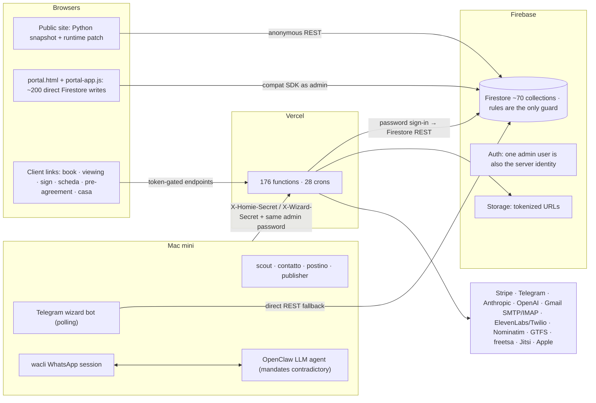

# BOOM — CLAUDE HANDOFF

Dense handoff for an independent reviewer or engineer. Every statement carries the evidence label used across the audit:
VERIFIED (read in code, configuration, CI logs or production data through public access), INFERRED, UNKNOWN, LEGACY,
PROTOTYPE. No secrets, credential values, environment values or customer personal data appear in this document; the
audit cites file paths and line numbers only. Line numbers refer to the reviewed commit.

## 1. Audit identity

| Field | Value |
|---|---|
| Audit date | 2026-09-06 (packaged 2026-09-07) |
| Repository | GitHub `valentino11marzo-pixel/Boum-roma`; Vercel project `boum-roma`; Firebase project `boom-property-dashboards` |
| Branch | `main` |
| Exact commit reviewed | `aed13c81606ed7e5d6a7ae7c6a21b6943908b175` (`aed13c8`, merge of PR #231, 2026-09-05) |
| Documentation commit | `b5d0644` on `claude/boom-architecture-strategy-dc5e1y` (adds `cto-room/`; no code changes) |
| Companion files | `BOOM_SYSTEM_INTELLIGENCE_DOSSIER_CLAUDE.md` (complete audit, 28 + 13 + 6 sections, 7 Mermaid diagrams), `BOOM_CLAUDE_FINDINGS.json` (machine-readable findings) |

## 2. Access limitations

- Full read access to the repository tree; shallow clone (57 commits, 2026-08-20 → 2026-09-05); older history read only through the GitHub API (commit counts per month, PR numbers).
- Anonymous read of the two public Firestore collections (`listings`, `publicGeo`) with the web API key already shipped in the site, exactly as a visitor's browser does. No admin data.
- GitHub Actions API: run list for `ci.yml` on `main` and the failed-job log of run 33975271662.
- Vercel API (through the ops investigation): project metadata, deployment list, team project count. No runtime logs, no environment values.
- No Firebase console, Stripe, Telegram, Mac mini, ElevenLabs, Twilio or Gmail access. Everything about live runtime state is UNKNOWN unless a repository artefact proves it.
- The 268 KB `CLAUDE.md` project guide (written by earlier AI sessions) was treated as a set of claims and checked against code; the audit records where it is stale (service-worker version, cron count, suite count, "EmailJS retired", "boom-core used by index", `settings/payout`, an Allegato generator said to live in the portal).

## 3. Current architecture (VERIFIED)

- Static HTML site (145 root pages, 69 in the sitemap) plus 176 serverless functions and 73 helpers under `api/` (ESM, ~40,400 lines) on Vercel; 28 crons; no build step; no framework. Root `vercel.json` is authoritative; `api/vercel.json` is a stale nested copy (LEGACY).
- Firestore is the only database: ~70 collections named in `firestore.rules`, three more referenced by code and absent from rules (`viewings` unruled; `clientErrors` and `messageLog` `write: if false` while the server writes them). `firestore.indexes.json` is empty. Firebase Auth (email/password, anonymous). Storage with tokenized download URLs.
- **Every server function authenticates as an admin user with email and password** through Identity Toolkit and uses Firestore REST (`api/homie/_lib.js:27-47`); the pattern is copied in nine files. No Admin SDK, no service account. Security rules therefore apply to the server, which is why every new server-written collection needs a rule line.
- Operator console: `portal.html` + `js/portal-app.js` (28,356 lines, 2.4 MB, unminified) writing Firestore directly from the browser at ~200 sites over ~35 collections, guarded only by rules; 24 API endpoints called. Mobile/desktop layers (`portal-mobile.js`, `portal-desktop.js`, `portal-actions.js`, `oggi-engine.js`) proxy the monolith by DOM scraping.
- Client surfaces: `/book`, `/viewing`, `/sign`, `/scheda`, `/pre-agreement`, `/casa` (`tenant.html`), `/client-portal`, `/pass-delivery`, plus Apple Wallet passes with a real PassKit web service (`api/pass-update/[...path].js`).
- Mac mini (launchd): Python listing wizard (a second Telegram bot, long polling, self-updating from GitHub hourly without signature verification), four deterministic bracci (scout, contatto, postino, publisher), an OpenClaw LLM agent with shell daemons (pulse, health, telemetry, memory, realtime). WhatsApp is reachable only through `wacli` on the Mac.
- Operator Telegram bot on Vercel (`api/telegram/webhook.js` + `notify-pending.js` cron every minute): alerts, approvals, viewings, tasks, document intake.
- Shared pure engines in `js/*-engine.js` (availability, canone concordato, contract layout, fiscal, taxpack, dataops, oggi, radar, market, fiducia, segretaria, inventario, registry) and `api/viewings/_avail.js`: no I/O, tested in Node, shared browser/server. These are the seed of any future core.
- AI: 24 Anthropic call sites in 23 files by raw `fetch` (haiku in 17 files; Opus 4.8 as the default of the shared client used by the Commerciale first reply and every Segretaria turn; sonnet-5 in the wizard interpreter with the whole catalog in the prompt; opus-5 vision for inventory), two OpenAI Whisper clients, ElevenLabs in-call LLM, OpenClaw provider UNKNOWN. No gateway, no prompt versioning, no evals.
- Money: Stripe Checkout and SEPA SDD under one account (Egidi Immobiliare S.r.l.), webhook branches PFS / SERVICE / RESERVE / PREAGREEMENT / DEPOSIT / RENT / INVOICE / SDD; bank feed via IMAP scanner and CSV import; no landlord settlement logic anywhere.
- Documents: one shared jsPDF contract layout (browser and server), pdf-lib server documents (signed contract, FES certificate, fiscal dossier, registration pack, verbale, inventory, statements), FES signature with a free unverified RFC 3161 timestamp.

## 4. Verified technical facts (the ones that change decisions)

1. The Firestore rules deploy has failed from CI since the login token expired; the merge of PR #231 (which introduced a service-account path) ran on the token path because the secret does not exist, and Firebase answered "credentials are no longer valid" (run 33975271662, 2026-09-05). Nine of the last twelve `main` runs are red; CI is advisory and there is no branch protection.
2. The repository is public (HTTP 200 to an unauthenticated client). `.vercelignore` deploys `tests/`, `docs/`, the 31 root studies, `bot/` and `CLAUDE.md` as static files. The tree contains internal audits, a named third party's email as a default, a numeric chat identifier and an example cron-secret value in a comment (`api/reminder-cron.js:11`).
3. The server identity is a human admin's email and password, copied in nine files; a password reset from `/login` rotates the platform credential; every write fails within 50 minutes of a rotation.
4. The Telegram webhook accepts any POST when its secret is unset (`api/telegram/_lib.js:64-72`); the chat id is the only remaining check; forged callback updates can approve and execute outbound actions.
5. Anonymous Firebase sessions may create `maintenance`, `documents` and `messages` docs; the admin dashboard renders `${m.title}` unescaped (`js/portal-app.js:4933`): a stored-XSS path into the admin session.
6. Every derived client token (scheda, viewing manage, pay links, co-sign, calendar feeds, phone key, sell links) is HMAC/SHA over `HOMIE_SECRET` with a fallback to a constant when the env var is absent (`api/viewings/_lib.js:129` and six more); Wallet auth falls back to another constant. `HOMIE_SECRET` has 56 references in 42 files and no rotation grace window.
7. A nightly plaintext ZIP of 26 collections (users, contracts, payments, leads, bank transactions…) is stored with a bearer download URL and emailed when under 18 MB; no retention; no restore drill; ~20 collections not covered (`api/ops/cassaforte.js`).
8. `listings.propertyId` has no writer and 0 of 26 live listings carry it; the signature-driven `rented` sync in `api/magic-sign/submit.js:527-556` therefore never fires; nothing resets availability at contract end. `listings.status` has seven writers; `properties` carry two more vocabularies.
9. `cedolareSecca` is stored as `'si'|'no'` (plus a nested boolean) and both fiscal engines test `=== true` (`js/fiscal-engine.js:41-53`, `js/taxpack-engine.js:90-105`): every contract is computed as ordinary IRPEF. Manually confirmed rent receipts become `invoices` and inflate the company VAT estimate.
10. The commission is defined three ways: terms "one month or 10 % of annual rent, whichever is lower" + 22 % IVA; code default 10 % of annual (`api/preagreement/create.js:96-102`); marketing "10 % of the annual rent". `contract.agencyFee` is written and read by nothing; the PFS €350 credit is not applied.
11. `contracts.status = 'active'` at creation; `expired` is never automated; journey, Gestore and relet reason on stale contracts. A manual WhatsApp reply flips a lead to `contacted`, which the portal renders as DISCARDED and every machine filter ignores.
12. Rent schedules are generated in three places with the same deterministic ids by convention; contracts are created by two factories with different field sets; an in-portal signing/activation path runs parallel to `/sign`; rules still allow a tenant to write signature fields from the browser.
13. Magic Sign: phone OTP is skippable (`sign.html:728`; `otpRequired` has no writer), the certificate hash covers metadata not bytes, the timestamp comes from a free TSA and is accepted unparsed, the delegate countersign is not printed on the artefacts.
14. Public listing documents carry the operator's email (`availabilityUpdatedBy`), contract ids and lease end dates, and exact addresses regardless of pin precision; `api/wizard/publish.js` has no field whitelist; `/listing/:id` returns 200 for unknown ids.
15. The public `/apartments`, `/` and `/apartment-detail` pages are Python snapshots dated 31 July whose inputs (`live-rows.json`, `foto-uri.json`) are not in the repository; the runtime overlay updates status/price/date and adds new cards but cannot remove deleted listings or refresh names, photos and descriptions; the page rewrites its "updated" stamp to today.
16. `reminder-cron` runs 14 sub-jobs with a time guard on the last one only; `_budget.js` is not imported there; six crons write no heartbeat; `notify-pending` has no overlap guard; `clientErrors` writes are rejected so the `/salute` error panel is permanently empty.
17. Rate limiting is per-instance `Map` state in ~20 files; three public endpoints call a model behind it. `geocode-bake.js` is an unauthenticated write endpoint. `viewings/slots` POST has no rate limit. PFS client access codes are 25 bits from `Math.random` with no rate limit.
18. AI output writes state without a human tap in nine paths (document filing, lead creation from emails and calls, grade → auto-archive, bank amounts → payments marked paid, photo rewrite, public description rewrite, Segretaria sends). Removing the Anthropic key hard-fails eleven features and silently loses portal-email leads.
19. Test estate: 109 suites, ~10 minutes in CI; 37 suites each carry their own in-memory Firestore fake; ≥28 assert on source text; five Python suites are never run; `run-all.mjs` marks a suite skipped if any line starts with `SKIP:` before checking the exit code; the monolith has no unit tests.
20. Velocity: 1,158 commits since 2026-01-12, 231 PRs in 125 days, ~3 PRs/day recently, all merged by the owner, authored largely by Claude; commit bodies average ~977 words; 46 % of recent commits touch `CLAUDE.md`, which grew 199 → 268 KB in 16 days.

## 5. Sources of truth (VERIFIED)

| Fact | Canonical today | Copies / competitors | Sync | Risk |
|---|---|---|---|---|
| Public availability | `listings.availableFrom/availableKind` via `js/dispo-engine.js` | `availableDate/availableRaw` free text, `properties.availabilityStatus/availableSince`, `contracts.endDate` | one-way at full signature only, and only if `propertyId` is set (never) | no release at contract end; `'Subito'` string mixed with ISO |
| Public price | `listings.price` | `properties.rent`, `contracts.rent`, snapshots on leads and viewings | none | portal property edits never reach the listing |
| Occupancy | contradictory: `listings.status` (available/waitlist/rented/reserved), `properties.availabilityStatus` (available/negotiation/rented/off_market), `properties.status='rented'`, `currentContractId` | LEGACY `occupied` in the static owner page | partial | three vocabularies, seven writers |
| Tenant identity | `contracts.tenant*` frozen at signature | `users` (two schemas), `preAgreements.tenants[]`, `coTenants[]`, `landlords`, `pfsClients`, `clients`, `leads` | server writes both user schemas | tenants created without Auth accounts cannot be authorised |
| Landlord identity | `properties.ownerId` → `users/<uid>` | `landlords/<uid>` (server) vs auto-id (portal), `contracts.landlord*` | prefill and sync at scheda/sign | `ownerId` polymorphic |
| Contract state | `signatureStatus` + `finalizedAt` (real "done") | `status` free select, `preAgreements.status/contractId`, `leads.stage`, `magicLinks.used` | one-way | `status` editable from the portal |
| Payment state | `payments.status` + `paidVia` | journey flags, fee stats, bank match fields | webhook idempotent on session/PI ids | manual paid has no `paidVia`; lateness never stored |
| Lead state | `leads.status` | `leads.stage`, `clients.stage`, `pfsClients.stage`, `action_queue` | phone dedupe only | six writers, no shared enum |
| Proposal state | proof fields `paidAt/paidSessionId/paidEur` (`paidOnRecord`) over `status` | `propertyLocks`, `contracts.preAgreementId` | webhook + repair endpoint | status can be degraded by re-submit; repaired by `resolve.js` |
| Viewing state | `viewingRequests.status` + reminder flags, single mutator `_apply.js` | portal docs use `proposedDate/Time` strings the server never reads | — | outcome never stored |

## 6. Current transaction lifecycle (VERIFIED)

Fragments, not a chain: `leads` (new → contacted/responded/converted/discarded/archived; `stage:'closed'` as a second field) → `viewingRequests` (pending → confirmed → completed/cancelled; unlinked to leads when self-booked) → `preAgreements` (sent → viewed → accepted/reserve → paid/revoked; no `leadId`) → `propertyLocks` per month (48 h unless firm) and, separately, the €300 `listings.status='reserved'` hold → `contracts` (`active` at creation; `signatureStatus` none → partial → complete → `finalizedAt`) → `payments` (pending → paid via stripe/sepa/bank/manual) → `contracts.journey` flags → verbale/inventory documents → renewal (new contract) or termination. Missing as explicit state: profile, application, negotiation, approval, check-in, active tenancy, exit. Approval rail: `action_queue` (pending → approved → executed/failed/rejected) with `contextHash` idempotency, executed by `api/agent/execute.js`, delivered by email or the Mac postino; bypassed by design by the Segretaria (writes `approved/autoApplied`), the richiamo campaign (writes `executed`) and a Homie auto-apply branch with no executor. Full state diagrams: dossier Part A § 8.

## 7. Homie architecture (VERIFIED unless labelled)

Five runtimes share one secret and one Firebase project: (a) the Vercel operator bot (webhook; slash commands, 64-byte callback grammar for viewings, tasks, campaigns, fiducia, Segretaria handover, approve/reject/edit; natural language limited to one reminder regex); (b) the Mac listing wizard, a second Telegram bot by long polling (INFERRED from distinct token env names) with its own grammar, self-updating from GitHub; (c) an OpenClaw LLM agent on the Mac reading WhatsApp through `wacli` and acting through the `boom` CLI against `api/agent/*`, with three contradictory mandates and no record of which is loaded (UNKNOWN whether it runs); (d) four deterministic Python bracci; (e) Twilio voicemail and an ElevenLabs receptionist (activation UNKNOWN). The server never sends WhatsApp; if the Mac is off, outbound stalls (detected after five minutes with a card containing the text) while inbound simply stops (undetected). The `api/agent/*` manifest is stale; nine of twenty-four tools have no caller; `tenant.html` posts maintenance events to an endpoint that always returns 401. Toward the target "USER → HOMIE → INTELLIGENCE → CORE → actions": the action rail and read-only engines exist; no conversational entry routes questions to them; no per-deal read model; conversation memory is one flag on the server, an in-process dict on the Mac bot, and JSON files on the Mac disk.

## 8. Critical risks (ranked)

1. Rules not deployable from CI; repo/production drift with four silent breakages (VERIFIED).
2. Public repository shipping internal audits, personal defaults and a secret-like value; docs and tests deployed as static files (VERIFIED).
3. Telegram webhook fail-open → forged approvals and executions (VERIFIED code; env UNKNOWN).
4. Human password as server identity in nine files; rotation or reset takes the platform down (VERIFIED).
5. Stored XSS into the admin session from anonymous `maintenance` creates (VERIFIED, not executed).
6. Plaintext full-database backup emailed nightly, no retention, no restore drill (VERIFIED).
7. Derived tokens falling back to constants in deployments without secrets; previews run all functions against production Firebase with no staging (VERIFIED).
8. Legal/financial: commission mismatch on every proposal; fiscal outputs wrong for every contract; client funds handled with no settlement record (PSD2 exposure INFERRED); FES evidence weaker than the copy claims; delegate signing unrecorded on artefacts.
9. Privacy: policy describes a different stack (AWS, SendGrid, MFA); Anthropic, OpenAI, ElevenLabs, Twilio, Telegram, Vercel, Gmail undisclosed as processors; no retention or erasure; lead scoring, call recording, ID OCR and personal-WhatsApp mining without DPIA; scraped advertisers' contacts stored.
10. Operational: one operator, one chat (alerts and approvals), one mailbox (SMTP, five IMAP scanners, invites, backups), one Mac, one password; the system's own incident record shows every guardian was unguarded.

## 9. Technical debt (ranked by cost of carrying it)

1. The portal monolith (28k lines, ~200 direct writes, three schedule generators, two contract factories, in-portal signing, browser rules engine, boot-time customer emails, three user-provisioning paths, race-prone invoice numbers, stale config with placeholder production block, 44 dead functions, 1,050 inline handlers). Maintainability 2/10.
2. Server identity and rules coupling. 3. Data model without a schema: seven person collections, three occupancy vocabularies, triple-encoded `cedolareSecca`, five timestamp encodings, twin fields, free-text taxonomies, a ghost `viewings` collection, no indexes, no pagination, no migrations. 4. Duplicated primitives: nine sign-in copies, two Firestore codecs (the webhook's flattens maps), four `normalizePhone`, five `wa()`, three listing readers, six inline Solari engines, 15 Firebase config copies, ~20 rate limiters, two Whisper clients, 19 PDF layouts. 5. Hand-run static-site generator with inputs outside the repo. 6. AI without a gateway. 7. Operations split across Vercel/Mac/OpenClaw with prose mandates. 8. Test harness shape (37 fakes, source-pinning, Python never run, `SKIP:` beats exit code). 9. Frontend fragmentation (five golds, six blacks, ≥8 nav variants, seven i18n switchers, two manifests, deployed `-classic` duplicates, 37 previews). 10. `CLAUDE.md` as changelog. 11. Configuration outside version control (55 env names, 14 undocumented; no staging; 49 dormant Vercel projects). 12. Legacy surface still deployed (list in dossier Part A § 19).

## 10. Product debt (works technically, wrong behaviour)

Hot leads disappear after a manual reply; the public site claims freshness and availability from a 31 July snapshot and keeps deleted listings; "verified properties", "48-hour move-in", "500+ happy tenants", "98 % success rate" and "2-minute average response" have no backing field or data (30 lifetime payments); the commission told to the client differs from the one charged by default; contracts are `active` before signing and never expire, so nothing reopens the home; the €300 hold is a payment with a manual refund and a lead nobody reads; applicants are never approved or declined; viewings have no recorded outcome and self-booked ones create no lead; the signer is told the signature is "fully valid" after skipping OTP; two Telegram chats for one operator with crons emitting commands for the other bot; the tenant app reports maintenance to a dead endpoint; public listing documents leak operator identity and exact addresses; three autonomy regimes all default off with no recorded decision; La Réunion and Executive are pages and studies without a market or a product.

## 11. Recommended target architecture (summary; full text in dossier Part B)

Eight domains, one platform runtime, five thin surfaces. Domains: INVENTORY (properties, units, one availability writer, public projection), PARTIES (one party model with roles, verification levels L0–L4 with provenance, consents; absorbs seven collections), DEALS (the canonical transaction state machine INQUIRY → PROFILED → QUALIFIED → MATCHED → VIEWING/VIEWED → APPLIED → PROPOSED/NEGOTIATING → ACCEPTED → HELD → DOCUMENTS → CONTRACTED → SIGNED → PAID → PRE_ARRIVAL → CHECKED_IN → ACTIVE → EXITING → RENEWED/CLOSED, with DECLINED/WITHDRAWN/EXPIRED; events with every transition), DOCUMENTS (templates, generation, signature evidence bound to bytes, archive classes with retention), MONEY (schedules, collections, reconciliation, commission receivables, landlord settlements, invoice series), SERVICES (event-driven offers with a partner registry as data), OPERATIONS (tasks, generalised approvals, SLA, audit projection, notifications), INTELLIGENCE (the existing pure engines plus AI-assisted extraction/drafting behind a gateway, and read models such as "what blocks this deal"). Platform: service-account identity and Admin SDK in one module; typed schema with validation at every write door and marker-based migrations; an `events` collection written with each state change and dispatched by the existing minute pump; config/flags with a staging Firebase project for previews; mandatory heartbeats, budgets, a second alert sink, an error tracker; an AI gateway with provider adapters, model tiers instead of ids, budgets, prompt versions, evals and PII routing. Surfaces: server-rendered public site from the inventory projection; BOOM PASS as the single client app over parties/deals/documents/money/services (not a paid tier); owner app with mandate and settlement statement; CONTROL (operator console) and HOMIE (one bot, deterministic grammar first, typed tool registry generated from the write doors, server-side memory) as two faces of the same control plane. Global code with an Italy pack and a Rome pack; the test is that domain code contains no Rome literal. Four AI tiers: T0 read/summarise, T1 propose, T2 execute with grace only for measured template categories, T3 never (legal/financial/first contact/publishing). Strangler in ten steps, each deleting something; by step five the codebase should be smaller than today.

## 12. Highest-priority interventions

Immediate (days): 1 create the service-account secret and get `deploy-rules` green, then probe production rules; 2 make the repository private or scrub it, stop deploying docs/tests/bot, rotate the example secret, remove personal defaults from source; 3 make the Telegram webhook secret mandatory; 4 rule `viewings` (or fix callers) and let the server write `clientErrors`/`messageLog`; 5 encrypt and prune backups, stop emailing them, enable PITR; 6 escape dashboard interpolations and restrict anonymous creates; 7 create a staging Firebase project for previews; 8 remove the constant fallbacks in token derivation; 9 decide one commission definition and align terms, code and marketing; 10 fix the fiscal engines' `cedolareSecca` reading and exclude rent receipts from company VAT; 11 make `contacted` leads visible; 12 make OTP mandatory on signing, print the delegate, store the byte hash; 13 retire the dead surfaces in one PR; 14 heartbeats on all crons and time budgets on `reminder-cron` and `notify-pending`; 15 rewrite the privacy policy from the real processor list.

Next 90 days (in order): server identity → schema and migrations → the DEALS entity with dual-write and nightly parity → one contract door (delete in-portal signing, browser rules engine, browser dunning, boot emails) → one availability writer and server-rendered public inventory (retire the Python builders and duplicates) → PARTIES → money truths (commission receivable, settlement statement, invoice series decision, double-charge detection, pay-link fee) → AI gateway and approval tiers → event spine and observability → one Telegram bot → design tokens → privacy programme.

Stop: new agents/radars/consoles/studies; new design directions; markets and segments before the rail works; AI where a rule suffices; documentation as a substitute for structure. Levers: the DEALS state machine with events; service-account identity + schema + doors; owner-side mandate + settlement statement; the AI gateway with approval tiers; server-rendered inventory from one projection.

## 13. Do-not-change list

The pure engines and their tests (`js/*-engine.js`, `api/viewings/_avail.js`); the "one place a state changes" modules (`api/viewings/_apply.js`, `api/preagreement/_lock.js`, `_state.js`, `resolve.js`, `api/magic-sign/submit.js`, `api/sign/_finalize.js`) — wrap, do not replace; idempotency conventions (deterministic ids, `fsCreate` 409 compare-and-set, `contextHash`, marker docs); the approval rail's shape (`action_queue` → executor → outbox → postino stall card) — generalise, do not rebuild; the viewing lifecycle, Wallet passes and the PassKit web service; the legal templates under `reference/` and their verbatim reproduction, and `api/_pdfbrand.js` as the header standard; `laneCopy` as the single availability dictionary, `boom-geo` precision, the SSR design of `api/listing.js`; the testing instincts (handler-level tests over an in-memory store, mutation checks, the anonymous production probe, browser suites at 390/1440 px); the public/client visual identity of the 2026 site and the SCALO boundary rule (no aviation language in contracts, money or legal copy).

## 14. First recommended engineering task

Land the service-account server identity and a rules/code contract test in one PR behind a flag: (1) `api/_core/db.js` exporting the existing `fsGet/fsList/fsCreate/fsPatch/fsDelete` signatures over the Firebase Admin SDK, selected by `DB_MODE=sa` (default `user` until cut-over); (2) replace the nine `signInWithPassword` copies with the one module; (3) `tests/contract/rules.mjs` that parses `firestore.rules`, greps every collection written by `api/**`, and fails on any collection without a rule or with `write: if false` while the server writes it (today: `viewings`, `clientErrors`, `messageLog`); (4) the service-account secret in GitHub and Vercel; (5) `deploy-rules` green with "Deploy complete". Two to three days for one engineer; reversible by one flag; validated by the existing suites plus the anonymous production probe; deletes eight duplicate helpers.

## 15. Unresolved questions

Which Homie mandate is loaded on the Mac, is the OpenClaw agent running, and which provider does it use? Are the Telegram webhook secret, the pass auth secret, `HOMIE_SECRET` and `CRON_SECRET` set in production and in previews? Was the Stripe webhook secret rotated after the April exposure noted in `BOOM_STATUS.md`? Do landlords receive rent directly or does Egidi collect and remit, and under what mandate? Is the ElevenLabs receptionist live? Is the Immobiliare feed activated? Does a GoCardless account exist? How many tenants use `/portal` versus `/casa`? Are there users with role `owner`, and do any legacy listings carry `propertyId`? Firestore region, PITR status, current size of `backups/`? Which of the 49 dormant Vercel projects hold crons or secrets? Is a natural-person estate-agent enrolment in place, and is there a written delegation template behind `landlordDelegate`? Revenue, deals per month and time-to-keys since 2 August 2026?
