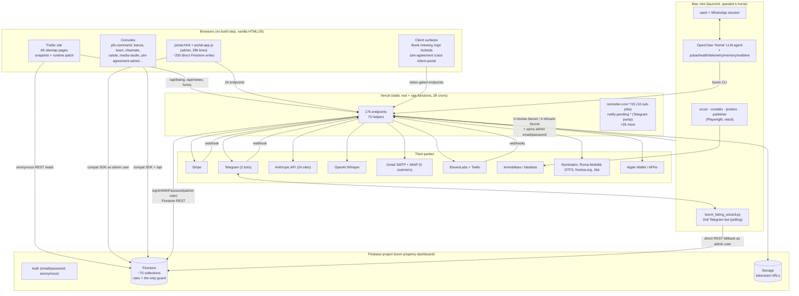
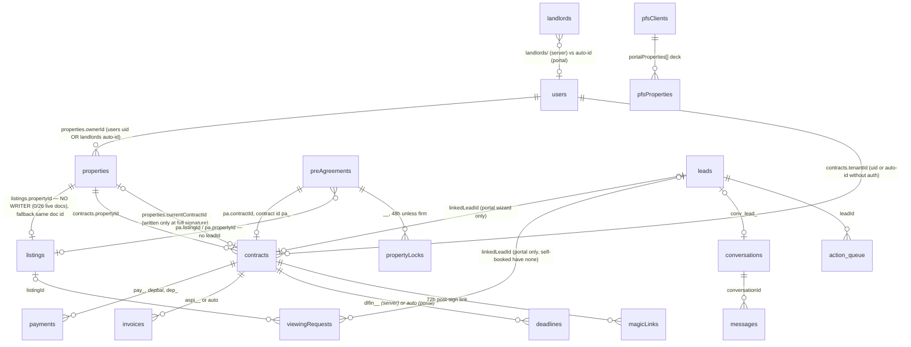
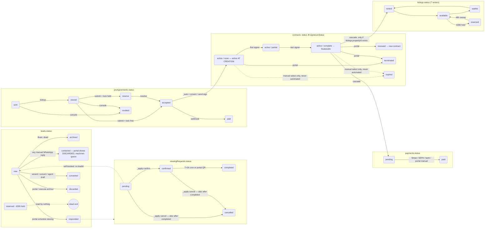
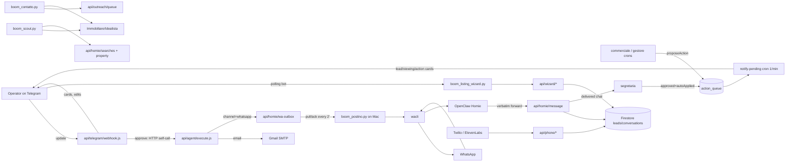
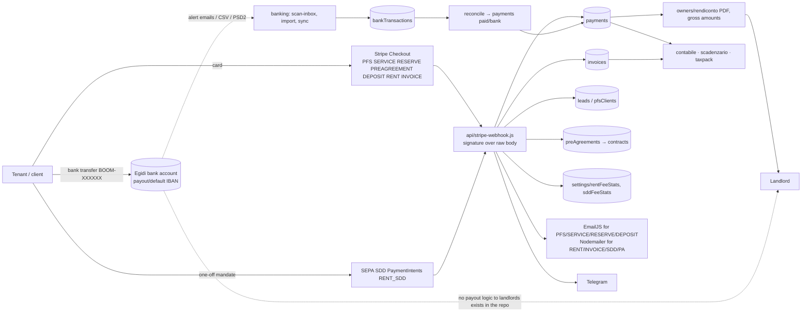
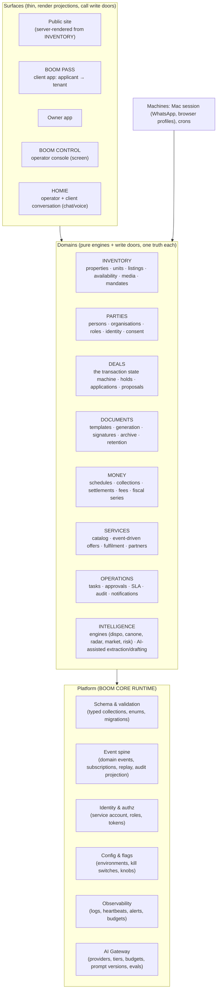
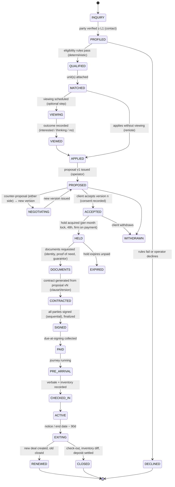

# BOOM SYSTEM INTELLIGENCE DOSSIER — CLAUDE EDITION

**Prepared for an independent cross-model architecture review.** This file packages the complete Claude audit of the
BOOM platform without changing any conclusion reached during the audit. It is the same material as the four documents
under `cto-room/` in the repository, assembled into one file, with a metadata block, a five-label evidence legend
(including PROTOTYPE) and a prototype register added for the reviewer. Secrets, credential values, environment values
and customer personal data are absent by construction: the audit cites file paths and line numbers, never values.

## Audit metadata

| Field | Value |
|---|---|
| Audit date | 2026-09-06 (packaged 2026-09-07) |
| Repository | `valentino11marzo-pixel/Boum-roma` (GitHub), Vercel project `boum-roma`, Firebase project `boom-property-dashboards` |
| Branch reviewed | `main` |
| Exact commit reviewed | `aed13c81606ed7e5d6a7ae7c6a21b6943908b175` (short `aed13c8`, merge of PR #231, 2026-09-05) |
| Documentation branch | `claude/boom-architecture-strategy-dc5e1y`, commit `b5d0644` (adds `cto-room/`, no code changes) |
| Auditor | Claude (Claude Code), one lead session plus thirteen parallel read-only domain investigations |
| Method | Static reading of the full tree; anonymous read of the public Firestore catalog with the web API key already shipped in the site; GitHub Actions API for CI run status and one failed-job log; Vercel API for project metadata (via the ops investigation). `CLAUDE.md` (268 KB, written by earlier AI sessions) treated as claims to verify, not as evidence. |
| Access limitations | No Firebase console, no admin data, no Stripe dashboard, no Telegram, no Mac mini, no production environment variables, no Vercel runtime logs. Shallow clone (57 commits, 2026-08-20 → 2026-09-05); full commit history read only through the GitHub API. Anything about live runtime state (which Homie mandate is loaded, whether the receptionist is active, env values in production) is labelled UNKNOWN. |
| Changes made by the audit | None to code, configuration, rules or pages. Documentation only, on the documentation branch. |

## Evidence labels (five)

| Label | Meaning in this dossier |
|---|---|
| **VERIFIED** | Read directly in code, configuration, tests, CI logs, or observed in production data through public read access. |
| **INFERRED** | Strongly suggested by code or by first-hand documents in the repository; not directly observed. |
| **UNKNOWN** | Cannot be determined with the access available. Stated as unknown rather than guessed. |
| **LEGACY** | Present in the repository but unreferenced, superseded, redirected away, or explicitly retired by later code. |
| **PROTOTYPE** | Present and possibly deployed, but not part of the operated product: design studies, experiments, features built without an active caller or activation, markets or segments without an entity, licence, price or customer. The feature inventory in Part A § 6 uses the status word `prototype` for these; the register below lists them under the label. |

## PROTOTYPE register (VERIFIED presence; PROTOTYPE status)

| Item | Where | Why it is a prototype, not product |
|---|---|---|
| 37 `preview-*.html` design studies, `v2-immersive.html`, `detail-v2.html`, `motion-preview.html`, `.journey-preview.html` | repository root | Design explorations; vercelignored or unlinked; sixteen named visual directions, of which production uses a handful (Part A § 4, Part B § 8) |
| Four `-classic` pages | `index-classic`, `apartments-classic`, `apartment-detail-classic`, `property-finding-classic` | Deployed and indexable duplicates with no inbound link; pre-SCALO fallbacks (also LEGACY) |
| Kiosk (SCALO S9), `design/scalo/scalo-lab.html`, boarding-pass OG generators beyond the live pass | `design/scalo/` | File exists, no route; the study itself marks S9 as not shipped |
| Photoreal 3D | `js/boom-photoreal.js`, `tests/photoreal/` | Structurally unavailable to an EEA-billed Google account (403); retained "in case the restriction is lifted" |
| Agent tool endpoints without a caller | `api/agent/concierge.js`, `documents.create/list/update.js`, `magicsign.create.js`, `radar.scan.js`, `relet.scan.js`, `compliance.scan.js`, `ack.js` | Built for a Mac agent mandate that later code says does not execute; nine of twenty-four tool files have no caller |
| OpenClaw "Agent OS" daemons and SOUL mandates | `homie-bridge/agent-os/`, `homie-bridge/SOUL-BOOM*.md`, `homie-bridge/HOMIE.md` | Three contradictory mandate generations; whether any runs is UNKNOWN; the deterministic Python bracci exist because the mandate demonstrably did not execute |
| Cockpit and deals command centre | `cockpit-preview.html`, `public/deals_v2_commandcenter.html` | Call non-existent endpoints; ordered retired by the repository's own studies, still present |
| Third pass generator | `pass-studio.html` | Own auth and endpoints, zero inbound links |
| ElevenLabs receptionist | `api/phone/elevenlabs.js`, `api/phone/agent-tools.js`, `bot/RECEPTIONIST.md` | Code complete; activation UNKNOWN |
| Immobiliare feed and the Pubblicista | `api/feed/immobiliare.js`, `api/publisher/*`, `bot/boom_publisher.py` | Built; portal-side activation never confirmed; `--auto` falls back to an assisted manual session; launchd plist not well-formed |
| Open banking via GoCardless | `api/banking/connect|finalize|sync|institutions.js` | Inactive unless keys exist; provider closed to new sign-ups per repository comments |
| La Réunion market | `reunion.html`, `api/reunion-lead.js`, `api/_market.js` guards | Lead form and copy for a market with no entity, licence, price or presence evidenced |
| Executive as a separate product | `executive.html`, `api/executive-lead.js`, three studies | A segment door feeding the same tenant pipeline |
| Miniera, demand meter, voice meter | `js/miniera-engine.js`, `js/wa-demand-engine.js`, `scripts/wa-voce-locale.mjs` | Analysis tools over personal WhatsApp history; their verdict has not visibly selected work |
| €300 hold | `api/reserve-checkout.js`, `api/ops/_lotto12.js sweepHolds` | Zero real transactions (operator tests only); lead status read by nothing |
| Tenant Passport, BOOM Gestione recurring management, white-label Magic Sign | studies only | Proposed in `SERVIZI_STUDIO_2026-08.md` and `docs/strategia-servizi-digitali.md`; not built (absent, not prototype) |

Everything else in this file is reproduced from the audit as written on 2026-09-06.


---

# PART 0 — HOW TO READ THIS DOSSIER

# BOOM CTO ROOM

Working documents for the technical re-foundation of BOOM (Egidi Immobiliare S.r.l. → BOOM, Rome).
Written 2026-09-06 from a read-only audit of this repository at commit `aed13c8` (branch `main`,
PR #231) plus an anonymous probe of the production Firestore catalog. Nothing in the repository was
modified by the audit; this folder is documentation only.

| File | What it is |
|---|---|
| `01-DOSSIER-CURRENT-STATE.md` | **BOOM SYSTEM INTELLIGENCE DOSSIER — CURRENT STATE.** Reconstruction of what exists today: architecture, data, lifecycle, Homie, AI, money, documents, auth, deployment, observability, security, privacy, debt, duplicates, bottlenecks, what to keep/improve/replace, missing foundations. 28 sections. |
| `02-TARGET-ARCHITECTURE.md` | **BOOM GLOBAL SYSTEM — TARGET ARCHITECTURE.** The achievable evolution: modules and boundaries, the canonical transaction, BOOM PASS, event-driven concierge, global/Italy/Rome layering, business architecture, design direction, human+AI approval architecture, engineering principles, migration strategy. |
| `03-PRIORITIES-AND-HANDOFF.md` | **NOW / NEXT / LATER**, five things to stop, five levers, and the **HANDOFF TO BOOM CTO ROOM** package for any other engineer or model continuing the work. |

## Evidence discipline

Every material claim in these documents carries one of four labels:

- **VERIFIED** — read directly in code, configuration, tests, or observed in production data.
- **INFERRED** — strongly suggested by the code or by first-hand documents in the repo, not directly observed.
- **UNKNOWN** — cannot be determined from the repository or from the access available to the audit.
- **LEGACY** — present in the repository but unreferenced, superseded, or explicitly retired.

Citations use `path:line` against commit `aed13c8`. Where the audit relied on `CLAUDE.md` (the 268 KB
project guide written by previous AI sessions), the guide's statements were treated as claims and checked
against code; the dossier notes where the guide is stale.

## Access the audit had

- Full read access to the repository (shallow clone: 57 commits, 2026-08-20 → 2026-09-05, PRs #182–#231;
  earlier history exists on GitHub but was not fetched).
- Anonymous read of the public Firestore collections (`listings`, `publicGeo`) using the web API key already
  shipped in the site, exactly as a visitor's browser does. No credentials, no admin data, no Stripe, no
  Telegram, no Mac mini access. Anything about the runtime state of those systems is labelled UNKNOWN.

## How to use this folder

1. Read `01` § 1 (executive reconstruction) and § 25–28 (keep / improve / replace / missing) first.
2. Read `02` § 1–3 for the target module boundaries and the canonical transaction.
3. Read `03` for the order of work and the handoff facts.
4. Do not treat the target architecture as a rewrite plan. It is a strangler plan over the existing
   Firebase + Vercel estate; § 12 of `02` explains the sequence.


---

# PART A — CURRENT STATE (28 sections)

# BOOM SYSTEM INTELLIGENCE DOSSIER — CURRENT STATE

Audit date: 2026-09-06 · Repository: `valentino11marzo-pixel/Boum-roma` at `aed13c8` (main, PR #231) · Method: read-only
code audit by one lead and thirteen parallel domain investigations, plus an anonymous probe of the production
catalog. Evidence labels: **VERIFIED** (seen in code/config/production data), **INFERRED**, **UNKNOWN**, **LEGACY**.
Citations are `path:line` at that commit. `CLAUDE.md` (268 KB, written by previous AI sessions) was treated as a set of
claims to check, not as evidence; where it is stale this dossier says so.

---

## 1. Executive reconstruction — what BOOM actually is today

**BOOM is a one-operator Rome letting agency with a software estate two orders of magnitude larger than its business.**

The business (VERIFIED unless noted):

- Legal operator is **Egidi Immobiliare S.r.l.** (P.IVA 17322991005, REA RM-1710623, Via dei Coronari 181/184); BOOM® is
  an EU trade mark of that company (`terms.html:437-444,584-585`). Every PDF footer, invoice, Stripe account and the
  privacy policy name Egidi. "BOOM" is a brand, not an entity.
- The public catalog holds **26 listings**: 8 `available`, 10 `waitlist`, 8 `rented` (anonymous Firestore probe,
  2026-09-06). Zones are free text with trailing spaces and duplicates ("Prati" and "Prati ", "Centro" and "Centro Storico").
  Zero listings carry a `propertyId`; 23 carry a free-text availability date ("1 Aug", "Mar 1", "31 July").
- Revenue evidence in the repo: the internal audit of 2026-08-02 read 194 Stripe checkout sessions since September 2024 and
  found **€15,232 collected in 30 payments**, of which €7,732 in July 2026 (five paid pre-agreements = €5,002; Property
  Finding €350 ×22 lifetime; every "Services 2.0" product 0 sales in 22 months) (`docs/audit-2026-08.md:3-67`). No later
  figures exist in the repo; the current run-rate is UNKNOWN.
- The first contract signed by both parties through the digital signing rail happened on **2026-09-01**, with Storage
  down at the time (`CLAUDE.md`, "La firma completa che non muore a metà"; INFERRED from that first-hand account). The
  end-to-end digital transaction has therefore been exercised in production roughly once.
- One human operates everything, from a phone, mostly through WhatsApp and Telegram (29,255 of the operator's own
  WhatsApp messages were mined to design the quick replies; `STUDIO_ORGANICO_2026-08.md` §1).

The software estate (VERIFIED):

| Dimension | Size |
|---|---|
| Tracked files | 1,080 |
| Root HTML pages | 145 (69 in the sitemap; 37 `preview-*` design studies; ~10 dead/legacy; 4 `-classic` duplicates still deployed) |
| Serverless functions | 176 endpoint files + 73 helpers under `api/` (~40,400 lines); 28 Vercel crons; 45 function config entries |
| Shared client engines | 49 files under `js/` (~44,700 lines), of which `js/portal-app.js` alone is **28,356 lines / 2.4 MB**, unminified, loaded on every portal open |
| Firestore collections | ~70 named in `firestore.rules`, plus at least 3 referenced by code but absent from rules |
| Mac-mini processes | 5 Python "bracci" + 1 Python Telegram bot + an OpenClaw LLM agent with 5 shell daemons, all on launchd |
| AI call sites | 24 Anthropic (23 files, 20 hand-built requests), 2 OpenAI Whisper, 1 ElevenLabs agent, 1 OpenClaw runtime |
| Tests | 109 suites in `tests/run-all.mjs`, ~135 files, run in CI; several drive real handlers over an in-memory Firestore |
| Documentation | 31 root Markdown studies/audits; `CLAUDE.md` 268 KB; commit messages are Italian narrative "lessons" |
| History visible in this clone | 57 commits (2026-08-20 → 2026-09-05), PRs #182–#231; the project is ≥5 months old (BOOM_STATUS.md dated 22/04/2026); ~230 PRs total (INFERRED from numbering) |

The architecture in one paragraph: static HTML served by Vercel (no build step), Firebase (Firestore + Auth + Storage) as
the only database, Vercel serverless functions as the backend, and **an admin user's email and password as the server's
identity** — every function signs in as that user through the Identity Toolkit and talks to Firestore over REST, so the
security rules apply to the server too (`api/homie/_lib.js:27-47`). A Mac mini in the operator's home runs the parts the
cloud cannot (WhatsApp session, portal scraping, a second Telegram bot). Telegram is both the alert channel and the
approval UI. Anthropic models are called directly from 23 files with no gateway.

What is genuinely distinctive (VERIFIED, detailed in § 25):

1. **Italian legal-document automation**: a 75-zone canone-concordato engine, the association's contract templates
   reproduced in one shared PDF module, fiscal dossier, registration pack, one-tap ASPI request, key-handover report,
   video-derived inventory with a legally careful diff rule.
2. **A disciplined availability model** (`js/dispo-engine.js`): three states, ambiguity never becomes "available now",
   late rounding, one dictionary of words, enforced across the site, JSON-LD, the AI-readable feed and the portal feed.
3. **A viewing lifecycle that is a real product fact**: availability grid, instant or double-confirm booking, Apple Wallet
   boarding pass with geofence, iCal invites that update in place, T-24h/T-3h/T-30m/T+2h moments, client self-service.
4. **WhatsApp/Telegram-native operations** with a single approval rail (`action_queue` → executor → outbox) that is
   idempotent by construction.
5. **A signed-rent dataset** (asked vs signed rent by zone) that no portal has, plus an AI-answer-engine distribution
   surface (`llms.txt`, `llms-listings.txt`, `/meteo`).

What is structurally wrong (VERIFIED, detailed in § 19–24):

1. **No system of record for the deal.** State lives in seven person collections, three occupancy vocabularies, two
   incompatible hold mechanisms, a proposal with no link to the lead, and a contract that is `active` before it is signed.
2. **The portal monolith duplicates the server.** ~200 direct Firestore writes from the browser, three rent-schedule
   generators, two contract factories, an in-portal signing path parallel to `/sign`, boot-time automations that email
   customers from a browser tab.
3. **Money and fiscal logic disagree with the terms and with the law it models.** Commission defined three ways; the
   fiscal engines never recognise `cedolareSecca` as written; company VAT is estimated on tenants' rent; BOOM collects
   rent into its own account with no settlement layer; invoices are not a fiscal series.
4. **The e-signature is weaker than the copy says.** Phone OTP is skippable in practice, hashes are not bound to the PDF
   bytes, the timestamp comes from an unverified free TSA, the delegate countersignature is invisible on the document.
5. **Security and privacy debt at the foundation.** Human admin credentials as server identity, a Telegram webhook that
   accepts any POST when a secret is unset, stored XSS in the admin session reachable by anonymous visitors, a nightly
   plaintext database dump emailed to a mailbox, no erasure tooling, a privacy policy describing a different stack.
6. **Surface far exceeds substance** (the 18 August audit's own phrase). 26 registry agents and 28 crons, 16 named visual
   directions and five golds, three Telegram voices with contradictory mandates, a hand-run Python static-site generator
   whose inputs are not in the repo. The last five weeks produced seven studies calling for consolidation and shipped
   more surface each time.

The founder's concept vocabulary (ROME ACCESS SYSTEM, LIVE PROPERTY BOARD, BOOM PASS, GET VERIFIED, SIGN & PAY, CLEARED,
ON HOLD, PRT/TRV/MNT) **does not appear anywhere in the repository** (VERIFIED by grep). The aviation layer that exists is
"LO SCALO" (`STUDIO_AVIATION_2026-08.md`, `js/scalo-codes.js` with codes TRA/MON/PIG/PRA), shipped in the last week.

---

## 2. System architecture

### 2.1 Runtime topology (VERIFIED)



### 2.2 The three control planes (VERIFIED)

BOOM has no single control plane. Three coexist and overlap:

| Plane | Where | What it decides | Evidence |
|---|---|---|---|
| **Portal (browser)** | `js/portal-app.js` | Contract creation, rent schedules, deadlines, invoices, user provisioning, in-portal signing and activation, rules engine, dunning emails, boot-time automations | § 6, `report` of the monolith; e.g. `saveContract` :15650, `generateMonthlyPayments` :17866, `checkContractExpiry` :2862 |
| **Server (Vercel)** | `api/**` + 28 crons | Public forms → leads, Brain grading, viewings, pre-agreement, Magic Sign, finalize, payments, journey, employees, radar, documents | `vercel.json`, § 6 |
| **Mac + Telegram** | `bot/*.py`, `homie-bridge/`, `api/telegram/*` | WhatsApp in/out, listing wizard, portal scraping/publishing, approvals, task memory | § 9 |

The same decision is frequently implemented in two or three planes with different data shapes (§ 21).

### 2.3 Request/authority model (VERIFIED)

- Browser principals are Firebase users; role is `users/{uid}.role` ∈ {admin, landlord, tenant} read by the rules
  (`firestore.rules:19-23`) and by `api/_auth.js:55-64`. An `owner` role is accepted by 17 server gates but has no rules
  helper (ghost role, § 7).
- Server principals: the admin user (all functions), `CRON_SECRET`, `HOMIE_SECRET`, `WIZARD_SECRET`, Stripe signature,
  ElevenLabs HMAC, Twilio derived key, Telegram chat-id (secret optional), and derived HMAC tokens for client links.
- Firestore rules are therefore **the only guard** for ~200 browser write sites and simultaneously **a constraint on the
  server** (every new server-written collection needs a rule line; four instances of silent breakage exist today, § 17).

---

## 3. Repository map

| Path | Responsibility | Status |
|---|---|---|
| `/*.html` (145) | All pages, no folders. Public marketing/SEO (55), client transactional (12), operator consoles (~22), previews/studies (41), dead/legacy (~15) | Mixed; `.vercelignore` drops previews and 10 named files but not the four `-classic` duplicates |
| `/api/` (249 js) | Vercel functions (ESM). Families: `agent/` (Homie tool contract, 24 files, 9 orphans), `banking/`, `contracts/`, `documents/`, `employees/`, `feed/`, `fiscal/`, `homie/`, `journey/`, `leads/`, `magic-sign/`, `market/`, `media/`, `ops/`, `outreach/`, `owners/`, `partners/`, `payments/`, `pfs/`, `phone/`, `photos/`, `portal/`, `preagreement/`, `profile/`, `properties/`, `publisher/`, `radar/`, `referral/`, `regista/`, `reviews/`, `search/`, `segretaria/`, `services/`, `share/`, `sign/`, `telegram/`, `viewings/`, `wizard/`; root-level `_auth`, `_budget`, `_catalog`, `_lang`, `_market`, `_modeljson`, `_pdfbrand`, `_passkit`, `_squadra`, `_zip` | Live; `api/vercel.json` is a stale nested config (LEGACY, ignored) |
| `/js/` (49) | Pure engines (`dispo`, `canone`, `contract-pdf`, `fiscal`, `taxpack`, `dataops`, `oggi`, `radar`, `market`, `miniera`, `fiducia`, `segretaria`, `outreach`, `inventario`, `tempi`, `mappa`, `whatsapp-replies`, `squadra-registry`, `scalo-codes`, `boom-geo`, `viewing-availability`), portal (`portal-app`, `portal-actions`, `portal-mobile`, `portal-desktop`, `boom-portal`), site layers (`boom-ambient`, `boom-scroll`, `boom-consent`, `boom-track`, `boom-err`, …), dead (`boom-bg*`, `boom-photoreal`, `boom-elevate`, `boom-fondali`, `boom-gallery`) | Engines are the best code in the repo |
| `/css/` (10) | `portal*.css` (admin system), `boom-2026.css`, `boom-core.css`, `boom-svc.css`, `boom-cinema/film.css`, `boom-scroll.css` | Five golds, no token source of truth (§ 22) |
| `/bot/` (17) | Mac-side Python: listing wizard (2nd Telegram bot), scout, contatto, postino, publisher, heartbeat wrapper; launchd plists; mandates `HOMIE.md`, `PUBBLICISTA.md`, `RECEPTIONIST.md`, `SCATTO_CONTATTO.md` | Live on the Mac (runtime UNKNOWN) |
| `/homie-bridge/` | OpenClaw agent bridge: `boom` Node CLI, `HOMIE.md`/`SOUL-BOOM*.md` prompts, `agent-os/` shell daemons, installers | Partly LEGACY (contradicted by `bot/HOMIE.md`) |
| `/tests/` (109 suites) | Handler-level tests over an in-memory Firestore, browser suites (Playwright), source-pinning tests, rules emulator tests, a production anonymous probe | Strong; see § 16 |
| `/design/` | Python page builders (23 `costruisci-*.py`), Solari engine source, OG generators, design briefs | The public site's build pipeline lives here and is not reproducible (§ 6, § 19) |
| `/docs/`, root `*.md` | 20 docs + 31 root studies/audits; `CLAUDE.md` | Documentation is the only changelog; partly stale |
| `/scripts/` | SEO builders, neighbourhoods builder, WhatsApp exports, rehost, page syntax check, ispettore | Mixed |
| `/reference/` | The association's official contract and rent-calculation templates (.doc/.docx) | Source of the legal templates |
| `firestore.rules`, `storage.rules`, `firebase.json` | Security rules (deployed by CI with a service account) | Live |
| `vercel.json`, `.vercelignore`, `sw.js`, `manifest.json`/`site.webmanifest`, `sitemap.xml`, `robots.txt`, `llms.txt` | Deployment, PWA, discovery | Two manifests, stale sitemap entries |
| `apartments-in/` (12), `public/` (1), `pass-assets/`, `foto-catalogo/`, `img/`, `assets/` | Generated zone hubs, a zombie command center, Wallet assets, images | |
| Oddities | `owner-dashboard` (extensionless broken paste), `smartlink-fix.js` (472-line orphan fragment), `.journey-preview.html` (hidden email gallery), `flats.json`/`flats-2.json`, `header.html` (never included), `api/ops/_lotto12.js` (a one-off data migration hardcoded in a helper) | LEGACY |

---

## 4. Technology stack

| Layer | Technology | Notes (VERIFIED) |
|---|---|---|
| Hosting | Vercel, static root, `cleanUrls`, no build step, `npm ci` install only | `vercel.json`; CI is advisory — Vercel deploys `main` regardless of test results (`ci.yml:4-7`) |
| Backend | Node.js ESM serverless functions (`api/package.json` `"type":"module"`), 60 s max duration, one 300 s/1769 MB function (GTFS) | Dependencies: `imapflow`, `jspdf 2.5.1`, `mailparser`, `nodemailer`, `passkit-generator`, `pdf-lib`, `sharp`, `stripe 22.0.2` — mirrored in root and `api/` manifests |
| Database | Firestore (only). Accessed via **REST v1** with a user ID token; no `firebase-admin` anywhere | `api/homie/_lib.js`; `firestore.indexes.json` is empty |
| Auth | Firebase Auth (email/password, anonymous); role in `users` doc; no MFA; no custom claims | `login.html`, `firestore.rules` |
| Storage | Firebase Storage; deterministic paths; delivery by never-expiring download-token URLs | `storage.rules` |
| Frontend | Vanilla HTML/CSS/JS, Firebase compat SDK 10.7.0 via CDN, jsPDF/pdf-lib/html2canvas/JSZip/Chart.js via CDN, PWA service worker `boom-v19` | No framework, no bundler, no TypeScript |
| Payments | Stripe Checkout (card), SEPA Direct Debit (PaymentIntents), webhooks; bank feed via IMAP email parsing + CSV import; GoCardless code present but usable only with a pre-existing account | § 12 |
| Email | Nodemailer over Gmail (SMTP) server-side; **EmailJS REST still used server-side in three files** despite the guide saying it was retired | `api/stripe-webhook.js`, `api/notify-viewing-created.js`, `api/portal/_notify.js` |
| Messaging | Telegram Bot API (two bots), WhatsApp through `wacli` on the Mac (no Business API), Twilio voicemail, ElevenLabs conversational agent | § 9 |
| AI | Anthropic Messages API by raw `fetch` (haiku 4.5 ×17 files, opus-4-8 default in the shared client, sonnet-5 ×1, opus-5 ×1), OpenAI Whisper ×2, ElevenLabs in-call LLM, OpenClaw on the Mac | § 10 |
| Documents | jsPDF (browser + server, one shared contract layout), pdf-lib (server), `passkit-generator` (Apple Wallet), custom ZIP writer, freetsa.org RFC 3161 | § 13 |
| Geo/data | Nominatim geocoding, Roma Mobilità GTFS, Jitsi video rooms, Immobiliare feed spec, Playwright on the Mac | |
| CI | GitHub Actions: syntax checks, money/fiscal/taxpack/dataops suites, Firestore rules emulator, Playwright smoke, full 109-suite run, rules deploy with service account | `.github/workflows/ci.yml` |
| Observability | Heartbeat docs (`teamHealth`, `pfsRadarHealth`, `heartbeat`), Telegram alerts, `/salute` and `/team` pages, `clientErrors` telemetry (currently unwritable, § 16), Vercel logs. No error tracker, no metrics, no tracing | § 16 |

---

## 5. Data architecture

### 5.1 Entity–relationship (transactional core, VERIFIED link fields)



### 5.2 Sources of truth (VERIFIED)

| Fact | Canonical today | Copies | Sync | Divergence risk |
|---|---|---|---|---|
| Public availability | `listings.availableFrom/availableKind` via `dispo-engine` | `availableDate/availableRaw` free text; `properties.availabilityStatus/availableSince`; `contracts.endDate` | One-way at full signature only, and only if `listings.propertyId` exists — which no writer sets | No release at contract end; `'Subito'` string mixed with ISO; 23/26 live listings on free text |
| Occupancy | Contradictory: `listings.status` {available, waitlist, rented, reserved}; `properties.availabilityStatus` {available, negotiation, rented, off_market}; `properties.status:'rented'` + `currentContractId` | `owner-dashboard.html` reads `'occupied'` (static page) | Seven writers for `listings.status` (§ 8.4) | Three vocabularies, two fields on one document |
| Price | `listings.price` | `properties.rent`, `contracts.rent`, snapshots on leads/viewings | None | Portal property edit never touches the listing |
| Tenant identity | `contracts.tenant*` (frozen after signature) | `users` in two schemas (`cf/dob/pob` and `codiceFiscale/birthDate/birthPlace`, both written by every server sync), `preAgreements.tenants[]`, `coTenants[]`, `leads`, `clients`, `pfsClients` | Server writes both user schemas | Users created without Auth accounts (`portal-app.js:7327,28095`; `convert.js:118` fallback) → `contracts.tenantId ≠ auth.uid` → tenant rules and `/api/payments/pay` can never authorise that tenant (INFERRED) |
| Landlord identity | `properties.ownerId` | `landlords/<uid>` (server) vs auto-id `landlords` docs (portal), `contracts.landlord*` | Prefill + scheda/sign sync | `ownerId` is polymorphic (uid or auto-id) |
| Contract state | `signatureStatus` {none, partial, complete} + `finalizedAt` | `status` is `'active'` at creation, editable from a select; `expired` never automated | One-way | Every downstream engine (journey, gestore, relet, scadenzario) reasons on stale `active` |
| Payment state | `payments.status` {pending, paid} + `paidVia` | `contracts.journey`, `bankTransactions.matched*`, Stripe | Idempotent webhooks on session/PI id | Manual "paid" lacks `paidVia`; lateness never stored (computed by 4 readers) |
| Lead state | `leads.status` | `leads.stage:'closed'` written by signature; `clients.stage`; `pfsClients.stage` in two vocabularies | Phone dedupe only | Six writers, no shared enum |
| Proposal state | Proof fields `paidAt/paidSessionId/paidEur` (`paidOnRecord`) over the `status` label | `propertyLocks`, `contracts.preAgreementId` | Webhook + `resolve.js` repair | Good pattern; the rest of the system does not follow it |

### 5.3 Schema debt (VERIFIED, from the data investigation)

- **Seven person collections** (`users`, `landlords`, `clients`, `pfsClients`, `leads`, `registrations`, `contractRegistrations`), keyed variously by uid, auto-id, email or phone; `normalizePhone` exists in four copies.
- **`cedolareSecca` encoded three ways** in the same contract (`'si'|'no'` top-level, boolean nested, readers comparing `=== true`, `!== false`, `=== 'si'`). The fiscal engines read the boolean form only → every contract is treated as ordinary IRPEF (§ 12.4).
- **Timestamps in five encodings** (serverTimestamp 63×, epoch 38×, ISO 29×, Date→timestampValue 26×, nowISO 2×).
- **`viewings` vs `viewingRequests`**: the collection is `viewingRequests`; three code paths read `viewings`, which has no rule and no writer → those reads are permanently empty (`api/leads/_richiamo.js:238`, `api/homie/miniera.js:118`, `api/ops/cassaforte.js:53`).
- **Twin fields** on listings (`beds`/`bedrooms`, `sqm`/`size`, four availability fields); `documents.category` has 30 distinct free-text literals; two task collections (`tasks`, `operatorTasks`); `deals` is a canone-concordato worksheet collection, not the proposal pipeline.
- **No composite indexes**; `fsList` supports one filter + one order and no cursor, so crons scan whole collections with hard caps (leads 4,000, contracts 1,000) and truncate silently.
- **No migrations framework**: schema evolution is by reader fallback; one-off corrections are hardcoded in a helper executed from a cron with a marker doc (`api/ops/_lotto12.js`).
- **Backups**: nightly ZIP of 26 collections (5,000-doc cap each), stored in `backups/` and emailed when ≤18 MB, no retention, ~20 collections not covered, native export/PITR not configured (`api/ops/cassaforte.js:17-19,49-57,139-153`).
- **Multi-city**: `market` exists only on `leads`; no city/currency on listings, properties, contracts, payments; five independent Rome zone tables; `'eur'` hardcoded 42×; `addressLocality: Rome` 91×; `TZ='Europe/Rome'` constant in the slot engine.

---

## 6. Complete feature inventory

Status legend: **W** working (live, callers exist, tested) · **P** partial (live but with a defect that changes behaviour) ·
**T** prototype (built, no evidence of use, or dormant) · **A** abandoned/legacy (unreferenced, superseded, or broken).

### 6.1 Public site & discovery
| Feature | Status | Evidence / defect |
|---|---|---|
| Marketing pages (55) with SEO/GEO discipline (FAQPage from visible summaries, ItemList, og images, `llms.txt`) | W | `tests/seo/run.mjs`; but `booking.html` (dead form), `deals.html` (admin-only collection read anonymously) and bare `/apartment-detail` are indexed and broken |
| `/apartments`, `/`, `/apartment-detail` snapshot + runtime "idrante/innesto" | P | Baked 31 Jul (`apartments.html:2352`), builder inputs missing from repo (`foto-uri.json`), deleted listings keep their card, meta text stale |
| `/listing/:id` SSR (JSON-LD Offer with PreOrder, noscript) | P | Soft-404 returns 200 with template (`api/listing.js:277-292`); whole document dumped into `window.__LISTING` |
| Zone hubs `apartments-in/*` (12) | W | Generated by `scripts/neighborhoods-build.js`, live compat reads |
| `/board` departures/arrivals, `/meteo` market weather, `/skyline`, `/match`, `/try` | W/T | Board and meteo live; match posts to `canone-lead`; try is a simulation |
| Saved searches + matcher digest | W | No double opt-in (email-bomb vector) |
| Four `-classic` page duplicates | A | Deployed, indexable, unlinked (`.vercelignore` omits them) |
| 37 `preview-*` design studies, `v2-immersive`, `detail-v2` | A | vercelignored |

### 6.2 Inventory
| Feature | Status | Evidence / defect |
|---|---|---|
| Telegram listing wizard (16-state conversation, photos, voice, NL edits with local parser first) | W | `bot/boom_listing_wizard.py`; publish endpoint has no field whitelist |
| Availability engine + multi-listing NL plan + `/api/listings-availability` | W | 112+45 checks; `availableFrom` may hold `'Subito'` |
| Photo brain (sharp + vision), nightly sweep; description sweep | W/P | Sweep publishes AI prose verbatim, no sanitizer |
| Geocoding + pin precision | P | `geocode-bake` is a public unauthenticated write endpoint; precision honoured by feed only, page prints exact address regardless |
| Commute-time grid from GTFS | W | `publicGeo/tempi-roma` |
| Immobiliare feed, Pubblicista (portal syndication) | T | Activation depends on unresponsive portal support; Playwright arm is `--assist` only |
| Property dossier, home manual, neighbourhood notes | W | Read by `/casa` and fiscal pack; not rendered by the portal |

### 6.3 Demand & CRM
| Feature | Status | Evidence / defect |
|---|---|---|
| 14 lead intake writers (web forms, portal emails via IMAP + haiku, WhatsApp via Mac, phone, Stripe recovery) | W | `apply-lead` hardcodes `language:'en'`; portal-email ingestion is lost without the Anthropic key |
| Lead Brain (rules + batched haiku, daily cap) | W | AI `dead` auto-archives; "never archive a reachable human" covers rules stage only |
| Telegram lead cards with pre-filled WhatsApp reply | W | Two Telegram messages per web lead (agentNotifications + card) |
| Commerciale first reply (Opus 4.8 default) with approval; template follow-up | W | Opus for 1–6 sentence drafts |
| Segretaria (per-conversation handover, live turns) | W | Writes `approved/autoApplied` — bypasses the approval rail by design |
| Fiducia (measured auto-send) | W | All categories default off |
| Richiamo campaigns, reverse match, referral, partners, executive, Réunion | W | Réunion has no entity/licence/price; executive feeds the same tenant pipeline |
| PFS (paid search): ingestion, scoring, swipe deck, client portal, radar, brief | W | 22 lifetime sales; client access code is 25-bit with no rate limit |
| `contacted` leads | P | Any manual WhatsApp reply flips status to `contacted`, which the portal renders as DISCARDED and every machine ignores |
| Legacy: `onboarding.html` → `registrations` (no reader), `form-tenant/landlord` (anonymous writes to admin-only collections), `api/apply.js`, `deals.html` | A | |

### 6.4 Viewings
| Feature | Status | Evidence / defect |
|---|---|---|
| Availability grid (`_avail.js`) shared by book, self-service, Telegram picker, phone agent | W | |
| Double-confirm booking, `_apply.js` single mutator, moments T-24h/3h/30m/T+2h, Wallet pass, iCal invites, calendar feed, Workspace busy ICS | W | Outcome never stored; self-booked viewings have no `leadId`; pass/ics served by document id alone |
| Regista call sheet + task memory | W | Deterministic ("no AI") |

### 6.5 Deal
| Feature | Status | Evidence / defect |
|---|---|---|
| Apply/Reserve/Waitlist from listing page | P | Application data stays in `leads.raw`; never copied to a proposal |
| €300 hold (Stripe) with 48h listing hold + sweep | P | Client controls the amount (100–2000); refund manual; separate from `propertyLocks`; EmailJS notifications |
| Pre-agreement suite (create, 4-step client flow, lock, pay, convert, auto-convert, send-sign, resolve, Wallet) | W | No `leadId`; no negotiation/version state; PA resume drops add-ons; add-ons paid inside a PA are never fulfilled |
| Per-month property locks (CAS) | W | `confirmLock` failure is silent |

### 6.6 Contract & signature
| Feature | Status | Evidence / defect |
|---|---|---|
| One shared contract layout (Allegato B/C) browser + server | W | |
| Magic Sign (`/sign`): terms freeze, pinned consent, server IP/UA, optimistic concurrency, sequential order, co-tenants, delegate | P | OTP skippable; hashes not bound to bytes; unverified free TSA; delegate invisible on document; client-side signature write path still allowed by rules |
| Finalize: Storage probe, FES certificate, signed PDF, deadlines, fascicolo, pack, CAF dossier, welcome emails, magic link | W | |
| La Scheda (universal anagrafica, OCR prefill) | W | |
| ASPI one-tap registration/attestation + markup invoice | W | Invoice created on send regardless of outcome; `registered` is manual |
| Verbale, inventario (video → list → diff), rendiconto, conservazione, cassaforte | W | Cassaforte is a plaintext dump emailed nightly |
| Portal contract wizard, Deal Link, in-portal signing/activation, browser rules engine, browser dunning | P/A | Parallel implementations of the server rails (§ 21) |
| `api/sign/custom/*` (arbitrary-PDF signing) | T | No tests, consent optional |

### 6.7 Money
| Feature | Status | Evidence / defect |
|---|---|---|
| Stripe Checkout for PFS/services/hold/proposal/deposit/rent/invoice; idempotent webhooks; measured card fee | W | PREAGREEMENT/DEPOSIT branches lack double-charge detection; public pay link always charges the seed fee |
| SEPA mandate + hourly collector | W | Capability activated 2026-08-05; real debit UNKNOWN |
| Free bank-transfer lane with derived reference | W | |
| Bank feed (IMAP + haiku, CSV), reconciliation, `/banca` | P | Unique-amount auto-match ignores counterparty; AI-read amounts flip payments to paid |
| Invoices, Contabile, scadenzario, taxpack | P | Not a fiscal series; company VAT estimated on tenants' rent; cedolare never recognised |
| Landlord settlement | — | Does not exist; BOOM collects rent into its own account (§ 12.3) |

### 6.8 Tenancy
| Feature | Status | Evidence / defect |
|---|---|---|
| `/casa` tenant app (payments 3 lanes, documents, manual, neighbourhood, maintenance, referral, route strip) | W | Declares `lang="it"` but is EN-first; maintenance report posts to a broken endpoint (`agent/notify` → 401) |
| Journey emails T-30 … end+3 with upsells | W | Fires on stale `active` contracts |
| Tenant Wallet pass (live-built), landlord/referral passes, real PassKit web service | W | Three pass generators in the UI |
| Renewal/termination | P | Manual portal actions; nothing resets listing/property availability |

### 6.9 Operations & intelligence
| Feature | Status | Evidence / defect |
|---|---|---|
| Oggi decision queue, command palette, mobile/desktop layers | W | Coupled to DOM strings of the monolith |
| La Squadra registry (26 agents, knobs), `/team`, `/salute` | P | `/salute` error panel reads a collection the server cannot write (`clientErrors` is `write:false`) |
| Radar 2.0 (twins, occasion score, watchers, valuer, mandate radar), Perito ledger, `/meteo` | W | Serves PFS (22 sales) and a public dataset with rarely-met sample thresholds |
| Miniera + demand meter + voice study | T | Verdict not evidenced as consumed |
| Centralino (Twilio voicemail) + Receptionist (ElevenLabs) | W/T | Activation UNKNOWN |
| Smistatore document intake (Telegram/email → archive) | W | Files with no human tap |
| Innesto (document → entities proposal) | W | Does not archive the document it read (`STUDIO_SCRIVANO.md`) |
| Media Studio, Watermark Studio, Photo Lab | T | Usage unmeasurable from repo |
| Homie agent API (`api/agent/*`), OpenClaw agent, agent-os daemons | T/A | 9/24 tools have no caller; three contradictory mandates |

---

## 7. User types and permissions

| Principal | How authenticated | What the rules allow | What the server allows | Notes |
|---|---|---|---|---|
| **admin** (the operator) | Firebase email+password, no MFA (`login.html:547`) | Everything (`isAdmin()` on every collection) | Every `requireRole` gate; also the server's own identity | One human, one account, one password = the whole platform |
| **landlord** | Same | Own `properties` by `ownerId`; contracts/payments/maintenance/documents of own properties; `documentShares`, `taxPacks` | `_guard.js` accepts landlord as a cron-trigger actor; `send-link`, `create`, `verbale`, `inventario` scoped to own property | Storage rules let **any** landlord read any user's `documents/`, `maintenance/`, `payment-proofs/` folder (`storage.rules:42,51,60`) |
| **owner** | Not creatable from any live page (only `admin.html`, LEGACY) | **No rules helper** → zero browser access | Accepted by 17 gates → server writes with admin creds on their behalf | Ghost role |
| **tenant** | Same; also provisioned server-side by `profile/bootstrap` (role forced `tenant`) and `convert.js` | Own contract (signature fields only), own payments (report fields only), own maintenance, own documents | `/api/payments/pay`, `sdd-setup` on own contract | Tenants created without Auth accounts cannot be authorised anywhere |
| **anonymous Firebase session** | `signInAnonymously` in `sign.html:512` and the portal's legacy intake/magic-link flows | May create `maintenance`, `documents`, `messages`, `notifications`? (no: non-anon only), read `payout/default` and `settings/company` | — | Vector for stored XSS in the admin dashboard (§ 17) |
| **PFS client** | Access code `BM…` (25 bits, `Math.random`) on `pfsClients` | None (server writes) | `portal/lookup`, `portal/action` — no rate limit | |
| **Link bearers** | Derived HMAC tokens (scheda, viewing manage, pay links, co-sign, feeds, phone key) or stored random tokens (pre-agreement 128-bit, magic-sign, share 192-bit) | — | Token-scoped endpoints | Derived tokens fall back to the literal salt `'boom'` when secrets are absent (§ 17) |
| **Machines** | `CRON_SECRET`, `HOMIE_SECRET`, `WIZARD_SECRET`, Stripe signature, ElevenLabs HMAC, Twilio derived key, Telegram chat id (+ optional secret) | — | `_guard.js` three-way gate (43 endpoints), `requireSecret` (12), `guardPost` (20) | Two secrets (`HOMIE_SECRET`, admin password) are total-control credentials |
| **Organisations / partners / universities** | No principal; only lead forms with `intent:'partner-*'` and B2B abstention in the Commerciale | — | — | "BOOM ORGANISATIONS" does not exist as an entity |

The rule helper `role()` performs a `get` on `users/{uid}` on every evaluation, and `documents` reads chain up to three
gets (`firestore.rules:119-125`) — a cost and latency tax on every browser read.

---

## 8. Complete transaction lifecycle — as implemented

The founder's canonical flow is INQUIRY → PROFILE → QUALIFICATION → MATCH → VIEWING → APPLICATION → PROPOSAL →
NEGOTIATION → APPROVAL → HOLD → DOCUMENTS → CONTRACT → SIGNATURE → PAYMENT → PRE-ARRIVAL → CHECK-IN → ACTIVE →
CHECK-OUT/RENEWAL. What the code implements is a set of **fragments** with their own status fields; no document carries the
whole deal.

### 8.1 The implemented state machines (VERIFIED)



### 8.2 Stage table (compact; every cell VERIFIED unless labelled)

| Canonical stage | Reality | Entity / status | Who | Side effects | AI | Human gate | Idempotency | Gaps |
|---|---|---|---|---|---|---|---|---|
| INQUIRY | exists | `leads.status='new'`; 14 writers (`apply-lead`, `leads/web`, canone/executive/reunion/partners/referral, IMAP `leads/scan-inbox` (haiku), `homie/inbound`, `homie/message`, phone, Stripe recovery/hold/service, demand letter) | client / machine | ack email; `agentNotifications lead.new`; Telegram card ≤1 min | haiku extraction on portal emails | none | per-email memory doc; per-person 7-day phone/email dedupe | `apply-lead` hardcodes `language:'en'`; `onboarding.html` writes `registrations` that nobody reads; `form-tenant/landlord` write to admin-only collections and fail silently |
| PROFILE | implicit | no entity; identity re-collected at PA, `/scheda`, `/sign`; two `users` schemas | client | Storage uploads; OCR prefill | haiku OCR | none | `schedaLocked` after signature | CF checksum optional on the signing path |
| QUALIFICATION | exists | `leads.grade` A/B/C/dead, `intent`, `brief`; `dead` → `status:'archived'` | machine | none | rules + one batched haiku call, daily cap | none | `!grade` filter | `contacted` leads leave every list |
| CONTACT | exists | `action_queue` reply (pending → approved → executed/failed/rejected) | machine proposes, operator taps | email via Nodemailer or WhatsApp via Mac outbox; `messageLog` | Opus 4.8 first reply; template follow-up; Claude per Segretaria turn | Telegram approve/reject; **Segretaria writes `approved/autoApplied` and executes immediately**; fiducia auto after grace (default off) | `contextHash`; executor skips executed/rejected | Two Telegram messages per web lead |
| MATCH | PFS only | `pfsClients.stage` (three vocabularies), deck `portalProperties[]`; reverse match `notifiedListings` | machine + operator | Telegram; client-portal alert | none (arithmetic) | none for deck push; one tap per richiamo campaign | `pfsProperties/h_<sha1(url)>` | No match state for organic leads |
| VIEWING | exists, unlinked | `viewingRequests` pending/confirmed/completed/cancelled (+`voided`); two doc shapes (self-service ISO `proposedDateTime` vs portal `proposedDate`+`proposedTime` strings the server never reads) | client / operator / machine | `_apply.js`: email, iCal in place, Wallet push; `_moments.js` T-24h/3h/30m/T+2h; Telegram cards | none | operator tap when `requireApproval` (default true) | flags on doc; slot re-verified (409) | Outcome never stored (only an `operatorTasks` row); self-booked viewings have no `leadId`; `completed` can be overwritten by cancel |
| APPLICATION | **missing** | `leads.intent` apply/reserve/waitlist + `raw{income,guarantor,household,occupation}` | client | ack email | none | none — no accept/decline transition | — | Applicant data never copied to the proposal (`create.js` has no `leadId`) |
| PROPOSAL | exists, unlinked | `preAgreements` sent → viewed → accepted / reserve → paid; revoked | operator creates, client accepts | `views[]`; Stripe Checkout; emails; Telegram on reserve; Wallet; 24h nudge | none | creating the PA is the approval | per-month `propertyLocks` CAS (48h unless firm); `paidOnRecord`; `checkoutSessionId` | No link to lead or viewing |
| NEGOTIATION | **missing** | edit-in-place while sent/viewed/revoked; after acceptance → Duplicate | — | — | — | — | — | No counter-offer, no version history (only `updatedAt/By`) |
| APPROVAL | **missing** | — | — | — | — | — | — | Hold refund "approval" is a Telegram note |
| HOLD | exists ×2 incompatible | (a) €300 Stripe hold → `listings.status='reserved'` + `holdExpiresAt`, `leads/res_<sid>` `status:'reserved'`; (b) `propertyLocks` from the PA | client | EmailJS ×2 (LEGACY path); Telegram at expiry | none | none | `writeDoc` 409; `placeHold` refuses when rented/held | Neither mechanism reads the other; refund manual; client controls the amount (100–2000) |
| DOCUMENTS | partial | `preAgreements.uploads[]`, `contracts.identityDocs[]`, `properties.dossier.*`, `documents` | client / operator | Storage under admin creds | haiku OCR | none | append-only arrays | No completeness state; computed checklists only |
| CONTRACT | exists, wrong semantics | `contracts.status='active'` **at creation**; `signatureStatus none`; `draft` from agent; `renewed`, `terminated`; `expired` never automated | machine (auto-convert) / operator (console, portal wizard, Deal Link, renewal clone) | `payments/depbal_<cid>`; users bootstrap incl. Auth signUp; PDF; deadlines; `agentNotifications` | none | none on auto-convert | id `pa_<paId>` CAS; `pa.contractId` | `cedolareSecca:'si'`, `paymentDay:5`, `paymentMethod` hardcoded in `convert.js:187-188,245`; two contract factories with different field sets |
| SIGNATURE | exists ×2 rails | `tenantSignature/landlordSignature/coTenants[i].signature`, `signatureStatus`, `signedTermsHash`, `fullySignedAt`, `finalizedAt`; `signRequests` for custom PDFs | client / landlord / operator (delegate) | cascade at complete: RLI deadline, lead/pfs `stage:'closed'`, `properties.status='rented'`, listing `rented`+`availableFrom` (if linked), schedule `pay_<cid>_<YYYY-MM>`, `_finalize` (certificate, deadlines `dlfin_`, signed PDF + TSA, magic link, fascicolo, pack, welcome + CAF emails, ASPI opt-in) | none | none (client signs); sequential guard 409 | `updateTime` precondition; race re-read; 410 already signed; `finalizedAt` set before emails | Three cron nudge engines + Gestore weekly proposals with independent keys → same signer can receive two nudges the same day (INFERRED); in-portal signing path still exists |
| PAYMENT | exists | `payments` pending/paid; `paidVia` stripe/sepa/bank/(none for portal manual); `sddStatus`; `contracts.sdd` | client / machine / operator | receipts, `agentNotifications`, Telegram; Wallet push flags | none | none (money) | `stripeSessionId`, `sdd_<paymentId>`, double-pay alarm on RENT/INVOICE/SDD | no `overdue` state (computed by 4 readers); dunning = weekly Gestore proposal |
| PRE-ARRIVAL | exists | `contracts.journey.{t30,t14,t7,t1,p3,r90,exit}` | machine | Nodemailer emails with Stripe buy links | none | none | flags | fires on stale `active` contracts; `pre-arrival.html` is a static checklist |
| CHECK-IN | implicit | `contracts.verbaleConsegna`, `properties/contracts.inventario`, `operatorTasks task_prep_*` | operator | PDFs, `documents`, emails | opus-5 vision (inventory) | none | — | no status transition |
| ACTIVE TENANCY | implicit | `maintenance.status` (tenant writes `pending`, portal reads open/in_progress/resolved/closed) | tenant / operator | `agent/notify` (broken, 401) | haiku concierge chat (unwired) | none | — | vocabulary split |
| CHECK-OUT / RENEWAL | partial | renewal = new contract + `renewed`; `terminated` + deposit fields; `inventarioUscita` diff | operator | admin email at r90/exit; WhatsApp buttons | none | none | — | renewal answer exists only as a WhatsApp message; nothing resets listing/property availability |

### 8.3 The human-approval architecture as implemented (VERIFIED)

| Action | Proposed by | Approval | Executor | Key / state |
|---|---|---|---|---|
| First reply (Claude draft) | `employees/commerciale` | always (fiducia `NEVER` list) | `agent/execute.js` → `messages.send` (email) or `wa-outbox` → Mac postino (WhatsApp) | `commerciale:first:<leadId>` |
| Follow-up (template) / payment reminder / signature nudge | commerciale / gestore | tap, or fiducia auto-send after 10′ grace when the category has ≥30 decisions at ≥95 % approval (all categories default off) | same | `commerciale:followup:<id>`, `gestore:payrem:<pid>:<ISOweek>`, `gestore:sign:<cid>:<role>:<week>` |
| Segretaria turn / opening | `segretaria/_core` | **none per message** — the 🤖 handover click is the signature; hard rails (`turnVerdict`, `sanitizeReply`, escalation regex, caps 12/chat, 60/day) | in-process executor | `segretaria:turn:<cid>:<msgId>`, `open_<leadId>` |
| Homie Tier-2 (`reply`, `schedule_viewing`, `qualify`, `archive`, `note`) | Mac LLM via `boom action` | pending, **except** tier 1 + confidence ≥0.9 + `autoApply` → `'auto-applied'` — a status the executor has no branch for | `execute.js` | optional `contextHash` |
| Richiamo campaign | operator `/richiama` | one ✅ per campaign | writes `action_queue` rows directly as `executed` for the postino; email via Nodemailer | `richiamoCampaigns` pending → sending → sent |
| Outreach to advertiser | operator in plancia | tap = approval, one per listing | Mac `boom_contatto.py` with 45′ lease, 3 attempts, park on uncertain outcome | `outreachQueue/out_<listingId>` |
| Viewing confirm/move/cancel | client, operator, Telegram | operator tap when `requireApproval` | `viewings/_apply.js` | status + flags |
| PA → contract, Magic Sign email | console buttons | operator | `convert.js`, `send-sign.js` | `pa_<paId>`, `signSentAt` |
| Smistatore filing, Brain grading, describe sweep, photo sweep, bank auto-match, Segretaria send | machine | **none** | direct writes | see § 10.4 |
| Postino repair | `notify-pending` | none; stalled WhatsApp → card with the text ready (`pw:` ack) | Mac postino | `waSentAt/waSendError` |

The approval rail is the best-designed part of the operations layer, and it is bypassed in three places by design
(Segretaria, richiamo, Homie auto-apply). Those bypasses also pollute the decision history that the fiducia scale uses to
decide what may run unattended (only `fiduciaAutoSent` rows are excluded; Segretaria rows are UNKNOWN).

### 8.4 The availability truth problem (VERIFIED)

`listings.status` has seven writers: the portal cycle button (`portal-app.js:14757`), the portal listing form (`:14612`),
the Telegram bot's `/affittato` `/riattiva` and NL edits (`bot/boom_listing_wizard.py:558,564,1108`; `api/wizard/interpret.js:78,97`),
the bot publish (`'available'`), the full-signature cascade (`api/magic-sign/submit.js:527-556` — only when
`listings.propertyId` exists, which no writer sets and 0/26 live listings have), the €300 hold (`api/ops/_lotto12.js:96-102`)
and the hold sweep. `properties` carry a second vocabulary (`availabilityStatus`) and a third field (`status:'rented'`).
Nothing anywhere resets availability at contract end, termination or renewal. Readers disagree on what "rentable" means
(`book.html:780` offers only `available`; `marketLane` treats `waitlist` as reservable ahead; the Commerciale uses a regex
including `reserved|unavailable`; the phone agent hides `draft|hidden|archived`).

---

## 9. Homie — technical architecture

### 9.1 What "Homie" physically is (VERIFIED)

There is no single Homie. Five runtimes share one secret (`HOMIE_SECRET`) and one Firebase project:

| Runtime | Where | Transport | Brain | Status |
|---|---|---|---|---|
| Operator Telegram bot | Vercel: `api/telegram/webhook.js` + `notify-pending.js` (cron every minute) | Telegram webhook (`setWebhook`) | deterministic + server AI modules | live |
| Listing wizard bot | Mac mini: `bot/boom_listing_wizard.py` (launchd, self-updating from GitHub) | Telegram **long polling** with `BOOM_TELEGRAM_BOT_TOKEN` — a second bot (INFERRED from distinct env names; a bot cannot poll and webhook at once) | regex router → server AI endpoints last | live (runtime health via `api/wizard/health.js`) |
| "Homie" LLM agent | Mac mini: OpenClaw runtime (`homie-bridge/agent-os/README.md:3`; `openclaw agent --agent main --channel telegram …` in `lib/common.sh:110-113`), woken by `pulse.sh` (15′), `realtime.sh` (15 s poll of `/api/agent/queue`), `health.sh`, `telemetry.sh`, `memory.sh` | reads WhatsApp through `wacli`; acts through the `boom` Node CLI → `/api/agent/*`, `/api/homie/*` | LLM (provider config not in repo; cost notes point to Anthropic haiku/sonnet — INFERRED) | UNKNOWN whether running; **three contradictory mandates** coexist |
| Deterministic bracci | Mac mini: `boom_scout.py` (10′), `boom_contatto.py` (5′), `boom_postino.py` (2′), `boom_publisher.py` (30′, `--check` only) | HTTPS to `/api/homie/*`, `/api/outreach/queue`, `/api/publisher/queue`; Playwright persistent profiles; `wacli send` | none | live code; runtime UNKNOWN; `com.boom.publisher.plist` is not well-formed XML |
| Phone | Vercel + Twilio voicemail + ElevenLabs receptionist | webhooks | haiku on transcripts; ElevenLabs-hosted LLM in call | live code; activation UNKNOWN |

The three mandates: `homie-bridge/HOMIE.md` (read all of WhatsApp, analyse, Tier-1/Tier-2, 30-minute sweeps),
`SOUL-BOOM-V2.md` + agent-os (same, cheaper: delta wakes, €5/day cap), and `bot/HOMIE.md` ("da oggi non analizzi più
nulla" — forward every message verbatim to `/api/homie/message`, no `analysis`). `pulse.sh:111` and `realtime.sh:84` still
instruct the LLM to analyse and draft. Nothing records which mandate is loaded. The deterministic postino and scout scripts
exist precisely because the prose mandate demonstrably did not execute (`bot/boom_postino.py:9-13`, `bot/boom_scout.py:5-9`).

### 9.2 Message flows (VERIFIED)



The server never sends WhatsApp itself; the only send path is Mac → `wacli`. If the Mac is off, outbound WhatsApp stalls
(a card with the text ready appears after 5′ — good), but **inbound WhatsApp simply stops arriving and nothing detects it**
(`heartbeat/mac` only drives a UI dot; scout/contatto/publisher heartbeats alert after three failed POSTs, never on
silence; only the wizard has a server-side dead-man cron).

### 9.3 The operator's command surface (VERIFIED)

Vercel bot: `/start /help /cancel /queue /segretaria /fiducia /recensione /vendi /richiama /visite /giornata /calendario
/snapshot /edit /task` plus one natural-language regex (reminders) and photo/PDF intake. Inline callbacks for viewings
(64-byte encoded), reviews, tasks, campaigns, Segretaria handover, postino, fiducia toggles, action approve/reject/edit.
Wizard bot: `/nuovoflat` (16-state conversation), `/listings /rent /reactivate /delete /video /prezzo /deposito /modifica
/fotolab /disponibilita /chicerca /status /stats /interessati`, NL edits with a local parser first and `claude-sonnet-5`
last. Server crons emit wizard-bot commands through the Vercel bot, so the operator copies text between two chats
(`api/wizard/video-radar.js:21-26`).

Against the target (USER → HOMIE → INTELLIGENCE → CORE → actions): the CORE/action side exists and is good
(`action_queue` rail); read-only intelligence exists as pure engines (`risk.scan`, `relet.scan`, `compliance.scan`,
`regista/_brief`, `oggi-engine`, `state.snapshot`) but **nothing wires them to language**; there is no per-deal read model;
operator conversation memory is one `awaiting_edit` flag plus an in-process dict lost on restart plus JSON profiles on the
Mac's disk. "What is blocking this deal?" cannot be answered by any bot today.

### 9.4 The `api/agent/*` tool contract (VERIFIED)

An MCP-like manifest (`spec.js`, public GET) with 24 files: `execute`, `messages.send`, `viewings.schedule`, `leads.update`,
`_claude`, `_lib` are live (the executor and its dispatch); `heartbeat`, `state.snapshot`, `risk.scan`, `digest`, `ai.reply`,
`queue`, `ack` are reachable only from the Mac agent or `cockpit-preview.html` (dormant); `notify` is called by `tenant.html:1085`
without a secret and always returns 401 (broken wire); `radar.scan`, `relet.scan`, `compliance.scan`, `concierge`,
`documents.*`, `magicsign.create` have no caller. The manifest is stale (lists none of viewings/segretaria/richiamo/fiducia).
`homie/action.js:110-121` contains a server-side auto-apply bypass (tier 1, confidence ≥0.9) that the mandates never mention.

---

## 10. AI architecture

### 10.1 Inventory (VERIFIED)

| Metric | Value |
|---|---|
| Anthropic call sites | 24 in 23 files; 20 build the HTTP request by hand; the shared client `api/agent/_claude.js` (text-only, one user turn, `cache_control` on system) is used by 4 |
| Model ids | `claude-haiku-4-5-20251001` in 17 files; `claude-opus-4-8` = default of the shared client (Commerciale first reply, `ai.reply`, **every Segretaria turn**) + `pfs/brief`; `claude-sonnet-5` in `wizard/interpret` (whole catalog in the prompt, including addresses); `claude-opus-5` in `contracts/inventario` (vision) |
| Other providers | OpenAI `whisper-1` in two copies (`wizard/_stt.js`, `phone/recording.js`); ElevenLabs in-call LLM chosen in their dashboard; OpenClaw on the Mac (provider UNKNOWN) |
| Abstraction | none. Shared seams: `aiSignal` timeouts (19 files), `_modeljson` JSON reader (10 files), `replyLang` (13). Hand-rolled JSON parsers survive in `photos/enhance.js:173`, `leads/brain.js:101`, `phone/_lib.js:289`, `canone-bot.js:72` |
| Prompts | inline template literals in 21 files; Mac-side prompts are Markdown mandates; one prompt ships in the browser (`boom_doc_parser.html:696`); **no prompt versioning**, no version stamped on AI-written documents |
| Evals | none with golden outputs; six suites stub `fetch` with canned JSON; Brain, Commerciale, banking, Smistatore, describe, enhance-classify, qa, ocr, brief, ask-listing, canone-bot, caption, concierge, interpret are never exercised through a handler with a stubbed model |
| Request shapes | text→JSON (16 sites), image/PDF→JSON (6), audio→text (2), free-text chat (4). No tool use, no streaming, no extended thinking anywhere |

### 10.2 Where AI output changes state without a human tap (VERIFIED)

| Path | Consequence | Sanitizer |
|---|---|---|
| `documents/_smista.js` | files into the legal archive + Storage; auto-ticks the commercialista checklist | category whitelist, `propertyId` existence; no plausibility check on `fiscalYear` |
| `leads/scan-inbox.js` | creates leads (identity extracted by the model) | field clipping; guard against extracting the portal's own contact is prompt-only |
| `leads/brain.js` | grade; **`dead` → `status:'archived'`** | enum coercion only |
| `banking/scan-inbox.js` + `_lib.js reconcile` | AI-read amount → `payments` **marked paid** on exact-amount rule | shape filter; amount unchecked |
| `photos/enhance.js` sweep | rewrites `listings.image/images` | enum coercion; **no request timeout** on the vision call |
| `wizard/describe.js` sweep | publishes prose to the public site, JSON-LD and `llms-listings.txt` verbatim | **none** |
| `phone/_lib.js`, `phone/elevenlabs.js` | create leads from callers | `sanitizeAnalysis`, `replyLang` override |
| `segretaria/_core.js` | sends the message to the customer | `sanitizeReply` (URL allow-list, markdown strip, length), `turnVerdict`, escalation regex |

### 10.3 Dependence on Anthropic (VERIFIED from the guards at each site)

Remove `ANTHROPIC_API_KEY` today → **hard failure**: Innesto, doc parser, Smistatore (Telegram + email intake), Documents
Q&A and OCR-at-upload, Media Studio copywriter, PFS brief, inventory analysis, `ai.reply`, concierge. **Degrades to a
deterministic path**: photo brain (brightness heuristic), Centralino (template), Lead Brain (rules only, middle band = B),
outreach (template), listing chat (canned), scheda OCR (empty form), Commerciale (template follow-ups only), wizard
(regex), canone chat (guided form). **Effectively off**: Segretaria (every turn escalates), describe sweep, **portal-email
lead ingestion** (leads silently lost), bank email import. **Unaffected**: money rails, signing, PDFs, viewings, journey,
Regista, Radar/Perito, dispo/feed/publisher, WhatsApp→lead, Miniera, fiducia, all portals.

Migration to a gateway is mechanical: one adapter plus edits at 20 sites; the risk concentrates in the 5 PDF-document
sites (Anthropic `document` blocks) and the 4 array-output parsers. Anthropic-specific shapes in use: top-level `system`
(14), `cache_control` (1), `document` blocks (5), `image` blocks (6), `anthropic-version` header, `content[].text` reads (16).

### 10.4 Judgement: where the boundary is right and where it is wrong

Deterministic by design and correct: Brain stage-0 rules with injection/noise regexes; the wizard router (question → regex
→ multi-listing plan → model last, plus `_create_invents`); every `js/*-engine.js` (no `fetch`); the Regista brief ("No
AI"); fiducia gates; `turnVerdict`/`sanitizeReply`; `replyLang` overriding the model's language claim; phone tools reading
the real slot grid; canone maths (the prompt forbids the model to compute).

Trusted too much: the describe sweep (public prose, no read); banking (AI amount flips a payment to paid); Brain (`dead`
archives); Smistatore (files into the legal archive on model `fiscalYear`/`propertyId`); `canone-bot` and `concierge`
accept client-forged `assistant` turns.

Over-engineered: portal request emails (six fixed templates) parsed by 8 haiku calls every 10 minutes although a template
parser already exists (`api/pfs/_alertparse.js`); bank alert emails from whitelisted domains with fixed formats; `pfs/brief`
spends Opus daily on already-computed statistics; Opus 4.8 as the default for one-to-six-sentence drafts.

PII sent to providers: passports/IDs, contracts with CF and IBAN, bank emails and statements, lead identities and messages,
the last 12 WhatsApp messages of handed-over chats, caller transcripts, home-interior frames (Anthropic); voice notes and
full voicemail audio (OpenAI); live call audio (ElevenLabs); recordings (Twilio). `api/_modeljson.js:31-35` records that
codici fiscali and IBANs of real people already reached Vercel logs once. None of these processors appear in `privacy.html`.

---

## 11. Integration map

| Service | Used for | Where | Auth held by BOOM | Failure mode | Label |
|---|---|---|---|---|---|
| Firebase Firestore / Auth / Storage (project `boom-property-dashboards`) | database, identity, files | everywhere | web API key (public) + one admin user's password (server) | total | VERIFIED |
| Vercel (project `boum-roma`, the BOOM team, Pro) | hosting, functions, crons, previews | `vercel.json` | dashboard | total; previews run all functions against production data | VERIFIED |
| Stripe (account Egidi Immobiliare S.r.l.) | Checkout, SEPA SDD, webhooks, receipts | `api/stripe-webhook.js` + 12 session creators | `STRIPE_SECRET_KEY`, `STRIPE_WEBHOOK_SECRET` (rotation after a chat exposure unevidenced) | money rails stop | VERIFIED |
| Telegram (two bots) | alerts, approvals, viewings, tasks, listing wizard | `api/telegram/*`, `bot/boom_listing_wizard.py` | `TELEGRAM_BOT_TOKEN` + chat id; `BOOM_TELEGRAM_BOT_TOKEN` on the Mac | no alerts **and** no approvals | VERIFIED |
| WhatsApp via `wacli` (unofficial session on the Mac) | inbound mirror, outbound sends, history mining | `homie-bridge`, `bot/boom_postino.py` | phone session on the Mac | Mac down → outbound stalls (detected), inbound silent (undetected) | VERIFIED; `wacli` provenance UNKNOWN |
| Anthropic Messages API | 24 call sites (§ 10) | `api/**` | `ANTHROPIC_API_KEY` | § 10.3 | VERIFIED |
| OpenAI Whisper | voice notes, voicemail transcription | `api/wizard/_stt.js`, `api/phone/recording.js` | `OPENAI_API_KEY` | 501 / no transcript | VERIFIED |
| ElevenLabs Agents + Twilio | receptionist and voicemail | `api/phone/*` | webhook secret; Twilio SID/token; derived phone key in URLs | calls unanswered by machine | VERIFIED; activation UNKNOWN |
| Gmail (one Google Workspace mailbox) | SMTP for every email; IMAP for five scanners (portal alerts, lead requests, bank mails, documents, Segretaria replies); calendar invites; destination of backups and legal archive | `GMAIL_USER/GMAIL_APP_PASS`, `PFS_IMAP_*` | app-password revocation = total email + intake + backup outage | VERIFIED |
| EmailJS REST | still used server-side for PFS/SERVICE/RESERVE/DEPOSIT emails and viewing-created notices | `api/stripe-webhook.js`, `api/portal/_notify.js`, `api/notify-viewing-created.js` | `EMAILJS_PRIVATE_KEY` | silent (errors swallowed) | LEGACY (contradicts the guide) |
| Google Calendar (secret ICS URLs) | operator busy time removes booking slots | `api/viewings/_busyics.js` | `BUSY_ICS_URLS` | fail-open | VERIFIED |
| Jitsi (`meet.jit.si`) | video viewing rooms | `api/viewings/_lib.js:34` | none (derived room names) | rooms unavailable | VERIFIED |
| Apple Wallet / APNs | passes for viewings, tenants, referrals, landlords, reservations; a real PassKit web service | `api/_passkit.js`, `api/pass-update/[...path].js`, `api/generate-pass.js` | `PASS_CERT_BASE64`, `PASS_KEY_*`, `PASS_AUTH_SECRET` (falls back to `"fallback"`) | passes not signed | VERIFIED |
| Nominatim (OpenStreetMap) | geocoding | `api/geocode-bake.js` (public endpoint), `api/geocode-all.js` | none; UA + 1.1 s sleep | stale pins | VERIFIED |
| Roma Mobilità GTFS | commute-time grid | `api/ops/gtfs-tempi.js` (300 s function) | none | stale grid, fail-open | VERIFIED |
| freetsa.org | RFC 3161 timestamp on signed contracts | `api/sign/_finalize.js:206-223` | none | fail-open, unverified | VERIFIED |
| Immobiliare.it / Idealista | feed (pull, not activated), agency back-office automation, scraping for PFS and market data | `api/feed/immobiliare.js`, `api/publisher/*`, `api/pfs/_fetch.js`, Mac scout/contatto/publisher | Playwright profiles on the Mac | 403s from datacenter IPs; ToS exposure (INFERRED) | VERIFIED code |
| GoCardless Bank Account Data | PSD2 bank feed | `api/banking/*` | `GOCARDLESS_SECRET_*` | inactive unless keys exist (closed to new signups per comments) | UNKNOWN |
| Google Analytics (Consent Mode v2), Meta pixel (dark) | analytics | `js/boom-consent.js`, `js/boom-track.js`, `js/boom-pixel.js` | — | — | VERIFIED |
| imgur | legacy image hosting on 5 sitemap pages | `corporate`, `partners`, `research`, `universities`, `virtual-viewing` | — | blank imagery | LEGACY |
| GitHub | source of truth, CI, raw-file self-update for the Mac wizard | `.github/workflows/ci.yml`, `bot/wizard_heartbeat.py:31` | service-account secret for rules deploy (missing, § 15) | — | VERIFIED |

---

## 12. Payment architecture

### 12.1 Products and rails (VERIFIED)

| Product | Price | Rail | Fulfilment | Evidence of sales |
|---|---|---|---|---|
| Agency commission | terms: one month OR 10 % of annual rent, **whichever is lower**, +22 % IVA (`terms.html:474-481`); code default: 10 % of **annual** rent (= 1.2 months) (`api/preagreement/create.js:96-102`); marketing: "10 % of the annual rent" (`how-it-works.html:2044,2181`); FAQ: whichever is lower | inside the pre-agreement `dueAtSigning` when `feeDue='signing'` | copied to `contract.agencyFee` and read by nothing | 5 paid pre-agreements in July 2026 |
| Property Finding | €350 IVA incl., 15-day / 3-options auto-refund | `api/create-checkout.js` → `pfsClients/<sessionId>` | portal code, two EmailJS emails | 22 lifetime |
| Services 2.0 (virtual viewing 89, deal assistance 249, deposit recovery 99 + 20 %, contract check 49, remote move pack 299, concordato pack 349, move-in pack 149, cleaning 119) | `api/_catalog.js` | `service-checkout`, `services/buy` (email one-tap) → `leads/svc_<sid>` + EmailJS | 0 sales in 22 months (August audit) |
| €300 hold | client-sent amount clamped 100–2000 | `reserve-checkout` → `leads/res_<sid>` + `listings.status='reserved'` for 48 h | refund manual | 0 real (operator tests) |
| Proposal due-at-signing (deposit split, fee, add-ons) | derived server-side | `preagreement/submit` → webhook PREAGREEMENT → `paid`, `confirmLock`, auto-convert, `payments/depbal_` | | 5 in July |
| Deposit at signature | contract deposit − already paid | `sign/deposit-checkout` → `payments/dep_<cid>` | | UNKNOWN |
| Rent (card) | instalment + measured fee (`rentFee`: average real Stripe cost + buffer 0, cap 4 %, seed 3.3 % + €0.30) | `/casa` → `payments/pay`; public WhatsApp link `payments/link` | receipts (Nodemailer) | UNKNOWN |
| Rent (SEPA SDD) | instalment + `sddFee` (average + €1.50, cap 1.5 %) | mandate via Checkout setup; hourly collector from `reminder-cron` | receipts | capability enabled 2026-08-05; real debit UNKNOWN |
| Rent (bank transfer) | free; reference `BOOM-XXXXXX` derived from the payment id (no secret) | `/casa` shows beneficiary + IBAN from `payout/default` | reconciled by the bank feed | UNKNOWN |
| ASPI registration / attestation | €89 / €189 (cost €37 / €100), invoiced to the landlord on send | `fiscal/registra` → `invoices/aspi_<kind>_<cid>` → pay link | | UNKNOWN |

Not implemented anywhere: the terms' §7 cancellation fees, the PFS €350 credit against the commission, the deposit-recovery
20 % success fee, "BOOM Gestione" recurring management, Tenant Passport.

### 12.2 Money flow (VERIFIED)



### 12.3 Who holds the money (VERIFIED code, INFERRED consequence)

Every Checkout session and SEPA PaymentIntent is created with the single `STRIPE_SECRET_KEY`; the bank-transfer lane names
"BOOM · Egidi Immobiliare S.r.l." as beneficiary with the operator's IBAN; the monthly rendiconto reports **gross** amounts
"as per contract" (`api/owners/rendiconto.js:205`) and never what was remitted. There is no transfer, Connect, payout,
netting or segregation logic anywhere under `api/`. The inference is that BOOM/Egidi collects tenants' rent into its own
balance and settles with landlords outside the system. Handling third-party funds sits outside PSD2 only under the
commercial-agent exemption with a mandate; no mandate template, reserve or settlement record exists in the repo. Whether
landlords are in fact paid directly by tenants is UNKNOWN — the bank-transfer lane says otherwise.

### 12.4 Defects that change money or fiscal outcomes (VERIFIED)

1. **`cedolareSecca` is never recognised by the fiscal engines**: contracts store `'si'|'no'` (and a nested boolean); `js/fiscal-engine.js:41-53` and `js/taxpack-engine.js:90-105` test `c.cedolare === true` → every contract is treated as ordinary IRPEF: registration-tax obligations emitted for cedolare leases, cedolare tax computed as 0, scadenzario ICS and Contabile wrong.
2. **Company VAT estimated on tenants' rent**: `autoInvoiceForPayment` (`portal-app.js:16209-16236`) turns every manually marked-paid rent into a paid `invoices` doc; `contabile.js:78-84` and `scadenzario.js:43-49` sum all paid invoices into `revenueByQuarter` and derive IVA at 22 %.
3. **Commission is a dead field** (`contract.agencyFee`), its default contradicts the terms, and the PFS credit is not applied.
4. **PREAGREEMENT and DEPOSIT webhook branches lack double-charge detection** (`stripe-webhook.js:522-566`, `:166-199`); PA Checkout sessions are never expired early; a second session silently overwrites `paidSessionId` and re-sends emails. RENT/INVOICE/SDD branches have the correct discipline.
5. **PA resume path under-charges** (`preagreement/pay.js:42` ignores `addonsEur`) and add-ons paid inside a PA are never fulfilled as services.
6. **Public pay link always charges the seed fee** (`payments/link.js:104` calls `rentFee` without the measured stats).
7. **Invoices are not a fiscal series**: four writers, three numbering schemes (one with no number), no FatturaPA/SDI XML, no VAT lines.
8. **Bank auto-match by unique amount ignores the counterparty** (`banking/_lib.js:149-169`); AI-extracted amounts are trusted as booked truth; content-hash dedupe collapses identical same-day alerts.
9. **Client-controlled hold amount** (€100 buys the 48 h hold).
10. `payRef` references are computable by anyone who knows a payment id; `settings/rentFeeStats` is world-readable.

Strong pieces: `paidOnRecord` + `resolve.js` (proof over label); RENT/INVOICE/SDD webhook discipline (never overwrite a
paid record, explicit double-payment alarm, real cost captured); the SDD collector (Stripe idempotency key + `sddPiId`,
rent-only, no auto-retry); per-month locks; deterministic `pay_<cid>_<YYYY-MM>` ids shared by both generators.

---

## 13. Document architecture

### 13.1 Catalogue (VERIFIED)

| Document | Generator | Library · runtime | Stored at | Linked field |
|---|---|---|---|---|
| Contract Allegato B (transitorio) / C (studenti) | `js/contract-pdf.js` (one layout) via `portal-app.js:18490` and `api/sign/_contractpdf.js:68` | jsPDF 2.5.1, browser and server | `contracts/<id>/contract.pdf` (overwritten on regenerate) | `generatedPDF`, `pdfHash`, `sigAnchors`, `clauseVersion` |
| Signed contract (+ signature page) | `api/sign/_finalize.js:362-479` | pdf-lib | `contracts/<id>/contratto-firmato.pdf` | `signedPdfUrl` |
| FES certificate | `_finalize.js:482-556` | pdf-lib | `signing-certificate.pdf` | `signingCertificateUrl` |
| RFC 3161 reply | `_finalize.js:206-223` (freetsa.org) | raw DER, unparsed | `timestamp.tsr` | `timestampTsrUrl` |
| Proposal PDF + reservation Wallet pass | `api/preagreement/_pdf.js`, `wallet.js` | pdf-lib, passkit | not stored (on demand, emailed) | — |
| Fascicolo fiscale (scheda ASPI, RLI data, scadenzario) | `api/fiscal/fascicolo.js` | pdf-lib | `fascicolo-fiscale.pdf` | `fascicoloFiscaleUrl`, `canoneScheda` |
| Registration pack ZIP | `api/sign/_pack.js` + `api/_zip.js` | custom STORE zip | `pack-registrazione.zip` | `registrationPackUrl/At/Missing` |
| Verbale consegna chiavi | `api/contracts/verbale.js` | pdf-lib + `_pdfbrand` | `verbale-consegna_*.pdf` | `verbaleConsegna` + `documents` row |
| Inventario (video → list → diff) | `api/contracts/inventario.js` | pdf-lib + `_pdfbrand`; `claude-opus-5` vision | contract or property folder | `inventario/inventarioUscita` + `documents` row |
| Rendiconto proprietario | `api/owners/rendiconto.js` | pdf-lib | `rendiconti/<ownerId>/…` | idempotency marker |
| Valutazione BOOM | `api/fiscal/valutazione.js` | pdf-lib | `valutazione-boom.pdf` | **not persisted on any document** |
| Demand letter (art. 1590) | `api/documents/demand-letter.js` | pdf-lib | streamed; writes a lead | — |
| Taxpack ZIP + riepilogo, invoice, receipts, 22 templates, ISTAT letter, RLI draft, landlord PDF | `portal-app.js` (8 builders) | jsPDF, browser only | download only; RLI draft stored as base64 **inside** a Firestore document (`:1924-1933`) | `documents` rows |
| Conservazione ZIP, Cassaforte ZIP | `api/ops/conservazione.js`, `api/ops/cassaforte.js` | custom zip | emailed; `backups/` | markers |

About 19 independent PDF-layout code paths exist; 7 server documents draw their own masthead and footer; only verbale and
inventario use `api/_pdfbrand.js`; `wa()` (WinAnsi sanitiser) exists in five copies; the Egidi footer text is hand-copied in
at least seven places.

### 13.2 What Magic Sign legally is (VERIFIED facts; legal reading INFERRED)

A **simple electronic signature** (FES, eIDAS art. 25(1); CAD art. 20 c.1-bis — freely assessed by a judge). Evidence
captured per signer: drawn signature PNG, server timestamp, IP from `x-forwarded-for`, user agent, pinned consent text with
a server-recomputed hash, a terms freeze (`signedTermsHash`, 409 on later change), identity fields, optimistic concurrency.
Strengths for a court: server-side timestamps and IP, pinned consent, terms freeze, single-use links, a third-party
timestamp on the signed bytes, sequential signing. Weaknesses:

- **Phone OTP is skippable** (`sign.html:728`, copy at `:388` "your signature stays fully valid"); the `otpRequired` flag has no writer anywhere → every production signature can be completed without a verified channel; email is never verified.
- **No hash is bound to the document bytes** that the signer sees: `pdfHash` is sha256/16 of four fields; the certificate's "document hash" is over metadata; the only byte hash goes to the TSA and is neither stored, printed nor shown.
- **The TSA is free and unverified**: response accepted if longer than 100 bytes, no ASN.1 parsing, no chain check; not on the EU trusted list → no *data certa* presumption.
- **Delegate countersignature is invisible on the artefacts**: `landlordSignedByDelegate` is recorded in Firestore only; the contract and the certificate print the owner's name over the admin's drawn signature; the delegation can be toggled from the portal without any written mandate on file.
- **A client-side signature write path still exists**: rules let a tenant write signature fields directly (`firestore.rules:82-86`) and the legacy in-portal modal writes signatures with an ipify IP and no consent record for token-less contracts.
- **Storage is admin-overwritable at deterministic paths; delivery is by never-expiring bearer URLs**; sign tokens are plain fields on a document the counterpart can read in full.
- CF checksum is enforced on `/scheda` but not on the signing path; `sign.html:395` overstates ("legally valid (FES — Art. 21 CAD)").

For RLI registration a scanned/electronic contract is accepted regardless of signature level (INFERRED); the registration
itself, the AdE receipt and the `registered` flag are manual; the ASPI invoice is created on send regardless of outcome.

### 13.3 Archive and retention (VERIFIED)

The `documents` collection is heterogeneous (30 free-text categories; matched by regex in the taxpack engine). Share links
return raw Storage URLs, so expiry and revocation are cosmetic after the first open, and the watermark is a DOM overlay.
There is no retention policy, TTL, erasure endpoint or lifecycle rule anywhere; signature PNGs, codici fiscali, dates of
birth, ID scans and IP/UA persist indefinitely on `contracts`, `users`, `landlords`, `preAgreements`, `signRequests`.
"Conservazione" is an off-platform ZIP emailed to Gmail — a copy, not conservazione sostitutiva (no manifest hashes, no
signed package, no conservatore).

---

## 14. Authentication / authorization architecture

Summarised from § 7 and the security investigation (VERIFIED):

- **Browser**: Firebase email/password with LOCAL persistence; role in `users/{uid}.role`; no MFA; no session revocation tooling; `login.html` is the only sign-in UI (a good rule, upheld).
- **Server identity**: the admin user's email and password (`api/homie/_lib.js:27-47`), re-implemented in nine places including `api/listing.js` and `api/llms-listings.js`, which sign in as admin during **public** page renders when an anonymous read returns 403. `FIREBASE_ADMIN_EMAIL` is also the default allow-list for agent approvals → INFERRED it is the operator's own login: a password reset from `/login` rotates the platform's server credential; within 50 minutes every write fails.
- **Rules apply to the server**, so every new server-written collection needs a rule line. Four instances of silent breakage exist today: `viewings` (no rule; two features read it), `clientErrors` (`write: if false`, yet `api/log.js` writes it → the `/salute` error panel is permanently empty), `messageLog` (same).
- **Machine principals**: `CRON_SECRET` (compared timing-safe in `_guard.js`, with plain `!==` in three crons), `HOMIE_SECRET` (`requireSecret` uses `!==`), `WIZARD_SECRET` (falls back to `HOMIE_SECRET`), Stripe signature over the raw body (correct), ElevenLabs HMAC (correct), Twilio derived URL key (no `X-Twilio-Signature`), Telegram (`TELEGRAM_WEBHOOK_SECRET` optional — when unset any POST is accepted and only the chat id is checked).
- **Derived tokens** (scheda, viewing manage, pay links, co-sign, calendar feeds, phone key, sell links) are HMAC/SHA over `HOMIE_SECRET`, timing-safe, revocable by rotating one secret — but every derivation falls back to `CRON_SECRET || 'boom'` (and Wallet auth to `"fallback"`) when the env var is absent, e.g. in preview deployments.
- **Blast radius of `HOMIE_SECRET`**: 56 references in 42 files; a leak gives total machine control and lets anyone mint every client link for every contract, viewing and invoice ever created; rotation invalidates every in-flight link, both calendar subscriptions, the Twilio URLs and five Mac `.env` files, with no dual-secret grace window.
- **Ghost role** `owner`; **anonymous** Firebase sessions can create `maintenance`/`documents`/`messages` docs and read `payout/default` and `settings/company`.

---

## 15. Deployment architecture

- **Vercel**: static root + `/api` functions (176), `cleanUrls`, 50 redirects, 56 rewrites, 9 header groups, 43 per-function configs, 28 crons; Node 22; one project on a team that hosts **50 projects, 49 apparently dormant** (Vercel API, VERIFIED by the ops investigation; their env/cron state UNKNOWN). No `engines`, no `.nvmrc`.
- **No staging environment.** `VERCEL_ENV` is referenced in zero files. Every push to a `claude/*` branch produces a preview deployment with all 176 functions **executing against production Firebase**; Magic-Sign CORS explicitly allows preview origins; whether Stripe/Gmail secrets are scoped to production only is UNKNOWN.
- **The repository is public** (VERIFIED: `https://github.com/valentino11marzo-pixel/Boum-roma` returns HTTP 200 to an unauthenticated client; Vercel deployment metadata says `githubRepoVisibility: public`). `.vercelignore` excludes 14 files only, so `tests/`, `docs/`, the 31 root studies, `bot/` and `CLAUDE.md` are deployed as static files (INFERRED reachable at `boomrome.com/CLAUDE.md`). The public tree contains internal audits, a named ASPI referent's personal email as a default (`api/fiscal/_aspi.js:59`), a numeric Telegram chat id (`homie-bridge/agent-os/lib/common.sh:22`), and a comment listing an example `CRON_SECRET` value (`api/reminder-cron.js:11`; whether current is UNKNOWN — rotate).
- **Firebase rules deploy**: CI job with a service account **that is not configured** — the merge of PR #231 (2026-09-05) took the deprecated token path and Firebase replied "credentials are no longer valid"; the job failed on 9 of the last 12 `main` runs (VERIFIED via the GitHub Actions API by the ops investigation; see § 16). Rules in production are whatever was last deployed by hand. The anonymous probe (`tests/regole`, run 2026-09-06) shows the ten probed collections match the repo, which does not prove that newer rules (e.g. the `backups/` and `rendiconti/` Storage matches) are live.
- **CI is advisory**: Vercel deploys `main` regardless of test results (`ci.yml:4-7`); there is no branch protection (8 of 57 recent commits are direct pushes to `main`, several duplicating PR content); PR #1 is still open.
- **Mac mini**: launchd plists for the wizard (KeepAlive, self-updating hourly from `raw.githubusercontent.com/…/main/bot/` with a sha1 + `py_compile` gate, no signature check), scout (10′), contatto (5′), postino (2′), publisher (30′), plus the agent-os daemons. Only the wizard self-updates; the others require re-running an install script by hand. `com.boom.publisher.plist` is not well-formed XML.
- **Configuration outside version control** (55 env names; ~14 absent from the guide): Stripe webhook endpoint and its four events, Telegram `setWebhook` (+ optional secret), Twilio voice/recording URLs, ElevenLabs agent + secret, Google Workspace ICS URLs, Immobiliare FTP, GoCardless, Gmail app password, Firebase console (auth user, bucket, rules), Mac `.env` files and launchd, the OpenClaw gateway.
- **Release process**: `claude/*` branch → PR → squash merge by the owner → production. No rollback procedure beyond Vercel's UI; no migrations; no changelog besides `CLAUDE.md` and PR bodies; kill switches exist as `settings/*` docs and query parameters (`?classic=1`, `?deskclassic=1`, `?nofinish=1`, `?nopersist=1`, `?demo=1`).

---

## 16. Observability

### 16.1 What exists (VERIFIED)

- Heartbeat documents: `teamHealth/<agent>` written by 22 crons, `pfsRadarHealth/<source>` by 9 sources, `heartbeat/listing-wizard` (Mac bot, every 60 s with a derived `build` fingerprint and the `launcher` path), `heartbeat/mac` (OpenClaw agent).
- Alert logic: `api/pfs/_health.js alertDecision` — three states (`ok`, `error` with a tapering reminder cadence 6h→24h→72h→week, `blocked` spoken once) — and `api/employees/_lib.js` (3 consecutive errors, 6h cooldown, recovery message). Sink: one Telegram chat.
- Pages: `/salute` (reads `teamHealth`, `pfsRadarHealth`, `clientErrors`), `/team` (registry of 26 agents with `driftVsCrons()` reconciling against `vercel.json` — all 28 crons declared).
- Client telemetry: `js/boom-err.js` on 8 pages → `POST /api/log` → `console.error` + a `clientErrors` document.
- Bug reports from every console → Telegram card.
- Vercel runtime logs (236 `console.error`, 147 `console.warn` in `api/`).

### 16.2 What is broken or absent (VERIFIED)

- `clientErrors` is `write: if false` in the rules and the server writes with an admin **user** token → every telemetry write is rejected; the `/salute` error panel reads a permanently empty collection (the emulator test even asserts admin cannot write it).
- Six crons emit no heartbeat (`pfs/brief`, `search/matcher` — which emails subscribers —, `wizard/health`, `wizard/video-radar`, the photo sweep, the description sweep).
- `reminder-cron` runs 14 sub-jobs in sequence with a time guard on the last one only; `_budget.js` is mentioned in a comment and not imported; SEPA collection and the T-30m viewing warning sit behind unbounded nudge loops (starvation INFERRED). `runBudget` is adopted by 4 of 28 crons. `notify-pending` (every minute) has no overlap guard.
- No structured logging, no error tracker, no metrics, no tracing, no uptime monitor in the repo, one alert sink that is also the approval UI.
- The Mac: only the wizard has server-side dead-man detection; scout/contatto/publisher heartbeats alert on failed runs, never on silence; the agent-os watchdog checks `com.boomrome.*` labels only and lives on the machine it watches.

### 16.3 The failure pattern (VERIFIED from the repo's own incident record)

| Incident | Root-cause class |
|---|---|
| `deploy \| tee` masked the exit status; job green while rules undeployed | success not proven |
| `scan-market` failed 1,145 times in a row and alerted ~96 times | non-actionable repetition → alert fatigue |
| Wizard wrapper skipped for 12 days; "missing heartbeat doc" encoded as neutral | absence encoded as health |
| `/salute` read `consecutiveFailures`, writers wrote `consecutiveErrors` | writer/reader field drift with no contract test |
| Rules undeployed for weeks; CI token expired silently | silently expiring credential + repo/prod drift |
| **PR #231 (2026-09-05) merged the service-account fix without the secret existing; run #399 failed on the token path — still true today** | fix merged without its dependency; CI advisory |
| Homie gateway stopped; `health.sh` stayed green because it checked `PATH` | watchdog checks a proxy, not the symptom |
| Scanners killed at 60 s with a soft deadline at 48 s | time budget without cost accounting; a kill leaves no heartbeat |

Every guardian was itself unguarded. Failures were found by measuring production, not by alerts.

### 16.4 Testing (VERIFIED)

109 suites (128 files), all Node `.mjs`, run sequentially by `npm test` in ~10 minutes
in CI; 19 use Playwright and self-skip without it; ≥28 read production source and assert on text (function names, line
order); 37 suites each define their own `globalThis.fetch` Firestore emulation (no shared fake); 18 use mutation checks.
The five Python suites are never run by `npm test` or CI. `portal-app.js` (28k lines) has no unit tests. `tests/rules`
(70 emulator assertions) runs as a separate job; `tests/regole` is the only test touching real Firebase. Harness defect:
`run-all.mjs:171-175` marks a suite skipped if any output line starts with `SKIP:` **before** checking the exit code.

### 16.5 Velocity and process (VERIFIED via the GitHub API)

First commit 2026-01-12; 1,158 commits on `main`: Jan 88 · Feb 63 · Mar 63 · Apr 69 · May 43 · **Jun 341** · Jul 190 ·
Aug 290 · Sep 1–6 11. 231 PRs in 125 days (~3/day in the last 17 days), all merged by the owner; commits authored by
Claude since at least 2026-05-29. Commit bodies average ~977 words; 46 % of recent commits touch `CLAUDE.md`, 77 % touch
`tests/`; about 11 of 57 are self-described fixes of shipped defects. `CLAUDE.md` grew from 199 KB to 268 KB in 16 days and
is simultaneously guide, changelog, incident log and design rationale; it contains stale claims (service-worker version,
cron count, suite count, "EmailJS retired", "boom-core used by index", `settings/payout`).

---

## 17. Security assessment

Ranked; each item VERIFIED in code unless noted. Fix sketches are in `03-PRIORITIES-AND-HANDOFF.md`.

| # | Severity | Finding | Evidence |
|---|---|---|---|
| 1 | HIGH | **Stored XSS in the admin session from an anonymous visitor**: anonymous sessions may create `maintenance` docs; the admin dashboard interpolates `${m.title}` unescaped from a 600-doc load | `firestore.rules:112-113`; `sign.html:512`; `js/portal-app.js:4933,2713` (sink + write path verified, not executed) |
| 2 | HIGH | **Telegram webhook fail-open**: when `TELEGRAM_WEBHOOK_SECRET` is unset the guard returns `true` and only the chat id is checked; forged `callback_query` updates approve and execute outbound actions | `api/telegram/_lib.js:64-72,86-88`; env state UNKNOWN |
| 3 | HIGH | **Server identity is a human admin's email and password**, copied in nine places, subject to rules, resettable from `/login`, shared with five Mac bots | `api/homie/_lib.js:27-47` |
| 4 | HIGH | **Rules/code drift silently breaks features and the rules deploy is failing** (`viewings` unruled; `clientErrors`/`messageLog` `write:false`; CI run #399 "credentials no longer valid") | `firestore.rules:244,285`; GitHub Actions run 33975271662 |
| 5 | HIGH (privacy) | **Nightly plaintext full-database ZIP** (26 collections incl. users, contracts, payments, leads, bank transactions) written to Storage with a bearer URL and **emailed** when ≤18 MB; no retention | `api/ops/cassaforte.js:63-64,139-153` |
| 6 | HIGH | **The repository is public** and ships internal audits, a default personal email, a numeric chat id and an example `CRON_SECRET` value in a comment; `.vercelignore` deploys `tests/`, `docs/`, `CLAUDE.md`, `bot/` as static files | HTTP 200 unauthenticated; `api/reminder-cron.js:11`; `api/fiscal/_aspi.js:59`; `homie-bridge/agent-os/lib/common.sh:22` |
| 7 | MEDIUM | Any landlord can read any user's Storage `documents/`, `maintenance/`, `payment-proofs/` folders, including tenant ID scans | `storage.rules:42,51,60` |
| 8 | MEDIUM | PFS client portal access code is 25 bits from `Math.random`, no rate limit on lookup/action | `js/portal-app.js:23929-23933`; `api/portal/lookup.js` |
| 9 | MEDIUM | `viewings/slots` POST is unthrottled (calendar DoS + email/Telegram/iCal spam to arbitrary addresses); `search/save` has no double opt-in | `api/viewings/slots.js:67,142`; `api/search/save.js` |
| 10 | MEDIUM | Public model-calling endpoints (`ask-listing`, `canone-bot`, `media/caption`) rely on per-instance in-memory rate limits (~20 copies of the same `Map` pattern across the API) | `api/ask-listing.js:31`, `api/canone-bot.js:9`, `api/media/caption.js:26` |
| 11 | MEDIUM | Derived-token helpers fall back to the literal `'boom'` (and Wallet auth to `"fallback"`) when secrets are absent → in a preview without env every client link is computable | `api/viewings/_lib.js:129`, `api/profile/_scheda.js:18`, `api/magic-sign/_shared.js:29`, `api/payments/_token.js:22`, `api/services/_sell.js:26`, `api/generate-pass.js:79` |
| 12 | MEDIUM | Viewing pass and `.ics` served by document id alone; Twilio callbacks authenticated only by a URL key (no `X-Twilio-Signature`); `geocode-bake` is an unauthenticated write endpoint with outbound Nominatim calls | `api/viewings/pass.js:25-31`, `api/viewings/ics.js:14-18`, `api/phone/_lib.js:44-52`, `api/geocode-bake.js:9-16` |
| 13 | MEDIUM | Permanent bearer download URLs for signed contracts, certificates and ID documents in emails and on documents readable by the counter-party; share links return raw Storage URLs | `api/sign/_notify.js:232-233`, `api/profile/upload.js:134-141`, `api/share/lookup.js:63` |
| 14 | MEDIUM | Non-constant-time secret comparisons in six places; `CORS *` on 22 write-capable endpoints; `_auth.js` trusts any `*.vercel.app` origin; CSP has no `script-src` | `api/homie/_lib.js:167`, `api/generate-pass.js:484`, `api/viewings/feed.js:29`, `api/agent/notify.js:55`, `api/pass-update/[...path].js:59,79`; `api/_auth.js:74`; `vercel.json` headers |
| 15 | LOW | `settings` world-readable (could carry the secret Workspace ICS URL); `payout`/`company` readable by anonymous sessions; `reserve-checkout` trusts the client amount; Stripe webhook secret rotation after the April chat exposure is unevidenced | `firestore.rules:50,54`; `api/reserve-checkout.js:42-45`; `BOOM_STATUS.md:47` |

Practices that are genuinely good: Stripe signature over the raw body with idempotent branches; derived tokens with
timing-safe comparison (once the fallback is removed); default-deny rules with `onlyChanges` field-level tenant updates,
`magicLinks` get-not-list, shape-locked public `registrations`, an emulator suite in CI and an anonymous production probe;
Consent Mode v2 before `gtag`; server-derived consent evidence on signatures; the voicemail disclosure.

---

## 18. GDPR / privacy architecture

Controller: Egidi Immobiliare S.r.l.; DPO named as the founder; rights mailbox `privacy@boom-rome.com` (existence UNKNOWN).

| Area | Reality (VERIFIED) | Gap |
|---|---|---|
| Processors named in `privacy.html:554-567` | "AWS, SendGrid, Google Analytics, Stripe"; SCCs cited for AWS and Stripe | AWS and SendGrid appear nowhere in the code. Actual processors: Google/Firebase, Vercel, Gmail, EmailJS, Anthropic (26 files), OpenAI, Twilio, ElevenLabs, Telegram, Jitsi, GoCardless, GA, imgur. US processors in use: Anthropic, OpenAI, Vercel, Stripe, EmailJS, Twilio, ElevenLabs, Google. Firestore region UNKNOWN. DPAs UNKNOWN. |
| Consent capture | Cookie plate with Consent Mode default-denied; signature consent text + server hash + IP/UA; PA acceptance `{at, ip, ua}`; voicemail greeting discloses recording | No marketing opt-in for saved-search digests (3 emails/day to any address); no notice for AI processing of ID documents, call transcription, WhatsApp mining, automated lead scoring |
| Profiling / automated decisions (INFERRED art. 22/35 exposure) | Lead Brain grades every lead A/B/C/dead and auto-archives `dead`; Segretaria auto-replies after handover; call audio + transcript + AI analysis of unknown callers persisted; ID photos OCR'd by Anthropic; La Miniera imports per-thread samples, phone and name from the operator's **personal** WhatsApp archive, including non-customers | No DPIA, no register of processing |
| Data minimisation | Telegram cards carry names, phones, emails, 350-char transcripts; `CF`/IBAN of real people reached Vercel logs once (`api/_modeljson.js:31-35`); scraped private advertisers' contacts persisted in `pfsProperties` | |
| Retention | None enforced anywhere; the policy's 7/10-year table has no implementation; Cassaforte keeps a nightly full dump forever and emails it | |
| Data-subject rights | No export or erasure endpoint; admin `deleteRecord` deletes Firestore docs only (no Auth user, no Storage cascade, no backups); "you can delete your account anytime" has no mechanism | |
| Policy vs reality | "Two-factor authentication for admin access" (none); "secure data backups" (plaintext ZIP in a mailbox); retention table (unenforced); recordings disclosed but not AI/transcription/mining; terms silent on AI, recording, automated replies | Rewrite from the real processor list |
| Bearer URLs | Signed contract, certificate and ID-document download-token URLs never expire; stored on `contracts.identityDocs` and `users.identityDocs`, readable by the counter-party through the contract read rule | |
| Scraping / outreach | Playwright profiles scrape Immobiliare/Idealista and automate agency panels (ToS breach likely, INFERRED); private advertisers' emails/phones stored for outreach without a documented basis | |

---

## 19. Technical debt (ranked by cost of carrying it)

1. **The portal monolith** — 28,356 lines in one closure, 821 functions, 1,050 inline `onclick`, ~200 direct Firestore writes, three rent-schedule generators, two contract factories, in-portal signing/activation, a browser rules engine, boot-time customer emails, three user-provisioning paths, race-prone invoice numbering, its own stale Firebase config (`ENV:'development'` + placeholder production block), 44 dead functions, 71 modals that bypass `openModal`, a 317,951-character line. Maintainability 2/10.
2. **Server identity and rules coupling** — one human's password as the platform credential; rules as the single guard for the browser and a constraint on the server; four silent breakages; the rules deploy itself failing.
3. **Data model without a schema** — seven person collections, three occupancy vocabularies, triple-encoded `cedolareSecca`, five timestamp encodings, twin fields, free-text taxonomies, a `viewings` ghost collection, no indexes, no pagination, no migrations, backups without restore.
4. **Duplicated primitives** — nine `signInWithPassword` copies; two incompatible Firestore codecs in the money path (`stripe-webhook.js` flattens maps to `String(v)`); four `normalizePhone`; five `wa()`; three Firestore readers for listings; six inline copies of the Solari engine; 15 Firebase config copies; ~20 in-memory rate limiters; two Whisper clients; 19 PDF layout code paths.
5. **The public site as a hand-run generator** — Python builders reading local JSON dumps that are not in the repo, outputs copied by hand, a runtime overlay that cannot remove deleted listings, stale meta text, builders that overwrite live pages in place, one with a session-local `/tmp` path.
6. **AI without a gateway** — 24 raw call sites, hard-coded model ids in 21 files, Opus as a hidden default, no prompt versioning, no evals, nine no-tap write paths, one vision call with no timeout.
7. **Operations layer split across three tiers** — Vercel, Mac, OpenClaw — with contradictory prose mandates, a stale tool manifest, a webhook if-chain with ordering rules, an HTTP self-call from the webhook to the executor, and dead wires.
8. **Test harness shape** — 37 hand-rolled Firestore fakes, ≥28 source-pinning suites (brittle to refactors, blind to behaviour), Python suites never run, `SKIP:` beats exit status, no unit tests for the monolith.
9. **Frontend fragmentation** — five golds, six blacks, no token source of truth, ≥8 nav variants, seven hand-rolled i18n switchers with five storage keys, two manifests, four deployed `-classic` duplicates, 37 previews in the root, dead layer scripts.
10. **Documentation as changelog** — `CLAUDE.md` at 268 KB and growing ~4 KB/day, stale in at least six places; 31 root studies with no index of what is current; commit essays that cannot be searched or validated.
11. **Configuration outside version control** — 55 env names (14 undocumented), Stripe/Telegram/Twilio/ElevenLabs/Immobiliare/GoCardless settings in dashboards, Mac `.env` files, no staging, previews against production, `api/vercel.json` legacy, 49 dormant Vercel projects.
12. **Legacy surface still deployed** — `booking.html`, `deals.html`, `form-tenant/landlord`, `onboarding → registrations`, `api/apply.js`, `ask-listing.js`, nine orphan agent tools, `geocode-all/bake`, EmailJS server calls, `smartlink-fix.js`, `owner-dashboard` (both), `pass-studio`, `cockpit-preview`, `public/deals_v2_commandcenter.html`, `header.html`, `flats*.json`, `js/boom-bg*`, `boom-photoreal`.

---

## 20. Product debt (works technically, produces the wrong behaviour)

1. **Hot leads disappear**: a manual WhatsApp reply flips a lead to `contacted`, which the portal renders as DISCARDED and every machine ignores (`api/homie/message.js:281-295`, `portal-app.js:6832,4425`).
2. **The public site says "Available now" or "updated today" from a 31 July snapshot**, keeps cards for deleted listings and returns 200 for unknown listings.
3. **"Verified properties" and "48-hour move-in"** are hard-coded copy on every listing, feed and `llms.txt`; no field, no process, no audit trail backs them. `about.html` animates "500+ happy tenants", "98% success rate", "2-minute average response" against 30 lifetime Stripe payments — the repo's own rule ("every figure exists in the repo, never invented") is violated on 12 live pages.
4. **The commission the client is told differs from the commission the system charges by default** (whichever is lower vs 10 % of annual).
5. **A signed contract is `active` from creation, never expires, and nothing reopens the home** at the end of the lease; journey emails and relet analytics reason on stale contracts.
6. **The €300 hold** promises "takes it off the market for 48 hours" but is a Stripe payment with a manual refund, a lead nobody reads, and a listing state the proposal lock does not see.
7. **Applicants are never "approved" or "declined"**; eligibility answers stay in `leads.raw`; the proposal has no memory of the application or the viewing.
8. **Viewings have no recorded outcome**; the after-visit answer is a WhatsApp deep link; self-booked viewings create no lead.
9. **The signer is told the signature is "fully valid" after skipping OTP**; the delegate signs under the owner's printed name.
10. **Two Telegram chats for one operator**, with server crons emitting commands meant for the other bot; two messages per web lead.
11. **The tenant app reports maintenance to a dead endpoint** (`tenant.html:1085` → 401) while the concierge chat that would answer is unwired.
12. **Public listing documents leak operator identity and contract ids** (`availabilityUpdatedBy:'portal:<email>'`, `'contract:<id>'`, `descriptionSource:'studio:<email>'`) and print exact street addresses regardless of pin precision.
13. **Three regimes of AI autonomy** (never / fiducia scale / Segretaria handover) with all switches off and no recorded decision; the studies that would turn them on have no execution record.
14. **La Réunion** is a lead form for a market with no entity, licence, price or presence; **Executive** is three studies and four page versions feeding the same tenant pipeline.

---

## 21. Duplicate concepts (implemented more than once)

| Concept | Implementations (VERIFIED) |
|---|---|
| Rent schedule | `api/magic-sign/submit.js:558-651`, `js/portal-app.js:17866-17924`, `js/portal-app.js:28112-28137` (Innesto) |
| Contract creation | `api/preagreement/convert.js`, portal `saveContract`, portal Deal-Link `wizardFinish`, portal renewal clone, `api/agent/contracts.draft.js` |
| Contract deadlines | `api/sign/_finalize.js` (`dlfin_` ids), portal `generateContractDeadlines` (auto ids), `saveDeadline` manual |
| Signing | `/sign` + `api/magic-sign/*` + `_finalize.js`; in-portal `saveContractSignature` + `activateContract`; `api/sign/custom/*` (`signRequests`) |
| User provisioning | portal secondary Firebase app (admin types the password), portal `S.users.add` without Auth, `api/profile/bootstrap.js`, `api/preagreement/convert.js` signUp |
| Welcome / magic link | portal `sendTenantWelcomeWithMagicLink`, `api/sign/_finalize.js` + `sendWelcomeEmails` |
| Payment reminders | portal `sendPaymentReminder` + WhatsApp dunning, `api/employees/gestore.js` proposals, `reminder-cron` Wallet pushes |
| Signature nudges | three cron engines in `reminder-cron.js` + Gestore weekly proposals |
| Contract expiry / onboarding checks | portal `runExpiryCheck`, `runOnboardingCheck`, `checkContractExpiry`; `api/journey/_run.js`; Gestore digest |
| Rules / automation engine | portal `rulesPage` + `executeRule` (11 triggers); `js/compliance-rules.js`; Gestore |
| Invoice numbering | portal modal (`length+1`), `nextInvoiceNumber` (max+1 in memory), quick invoice (no number), `api/fiscal/_aspi.js` |
| Property/listing status | seven listing writers, three property vocabularies |
| Holds | `propertyLocks` (per month, CAS) and `listings.status='reserved'` + `holdExpiresAt` |
| Person | `users` (two schemas), `landlords` (two keys), `clients`, `pfsClients`, `leads`, `registrations`, `contractRegistrations` |
| Phone normalisation | `api/homie/_lead.js`, `api/homie/inbox-sync.js`, `js/miniera-engine.js`, `js/conversations.js` |
| Firebase sign-in | nine copies in `api/` and `bot/` |
| Firestore codec | `api/homie/_lib.js` and the flattening copy in `api/stripe-webhook.js` |
| Firestore readers for listings | `api/listing.js`, `api/listings.js`, `api/llms-listings.js`, `api/sitemap-listings.js` |
| Firebase web config | `js/firebase-config.js` + 14 inline copies (three distinct API keys) |
| Whisper | `api/wizard/_stt.js`, `api/phone/recording.js` |
| Solari engine | six inline copies + `design/home-live-deco/solari-engine.html` |
| PDF masthead/footer | seven server documents, five `wa()` copies, eight browser jsPDF builders |
| Rate limiter | ~20 module-scope `Map`s |
| Zone lexicon | `radar-engine` (38), `scalo-codes` (25), `neighborhoods.js` (11), `canone-engine` (75), `DZONES` (legacy) |
| Pass generators (UI) | `proppass.html`, `pass-studio.html`, `pass-demo.html` (delivery: `pass-delivery.html`) |
| Command centres / radars / photo studios | three / four / three (per `STUDIO_ARSENALE_2026-08.md`) |
| Homie mandates | `homie-bridge/HOMIE.md`, `SOUL-BOOM-V2.md` + agent-os, `bot/HOMIE.md` |
| WhatsApp memory | `conversations`, `minieraThreads`, Mac `memory.sh` profiles |
| Telegram bots | Vercel webhook bot, Mac polling wizard bot, OpenClaw delivery |
| Manifests | `manifest.json`, `site.webmanifest` |

---

## 22. Broken abstractions

1. **"Rules are the guard" while the server is also a user** — the abstraction leaks in both directions: the browser writes business state guarded only by rules, and the server must remember to add a rule for every collection it writes.
2. **`fsPatch` create-or-update with two round trips and no precondition** — the platform's only general write primitive cannot express "update only if unchanged"; optimistic concurrency exists in one file (`magic-sign/_shared.js`) and nowhere else.
3. **`fsList` with one filter, one order and no cursor** — every cron scans whole collections with hard caps and in-memory filtering; silent truncation at 800/1,000/4,000/5,000 documents.
4. **Status as a string on the document** — `contracts.status` says `active` before signature; the real state is inferred from `signatureStatus`, `finalizedAt`, `paidAt` and `propertyLocks`; readers invent regexes (`rented|affittat|off_market|reserved|unavailable`).
5. **The listing↔property link** — a field with no writer and a fallback on identical document ids.
6. **`action_queue` as the approval rail** — sound, but three producers write `approved`/`executed` rows directly, and the fiducia statistics that decide autonomy are computed over that polluted history.
7. **Layers by DOM scraping** — mobile/desktop/Oggi/Prontuario proxy the monolith through `#modals.innerHTML`, `onclick="goTo('…')"` strings and 47 global names; drift is silent and only source-pinning tests notice.
8. **The Homie "tool contract"** — a hand-written manifest that is stale, an executor dispatch that is a switch, a webhook that must run non-queue verbs before the queue lookup, and a status (`auto-applied`) with no consumer.
9. **The "one copy" rule** — declared and enforced in places (`_avail.js`, `contract-pdf.js`, `dispo-engine`) and violated by the Solari engine, `wa()`, phone normalisation, the Firestore codec and the sign-in helper.
10. **Documentation as the schema** — field meanings live in commit essays and `CLAUDE.md`, not in code, and diverge (`settings/payout` vs `payout/default`; `viewings` vs `viewingRequests`; `boom-core.css` "used by index").

---

## 23. Architecture bottlenecks

1. **One operator, one chat, one phone** — approvals, alerts and the wizard all converge on the same Telegram thread; every new automation adds cards to it; the Miniera measured 544 unanswered last words from customers and 17-character median replies (`STUDIO_ORGANICO_2026-08.md` §1).
2. **The 60-second function and the 15-minute cron** — `reminder-cron` chains 14 jobs; the viewing countdown and SEPA collection are behind unbounded loops; `notify-pending` runs every minute without an overlap guard; seven functions fire together at every hour.
3. **The Gmail mailbox** — one account carries SMTP for every email, IMAP for five scanners, calendar invites, backups and the legal archive, and is the operator's inbox.
4. **Firestore REST through a user token** — sign-in per cold start (per call in the webhook), rules evaluated on every server read/write, `role()` `get` per rule evaluation, no composite indexes.
5. **The Mac mini** — WhatsApp in/out, scraping, publishing, the listing bot; hand-deployed; no server-side dead-man for four of five processes.
6. **The portal boot** — 2.4 MB of JavaScript plus 20 scripts, a cache of 19 arrays in `localStorage`, ten collections read in one batch with limits and an unbounded `refreshOnly`.
7. **The build pipeline** — a human running Python against a local dump is the only way the home and catalog pages change structurally.

---

## 24. Single points of failure

| SPOF | Consequence of loss | Detection today |
|---|---|---|
| The admin user's password (server identity) | every cron, webhook write and SSR fallback fails within 50 minutes | none (write watchdog in the portal only) |
| `HOMIE_SECRET` | rotation invalidates every client link, both calendar feeds, Twilio URLs, five Mac `.env` files; leak = total control | none |
| The Mac mini | WhatsApp inbound silent, outbound stalls (detected after 5′), scraping/publishing/wizard stop | wizard only |
| The Gmail account (app password) | all email, all intake scanners, invites, backups, archive | heartbeats after three failed runs |
| The Telegram bot token / chat | no alerts **and** no approvals | none |
| Stripe keys / webhook secret | money rails; rotation after the April exposure unevidenced | Stripe dashboard only |
| `ANTHROPIC_API_KEY` | § 10.3 | per-feature errors |
| Firebase project (rules, Auth, quotas) | everything; rules currently not deployable from CI | `tests/regole` probe (manual) |
| Vercel project | everything; previews share production data; 49 dormant sibling projects | — |
| GitHub `main` | the Mac wizard self-updates from it hourly without signature verification | — |
| freetsa.org, Nominatim, Roma Mobilità, Jitsi, imgur | fail-open or blank imagery | none |
| `CLAUDE.md` + one founder's context | the only place the system is explained | — |

---

## 25. Parts we should ABSOLUTELY KEEP

1. **The pure engines and the discipline behind them** — `js/dispo-engine.js` (availability), `js/canone-engine.js` (75-zone accord), `js/contract-pdf.js` (one layout for browser and server), `js/fiscal-engine.js`/`taxpack-engine.js` (once the cedolare bug is fixed), `js/dataops-engine.js`, `js/oggi-engine.js`, `js/radar-engine.js`, `js/market-engine.js`, `js/fiducia-engine.js`, `js/segretaria-engine.js`, `js/inventario-engine.js`, `js/squadra-registry.js`, `api/viewings/_avail.js`. No I/O, tested in Node, mutation-checked, shared across surfaces. This is the seed of BOOM Core.
2. **"One place a state changes"** modules — `api/viewings/_apply.js`, `api/preagreement/_lock.js` + `_state.js paidOnRecord` + `resolve.js`, `api/magic-sign/submit.js` + `api/sign/_finalize.js` (terms freeze, pinned consent, `updateTime` precondition, Storage probe, deterministic ids, finalized-before-emails).
3. **Idempotency by construction** — `fsCreate` with deterministic ids (409 = compare-and-set), `contextHash` proposals, per-day/month marker docs, Stripe session/PI ids, SDD idempotency keys, never-overwrite-paid with explicit double-payment alarms.
4. **The approval rail** — `action_queue` → `execute.js` → outbox → Mac postino with the stall card; fiducia gates with the `NEVER` list and the stop button; `alertDecision` three-state alerting.
5. **The viewing lifecycle** — slot engine shared by four surfaces, moments, iCal in place, Wallet pass that refuses to print for an unconfirmed visit, client self-service with derived tokens, the Regista call sheet.
6. **Italian legal-document automation** — the fiscal dossier, registration pack, ASPI one-tap, verbale, inventory diff rule ("an undeclared condition never becomes damage"), `_pdfbrand`.
7. **Deterministic WhatsApp → lead** (`api/homie/_lead.js`), phone variants, noise filter; the measured quick replies; the Telegram viewing encoding.
8. **The listing-page SSR design** (`api/listing.js` JSON-LD with PreOrder, noscript facts), `boom-geo` pin precision, the reversible photo pipeline and the human-copy guard, `llms-listings.txt`.
9. **Testing instincts** — handler-level tests over an in-memory Firestore, mutation checks, the anonymous production probe, browser suites at 390/1440 px, the ispettore that fails on buttons calling missing functions.
10. **The derived-token pattern** (scheda, manage, cosign, pay links) — once the `'boom'` fallback is removed and rotation gets a grace window.

---

## 26. Parts that need improvement (keep the design, fix the implementation)

1. Server identity → service account / Admin SDK (or at minimum a dedicated non-human admin user with one auth library); rules become browser-only guards.
2. `firestore.rules` deploy → working credential, a contract test that diffs collections written by `api/` against rule matches, and the three ghost/blocked collections fixed.
3. Magic Sign → OTP mandatory by default (email or SMS), byte-level hash of the exact PDF shown and stored on the certificate, a qualified or at least verified TSA, the delegate printed on the artefacts, the client-side signature write path closed in rules, expiring download URLs.
4. Money → one commission definition (terms = code = marketing), commission as a receivable, double-charge detection on PREAGREEMENT/DEPOSIT, PA resume with add-ons, pay-link fee from measured stats, fiscal engines reading `cedolareSecca` as written, rent receipts excluded from company VAT, a settlement statement per landlord.
5. AI → a gateway with tiers, timeouts everywhere, one JSON reader, prompt versions stamped on writes, weaker writes for the nine no-tap paths, evals for the top five prompts.
6. Availability → one writer, one vocabulary, a reset at contract end, `propertyId` actually persisted, precision honoured on the page and JSON-LD.
7. Leads → `contacted` visible as hot, `stage` folded into `status`, a `leadId` on proposals and viewings, an outcome on viewings.
8. Observability → heartbeats on all crons, `clientErrors` writable, a second alert sink, budgets in every cron, an overlap guard on the minute pump.
9. Public site → server-render `/apartments` and `/` from Firestore with the same `laneCopy` (retire the Python snapshot), 404 on unknown listing, remove `-classic`, fix sitemap/meta staleness, strip operator identity from public documents.
10. Privacy → policy rewritten from the real processor list, retention job, erasure runbook (Auth + Firestore + Storage + backups), encrypted and pruned backups, DPIA for lead scoring/recordings/ID OCR, consent for digests.
11. Frontend tokens → one `tokens.css`, one nav include, one i18n helper, one manifest, Solari as one module.
12. Repository hygiene → private repository (or a scrubbed public mirror), `.vercelignore` for docs/tests/bot, rotate the example cron secret, remove personal defaults from source.

---

## 27. Parts that should eventually be replaced

1. **The portal monolith's business logic** — strangled into server endpoints (contract creation + schedule + deadlines first), then the UI split by page; the in-portal signing/activation, browser rules engine, browser dunning and boot automations deleted, not migrated.
2. **The Python static-site generator** for `/`, `/apartments`, `/apartment-detail`, `/property-finding`, `/skyline` — replaced by server rendering from Firestore using the existing SSR pattern and `laneCopy`.
3. **The OpenClaw LLM Homie on the Mac** as a decision-maker — replaced by the deterministic bracci (already happening) plus a server-side conversational entry point over the pure engines; the Mac keeps only the session (WhatsApp, browser profiles).
4. **The second Telegram bot** — the wizard's commands folded into the operator bot or into a server-side conversation grammar so crons stop emitting commands for a different chat.
5. **EmailJS remnants**, `api/vercel.json`, `api/apply.js`, `ask-listing.js`, the nine orphan agent tools, `geocode-all/bake`, `booking.html`, `deals.html`, `form-tenant/landlord`, `onboarding → registrations`, `smartlink-fix.js`, `pass-studio`, `cockpit-preview`, `deals_v2_commandcenter`, the 37 previews, the four `-classic` pages, dead `js/boom-*` layers.
6. **`CLAUDE.md` as changelog** — replaced by a short guide + ADRs + a generated changelog; the studies archived under a dated index with a "current/superseded" flag.
7. **Ad-hoc PDF layouts** — migrated onto `_pdfbrand`, one Egidi footer constant, one `wa()`.
8. **freetsa.org** — a verified (ideally qualified) timestamp service, or an explicit decision to document the FES as unsigned-timestamp.
9. **The seven person collections** — a single `parties` model with roles (§ `02` § 4).

---

## 28. Missing foundations

1. **A canonical Deal entity** with an explicit state machine (application → proposal → approval → hold → documents → contract → signature → payment → check-in → active → exit) and an event log; today the deal is scattered over nine collections and Telegram.
2. **A Party/identity model** (one person, many roles, verified attributes with provenance) — the prerequisite for BOOM PASS.
3. **A service-account server identity and an Admin SDK** — the prerequisite for everything else being safe.
4. **A schema layer** (typed field definitions, enums, validation at every write door, migrations with markers and dry-runs).
5. **An event layer** — `agentNotifications` is an embryo (dotted types, deterministic ids, priorities) but is consumed by one Telegram pump and one optional Mac poller; there is no subscription model, no replay, no audit projection.
6. **A domain-level audit trail** — `activityLog` exists but is appended ad hoc; consequential writes (status changes, money, signatures) have no uniform envelope (who, why, from which surface, prior value).
7. **A config/flags service** — kill switches are scattered `settings/*` docs and query strings; no environment separation; no staging.
8. **An AI gateway** with tiers, budgets, prompt versions, evals and a data-classification rule for what may leave the EU.
9. **Observability basics** — structured logs, an error tracker, heartbeats on every job, a second alert channel, a dead-man for the Mac.
10. **A settlement and fiscal-series model** — commission receivables, landlord statements with remittances, e-invoicing (FatturaPA/SDI) or an explicit decision that Egidi's commercialista issues invoices outside BOOM.
11. **A privacy programme** — register of processing, retention and erasure jobs, DPIA, accurate policy, encrypted backups.
12. **A design-token and component source of truth** shared by marketing, client and operator surfaces (with the aviation vocabulary as a status language, § `02` § 8).
13. **A market/city dimension** on inventory, contracts, payments and settings, with the Rome-specific tables (zones, accord, ISTAT, GTFS, ASPI) loaded as data for `ROM` rather than compiled in.


---

# PART B — TARGET ARCHITECTURE

# BOOM GLOBAL SYSTEM — TARGET ARCHITECTURE

Written 2026-09-06 against the current state in `01-DOSSIER-CURRENT-STATE.md`. This is not a rewrite plan and not a
fantasy platform: it is the smallest set of structural decisions that turns the existing Firebase + Vercel estate into
a system with one source of truth, explicit state, an event spine, and safe automation — operable by one excellent
engineer plus the operator today, and by a small team later. Rome-native execution, globally extensible boundaries.

The governing constraint is stated first because every decision below follows from it:

> BOOM has ~26 homes, ~30 lifetime card payments, one operator and one fully digital signed contract. The target
> architecture must **remove** code and surfaces faster than it adds them for at least the first quarter, and every new
> foundation must pay for itself on today's volume.

---

## 1. Boundaries — challenging the proposed module list

The founder proposed: CORE, API, EVENT LAYER, IDENTITY, INVENTORY, PEOPLE, DEAL ENGINE, DOCUMENTS, MONEY, OPERATIONS,
SERVICES, INTELLIGENCE, AI GATEWAY, HOMIE, PASS, OWNER, TENANT/MEMBER, ORGANISATIONS, CONTROL. Eighteen names for a
one-team system is too many, and several are not the same kind of thing. Three corrections:

1. **Separate domains from surfaces from platform.** OWNER, TENANT/MEMBER, PASS, CONTROL and HOMIE are *surfaces*
   (apps and a conversational interface) over the same domains. Naming them as modules invites five codebases with
   five truths — the exact failure the portal monolith already has (a second tenant surface inside `portal-app.js`
   running in parallel with `/casa`).
2. **PEOPLE + ORGANISATIONS + IDENTITY are one domain: PARTIES.** A person and a company are both parties with roles
   (applicant, tenant, guarantor, landlord, owner-company, employer, university, partner). Identity — authentication,
   verification level, consent, portable documents — is a *capability* of a party, not a sibling domain. BOOM PASS is
   the client-facing surface of PARTIES + DOCUMENTS + DEALS, not a module.
3. **CORE and API are not peers.** Core is the domain code; API is its transport. Splitting them by name produces the
   current situation where "the API" is 176 files and "the core" is whatever the browser does directly.

The resulting shape has **eight domains, one platform layer, five surfaces**:



What each name means in practice (and what it absorbs from today):

| Domain | Owns | Absorbs today's | Explicitly does not own |
|---|---|---|---|
| **INVENTORY** | `properties` (physical asset, owner, mandate, dossier, manual), `units`/`listings` (the marketable offer: price, availability lane, media, copy, precision), one availability writer, syndication state | listings, properties, dispo-engine, boom-geo, photos/describe pipelines, feed/publisher, GTFS grid, market ledger inputs | the deal (who wants it) |
| **PARTIES** | one `parties` collection with roles; identity attributes with **provenance and verification level**; consent records; contact channels (phone variants once); organisations | users (both schemas), landlords, clients, pfsClients, leads' identity fields, contractRegistrations, cotenants | the deal, the documents' bytes |
| **DEALS** | the `deals` entity and its state machine (§ 3); applications, proposals (versions), holds, viewings as deal steps, check-in/out; the only writer of `deal.status` | leads (as the first deal step), viewingRequests, preAgreements, propertyLocks, the €300 hold, contracts' lifecycle fields | contract *documents*, payments |
| **DOCUMENTS** | templates (Allegato B/C, verbale, inventory, fascicolo…), generation, signature evidence, archive with classes and retention, share grants | contract-pdf, _finalize, _pack, fascicolo, verbale, inventario, documents, documentShares, smistatore | who may sign (DEALS decides), money |
| **MONEY** | schedules, collections (card/SEPA/transfer), reconciliation, fees, commission receivables, landlord settlements, invoices as a fiscal series, refunds | payments, invoices, stripe-webhook branches, _sdd, _ref, banking, rendiconto, contabile inputs | pricing of listings |
| **SERVICES** | catalog, event-driven offers, fulfilment tasks, partner registry, margins | _catalog, service-checkout, buy links, journey upsells, concierge page | payment execution (MONEY) |
| **OPERATIONS** | tasks, approvals (`action_queue` generalised), SLAs, the audit projection, notifications routing, heartbeats | action_queue, operatorTasks/tasks, agentNotifications, notifications, Regista, employees' proposals, fiducia | domain decisions |
| **INTELLIGENCE** | pure engines (already exist) + AI-assisted extraction/drafting/classification behind the gateway; read models ("what's blocking this deal", "who arrives this week") | oggi-engine, risk/relet/compliance scans, radar, market, miniera, brain, commerciale drafts, segretaria, smista, innesto/scrivano | any write without a door |

Rule of the model: **every domain has one write door per aggregate** (a server function or a library called only from
server functions), one status vocabulary, and emits events. Surfaces never write domain state directly. The browser
writes only UI preferences.

---

## 2. Platform layer — BOOM CORE RUNTIME

Nothing new to buy. Firestore stays the store; Vercel stays the runtime. The platform layer is a handful of libraries
and conventions that already half-exist:

| Capability | Today | Target |
|---|---|---|
| Server identity | admin user's password in 9 files | one Firebase **service account** + Admin SDK in one module (`api/_core/db.js`); rules become browser-only guards; the human admin account is just a user |
| Schema | none; readers tolerate everything | `schema/` folder: one typed definition per collection (fields, enums, required, indexes), a `validate(collection, doc)` used by every write door, a generated `firestore.indexes.json`, and a `migrations/` folder with marker-doc idempotency (the `_lotto12` pattern, made a first-class tool) |
| Write doors | ~200 browser writes + ad-hoc endpoints | `api/<domain>/<aggregate>.<verb>.js` functions that validate, apply the state machine, write, and emit; Firestore rules deny browser writes to domain collections |
| Event spine | `agentNotifications` (one consumer) | a `events` collection: `{type, aggregate, id, at, actor, surface, payload, prev}` written in the same batch as the state change; a dispatcher cron (the existing minute pump) fanning out to subscribers (Telegram, email, tasks, SERVICES offers, Mac queue); replayable; the audit trail is a projection of events, not a separate log |
| Identity & authz | roles in `users`, ghost `owner`, derived tokens with `'boom'` fallback | roles per party-role, capability checks in one `authz.js`; derived tokens keep the pattern but fail closed and get a dual-secret rotation window |
| Config & flags | `settings/*` docs + query params, no staging | `config/<env>` documents read through one `flags.js`; a **staging Firebase project** for previews (previews must stop executing against production data); kill switches registered in one place with owners |
| Observability | heartbeats on 22/28 crons, one Telegram sink, `clientErrors` unwritable | structured JSON logs with a request id; heartbeats mandatory (a cron without one fails CI); budgets in every cron; a second alert sink (email or a second chat); a dead-man for the Mac; an error tracker (Sentry free tier is enough) |
| AI Gateway | 24 raw call sites | `api/_core/ai.js`: provider adapters (Anthropic, OpenAI, later others) behind `AI_PROVIDER`, **tiers** (`small`, `large`, `vision`, `audio`) instead of model ids, `aiSignal` built in, one JSON reader for objects and arrays, per-task daily budgets, `promptVersion` stamped on every AI-originated write, a data-classification flag (`pii: true` → EU-only providers or redaction), an exported test double |

The gateway is a library, not a service. Provider choice per tier is configuration; no feature may name a model.

---

## 3. The canonical rental transaction — the DEALS state machine

One `deals` document per (party, unit) intention, created at the first qualified contact and carried to exit.
Every existing artefact becomes a **step** of the deal rather than a free-standing collection: the lead is step 0,
the viewing is a step, the proposal is a versioned step, the contract is a step, the tenancy is a step. The existing
collections can remain as storage for their payloads during the strangler period; the deal owns the state.



For each state the deal document carries `status`, `enteredAt`, `by`, `surface`, `reason`, and the step's payload
reference. The table below is the contract every surface and automation must respect.

| State | Responsible | Required information / documents | Allowed actions | Automations (event → effect) | Communications | AI involvement | Human approval | Exceptions |
|---|---|---|---|---|---|---|---|---|
| INQUIRY | machine | contact channel, source, unit of interest (optional) | merge, qualify, decline | `deal.created` → Telegram card, Brain grading, ack | ack email/WhatsApp in the person's language | classify intent, extract facts (draft only) | none | spam → `DECLINED(spam)` never `archived` silently |
| PROFILED | client | party ≥ L1 (verified contact) | complete profile | `party.verified` → eligibility rules | "your BOOM PASS" | OCR prefill (never writes without confirmation) | none | |
| QUALIFIED | machine + operator | income/guarantor/household/move-in window (deterministic rules) | attach units, decline | `deal.qualified` → match engine | — | scoring is deterministic; AI only summarises | operator may override with reason | |
| MATCHED | operator/machine | ≥1 unit attached | schedule viewing, apply | `deal.matched` → offer viewing slots | — | — | none | |
| VIEWING / VIEWED | client + operator | slot, mode; **outcome** | reschedule, cancel, record outcome | moments T-24h/3h/30m/T+2h; `viewing.completed` → outcome request | confirmation, boarding pass, reminders | none | double-confirm as today | no-show → `VIEWED(no_show)` |
| APPLIED | client | eligibility snapshot frozen on the deal | approve → propose, decline | `deal.applied` → operator task with SLA | "application received" | none | **operator approves** the applicant (the missing APPROVAL step) | |
| PROPOSED / NEGOTIATING | operator issues, client responds | proposal version n (money knobs, clauses, add-ons) | accept, counter, withdraw | `proposal.issued` → link + 24h nudge | proposal email/WhatsApp | drafting help only | operator issues every version | edits after acceptance forbidden → new version |
| ACCEPTED | client | consent record (text hash, IP, UA, time) | pay, withdraw | `proposal.accepted` → hold attempt | — | none | — | lock held by another deal → `ACCEPTED(waiting)` visible to both sides |
| HELD | machine | per-month lock | pay due-at-signing, expire | `hold.acquired` → Checkout; `hold.expiring` T-6h → reminder | — | none | none | hold expired → unit released, other deals notified |
| DOCUMENTS | client + operator | identity docs, proof of transitional need, guarantor, employer letter | upload, request extra | `documents.complete` → contract generation | checklist message | OCR prefill, completeness check | none | never blocks signing; declared missing in the pack |
| CONTRACTED | machine | contract from proposal vN, `clauseVersion`, PDF bytes hash | send links, regenerate (only while unsigned) | `contract.generated` → sign links | invitation | none | operator taps "send" | |
| SIGNED | parties | signature evidence per signer, verified channel (OTP mandatory), byte hash on certificate, TSA reply verified, delegate printed | — | `contract.signed` → finalize (certificate, deadlines, pack, CAF dossier), `unit.reserved_until(endDate)` | welcome, CAF | none | none | Storage down → retry watchdog (exists) |
| PAID | machine | due-at-signing on record (proof fields) | — | `payment.settled` → schedule generated, journey armed | receipt | none | none | double session → alarm, never overwrite |
| PRE_ARRIVAL | machine | arrival date, arrival needs | — | journey T-30/T-14/T-7/T-1; SERVICES offers (§ 6) | journey emails/WhatsApp | drafting of offers only | none | late payment silences upsells (exists) |
| CHECKED_IN | operator | verbale, inventory, meter readings, keys | — | `deal.checked_in` → tenancy active, first-week offers | Wallet pass, manual | vision inventory proposal (human reviewed) | operator confirms | |
| ACTIVE | tenant + operator | schedule, maintenance, documents | report issue, pay, renew intent | monthly statement to owner, dunning proposals | receipts, reminders | drafts for reminders (approval or fiducia) | fiducia-gated | |
| EXITING | operator | notice date, renewal intent | renew, close | T-90 renewal question recorded **on the deal**; `unit.available_from` set | renewal email | none | operator decides | |
| RENEWED / CLOSED | operator | inventory diff, deposit settlement, review | — | `deal.closed` → unit released, deposit settlement, review ask, exit offers | thank-you, review | none | deposit deductions approved by operator | disputes → task with SLA |

Audit: every transition writes an event with `prev`, `next`, `actor`, `surface`, `reason`; the deal's `history[]` is
a projection. Idempotency: transitions are conditional writes (`updateTime` precondition, already used in Magic Sign)
and every automation keys on `(dealId, step, version)`.

### 3.1 Status language — the aviation semantics, as projections

A status word is never stored; it is a projection of deal/unit facts, defined once (extending `laneCopy`), used by
every surface in the viewer's language. UX clarity wins: the customer sees plain English; the operator sees the
short code; the metaphor lives in the code set and the board, not in legal or money copy (the SCALO boundary S10 is
right).

| Fact | Customer (EN) | Operator code | Board glyph |
|---|---|---|---|
| unit rentable now | Available now | AVAILABLE | green |
| unit occupied, release date known | Free from 1 Sep | LANDING 01SEP | amber |
| unit occupied, no date | Ask us | ASK | grey |
| unit held by an accepted proposal | On hold until Fri 18:00 | ON HOLD | amber |
| hold expiring < 24 h and no payment | Last call — hold ends in 6 h *(only when true)* | LAST CALL | amber pulse |
| unit rented | Rented | DEPARTED | grey |
| party verification pending | Verifying | VERIFYING | — |
| applicant approved | Cleared | CLEARED | — |
| documents missing | Awaiting documents | AWAITING DOCS | — |
| contract generated, unsigned | Ready to sign | READY TO SIGN | — |
| signed, due unpaid | Payment pending | PAYMENT PENDING | — |
| paid, before arrival | Ready for arrival | READY FOR ARRIVAL | — |
| check-in recorded | Check-in confirmed | CHECKED IN | — |
| tenancy running | Active | ACTIVE | — |
| deal closed | Departed | DEPARTED | — |

"LAST CALL" is allowed only when a real deadline exists; synthetic urgency is banned (the repo's own rule).

---

## 4. PARTIES and BOOM PASS

### 4.1 The party model

```
parties/{id}
  kind: person | organisation
  names, contacts[] {channel, value, verifiedAt, primary}, language, market
  roles[] {role: applicant|tenant|cotenant|guarantor|landlord|owner_org|employer|university|partner|operator, scope}
  identity {
    level: L0 anonymous | L1 contact verified | L2 document uploaded | L3 document read & matched | L4 verified in person/qualified
    attributes {cf, dob, pob, nationality, address, document {type, number, issuer, issueDate, expiry}}
      — each attribute carries {value, source: self|ocr|operator|contract, at, evidenceRef}
  }
  consents[] {purpose, text hash, at, ip, ua, surface, withdrawnAt}
  preferences {zones, budget, moveIn, household, duration}
  documents[] refs → DOCUMENTS with class + retention + share grants
  privacy {retentionClass, legalHoldUntil, erasureRequestedAt}
```

This replaces seven collections and the two `users` schemas. Firebase Auth uids map to parties; parties without a login
are allowed (a guarantor, a landlord company) but a tenant who must pay always has one.

### 4.2 BOOM PASS — the client surface

"One profile. One verification. One access layer." Not a membership, not a paid tier at first: it is the applicant's
and tenant's single app over PARTIES + DEALS + DOCUMENTS + MONEY + SERVICES, replacing the eight disconnected client
pages (`/scheda`, `/pre-agreement`, `/sign`, `/viewing`, `/book`, `/casa`, `client-portal`, `pass-delivery`) with one
authenticated surface that those links deep-link into. The Wallet pass remains the visible token.

What it contains: verified profile and level; housing preferences; a document vault with per-share consent; applications
and their status (the projections above); viewings with boarding passes; proposals with versions; contracts and signature
evidence; payments in three lanes; arrival information; services; support; a city history that becomes multi-city later.

The privacy design must be decided before the product, because the current estate has none:

| Concern | Decision |
|---|---|
| Purpose limitation | each document and attribute is shared per purpose (this landlord, this contract, this registration) with a consent record; the counter-party sees a projection, never the vault |
| Verification | levels L0–L4 with provenance; OCR proposes, the person confirms; operator verification recorded with who/when; no biometrics; no model may set a level |
| Retention | classes: ephemeral (viewings, 12 months), contractual (signed contracts, 10 years legal hold), identity evidence (until contract retention ends), marketing (until withdrawal); a nightly retention job enforces it; backups encrypted and pruned |
| Portability | one-click export of the party's data (JSON + documents) — the same projection the tenant already sees |
| Erasure | a runbook that deletes Auth user, party, documents, Storage, and marks events as erased, with legal-hold exceptions stated to the person |
| Processors | listed in the policy from the gateway's provider table; PII-classed prompts routed to EU-hosted providers or redacted |
| Security | no bearer download URLs in emails; signed short-lived links through a proxy; OTP on signing; MFA for the operator |
| Legal implications | the signature remains a FES until a qualified provider is added; the copy must say so; identity L3 + verified channel + byte hash + qualified timestamp gets close to FEA-grade robustness and is enough for registration and most disputes (INFERRED) |

### 4.3 Organisations

An employer, a university or a corporate partner is a party of kind `organisation` with roles and members. B2B housing
requests are deals whose `party` is the organisation and whose `occupants` are persons. This is the whole of "BOOM
ORGANISATIONS": no separate module, one role, one invoice recipient, one SLA.

---

## 5. INVENTORY

- `properties` = the physical asset with owner (party), mandate (a document with dates and fee terms — the missing
  supply-side contract), dossier, manual, inventory.
- `units` (today `listings`) = the marketable offer: one availability writer (`unit.setAvailability(lane, from, source)`),
  one status vocabulary (the projections above), media with provenance, copy with provenance, precision honoured on every
  surface, market dimension, `propertyId` mandatory.
- Contract end, termination and renewal call the availability writer; nothing else may.
- Public documents are a **projection** (`publicUnits`) that never contains operator identity, contract ids, exact
  addresses below precision `exact`, or internal notes.
- The public site is rendered on the server from that projection using the existing `laneCopy` and SSR pattern; the
  Python snapshot builders retire.

---

## 6. SERVICES — the event-driven concierge

No marketplace page. SERVICES subscribes to deal events and emits **offers** that are contextual, few, and measured:

| Trigger | Offer | Fulfilment |
|---|---|---|
| `deal.paid` with arrival in 7–30 days | transfer, SIM, utilities transfer | task to partner or operator with SLA |
| arrival day − 1 | driver, keys hand-over slot, check-in confirmation | Regista call sheet |
| `deal.checked_in` first week | internet, banking, gym, essentials | partner referrals |
| ACTIVE monthly | cleaning, maintenance, experiences | tasks |
| EXITING | cleaning, move-out inspection, luggage, transfer | tasks |

Each offer is a document with `dealId`, `trigger`, `shownAt`, `acceptedAt`, `fulfilledAt`, `marginEur`. Acceptance is
one tap from BOOM PASS or WhatsApp; payment goes through MONEY; fulfilment is an OPERATIONS task. The partner registry is
data (name, city, service, SLA, price, margin), so a second city adds rows, not code. Measurement first: an offer that is
never accepted after 20 exposures is retired automatically.

---

## 7. Global / Italy / Rome layering

| Layer | Concepts | Where it lives |
|---|---|---|
| GLOBAL (code) | party, unit, deal state machine, viewing, proposal versioning, signature evidence, payment schedule, settlement, service offer, events, tokens, approvals | domain modules |
| COUNTRY pack (data + a few rules) | tenancy law templates and clause versions, tax regimes and obligations, registration workflow, identity attribute rules (CF), e-invoicing, language defaults, legal copy of the signature | `packs/it/` — the current Allegato B/C, fiscal-engine, ASPI flow, taxpack |
| CITY pack (data) | zones (one lexicon, one code table), territorial rent accord, ISTAT/portal ids, transit graph source, partner registry, market stats thresholds, cultural copy | `packs/it-rom/` — the current 5 zone tables merged, canone 75 zones, GTFS source, scalo codes |

Every domain document carries `market: 'it-rom'`; every engine that today imports a Rome constant reads it from the
pack. This is the whole of "multi-city readiness" for the next year: not a second city, but no Rome literal in
`GLOBAL` code. The test is mechanical: `grep -r "Roma\|Rome\|058091\|Europe/Rome"` in domain modules returns nothing.

---

## 8. Design direction (strategic, not a redesign)

Preserve: the black / warm-white / BOOM yellow palette of the 2026 site, the tabular numerals, the measured motion
doctrine ("movement is information"), the Solari board as a real-data instrument, the boarding pass as a product fact,
the "in brief" honesty blocks, the ≥44 px touch rule, degrade-without-JS.

Decide (one document, one token file):

1. **Two contexts, one system.** Public/client context (`#FFD700` on `#030303`/`#060607`, warm white) and operator
   context (`#D4AF37` on `#08080A`) are a legitimate pair *if declared as two themes of one token set*. Today they are
   five golds and six blacks by accident. `tokens.css` with `[data-ctx=scalo]` and `[data-ctx=os]`; client surfaces
   (BOOM PASS, `/casa`, pre-agreement, sign) move to the client context — a tenant should never see the operator's gold.
2. **Typography**: one display/body stack (Helvetica Neue → Inter, weights 200/300/400/600), one data face (JetBrains
   Mono for codes, statuses, money, times — already in the portal), no serif experiments in production. Wide tracking
   only on micro-labels; never on body.
3. **Grid and spacing**: the `boom-core` 4/8-based scale promoted to the token file; page max-width 1200; cards on an
   8 px grid; status rows fixed height so boards read like boards.
4. **Interaction**: one primary action per screen; status before decoration; every number carries its provenance
   (measured / estimated / declared) as the map already does.
5. **Motion**: settle digits once, flap on data change, chase on focus only, nothing loops; `prefers-reduced-motion`
   = complete and still. Budget: one live instrument per screen.
6. **Status language**: § 3.1 — a projection, one dictionary, three registers (customer words, operator codes, board
   glyphs). The metaphor never enters contracts, fiscal PDFs, dunning or legal copy.
7. **Iconography**: no icon font; a small inline SVG set (12–16 glyphs) in one file; emoji removed from data rows
   (the portal's Rifinitura already started this).
8. **Microcopy**: EN-first for clients, IT for owners and operators, FR only where a market pack says so; one i18n
   helper with one storage key; every status word from the dictionary; no invented numbers on any page (enforced by the
   existing SEO test: every figure must exist in the repo or the ledger).
9. **Data visualisation**: tabular, monochrome with one accent, provenance stated, sample thresholds visible ("measuring"
   when below), no gauges.
10. **Solari behaviour**: one engine module (`js/solari-engine.js`, the unbuilt S1), mounted only where data changes
    (price on cards, the board, the hero counters), calibrated once, Safari fallback inside the module.
11. **Aviation references**: codes (ROM, TRA, BM 0142), boards, boarding passes, clearance, arrival — used where the
    customer is *travelling through a process*; banned where the customer is *paying or signing*. No sound. No kiosk
    until the digital funnel converts.
12. **Premium/human balance**: the human is a named person with a photo and a response-time that is measured, not
    claimed; the system is precise; the copy is short. "Roman without touristy": stone, warm white, travertine grain as a
    texture at most, never monuments.
13. **Mobile**: the client surface is mobile-first (BOOM PASS is a phone app in the browser); the operator surface is
    the two-face portal already built; the public site's critical path stays under 200 KB with the ambient engine
    deferred (already done).

The user should feel "I am entering a system that knows what is happening" — which requires the system to actually
know: the design direction depends on § 3 more than on CSS.

---

## 9. Human + AI — the approval architecture

"Automate the routine, augment the judgment, keep humans accountable" becomes four tiers on the event spine, replacing
the three coexisting regimes (never / fiducia / handover):

| Tier | What | Examples | Gate | Audit |
|---|---|---|---|---|
| **T0 — read & summarise** | no state change | "who arrives this week", deal blockers, risk lists, call summaries, document classification proposals | none | event `ai.read` with prompt version |
| **T1 — propose** | a draft or a proposed write that a human applies | first replies, reminders, extraction into a proposal (Innesto/Scrivano), inventory lists, listing copy, bank-match suggestions | human tap on the proposal (Telegram or console) | event `proposal.created/approved/rejected` — the only source for autonomy statistics |
| **T2 — execute with grace** | routine, reversible, template-based actions | follow-ups, payment reminders, signature nudges, viewing reminders, availability updates from a signed contract | fiducia gate: ≥30 human decisions at ≥95 % approval per category, grace window with stop, kill switch, daily digest; **never** for categories that touch money, legal text, or a first contact | event `action.auto` with the statistic that authorised it |
| **T3 — never** | consequential legal/financial decisions | approving an applicant, issuing a proposal version, signing, refunds, deposit deductions, archiving a reachable human, publishing to the public site | human only | — |

Rules that make it safe: AI output never sets a domain status; every AI write goes through a door with a validator;
prompt version and model tier are stamped on the result; PII-classed inputs are routed or redacted; a per-task daily
budget stops runaway spend; the decision history is never polluted by machine self-approvals (Segretaria and richiamo
must write T1/T2 events, not `approved` rows). Homie, the operator console and the Mac all speak to the same four tiers.

---

## 10. HOMIE — the conversational control tower

Homie becomes one thing: **a conversational interface to INTELLIGENCE read models and to OPERATIONS proposals**, on
Telegram for the operator and on WhatsApp for clients, with no LLM deciding domain state.

```
operator/client message
  → channel adapter (Telegram webhook · WhatsApp mirror from the Mac · voice via ElevenLabs)
  → intent router: deterministic grammar first (commands, regexes, the wizard's local parser), AI classification last
  → tool registry (typed, generated from the write doors and read models — not a hand-written manifest)
  → read model or proposal
  → reply in the person's language; consequential actions become T1 proposals with buttons
```

Concretely, in order: (1) one Telegram bot (the wizard's grammar moves server-side; the Mac keeps only the WhatsApp
session and browser profiles); (2) a `deals` read model that answers "what is blocking deal X", "who arrives this week",
"which applicants are missing documents" from facts; (3) a typed tool registry replacing `spec.js`; (4) conversation
memory on the server (per party, per operator thread) instead of an in-process dict and Mac-disk JSON; (5) the OpenClaw
agent retired as a decision-maker, kept only if it is the cheapest WhatsApp session bridge. Provider independence comes
from the gateway: Homie never names a model.

---

## 11. Business architecture — where the structural advantage is

Grounded in what the repo can evidence (30 payments; July €7.7k; PFS the only self-serve seller; 0 services sold):

| Layer | Today | Structural advantage? | Recommendation |
|---|---|---|---|
| Transaction commission (tenant fee) | core revenue, hand-closed | yes — the digital proposal → sign → pay rail is real and rare in Rome | make it the product: one definition of the fee, visible math, e-invoice, measured time-to-keys; this is what BOOM PASS sells |
| Owner side: mandates, management, recurring fee | promised on `owners.html`, unbuilt | **the terminal value** the strategy docs name and the supply bottleneck every study names | build the mandate as a document + settlement statement + owner app before any new demand tool; supply is the constraint |
| B2B housing (employers, universities, UN agencies) | quote-only forms | multiplier: repeat deals, invoice-grade paperwork, guarantor structures | one organisation party, one framework agreement document, one invoice recipient; pilot with two accounts |
| Property Finding | 22 sales | proven paid intent; converts to commission | keep; fold into the deal (a PFS purchase is a deal at QUALIFIED with a paid flag) |
| Services / concierge | 0 sales | not yet | event-driven offers only (§ 6); retire the seven service pages into one; measure before pricing |
| Data (signed rents, absorption) | small sample | potential moat, not revenue yet | keep collecting; publish only above thresholds; sell nothing until n is meaningful |
| Réunion, Executive as separate products | pages and studies | no | fold Executive into the B2B/organisation path; park Réunion until an entity and licence exist |
| Software / white-label (Magic Sign, canone-as-code) | parked twice | possible later | only after the rail has closed 50 deals; a licence needs a product, not a repo |

Unit of measure to instrument now: deals per month by state, time in each state, commission per deal, cost to serve
(operator minutes per deal from the task log), owner mandates signed. Revenue targets belong to the operator; the
architecture's job is to make these five numbers true and visible.

---

## 12. Engineering principles (enforced, not aspirational)

1. **One truth per fact**: one collection, one writer, one vocabulary; a CI test lists every collection written by
   `api/` and fails if a second writer of `status` appears.
2. **Explicit state machines** in code (`deals.transition(from, to, actor, reason)`), never `status = 'x'` assignments.
3. **Events with the write**: same batch, deterministic ids, replayable; audit is a projection.
4. **API-first actions**: browsers call doors; rules deny domain writes from the client; the portal loses its pen.
5. **Idempotency keys everywhere**: deterministic doc ids, `contextHash`, conditional writes; a retry never duplicates.
6. **Clear permissions**: one `authz.js`, roles from party-roles, service account for the server, fail-closed tokens.
7. **Testable business logic**: engines pure; doors tested over a shared in-memory Firestore fake (one, not 37);
   source-pinning tests retired as behaviour tests arrive.
8. **Minimal provider lock-in**: AI behind the gateway; email behind one transport; WhatsApp behind one outbox.
9. **Strong observability**: a cron without a heartbeat fails CI; every function logs a request id; two alert sinks.
10. **Safe migrations**: `migrations/` with markers, dry-run, and a report; never a migration inside a helper.
11. **Structured documents**: every generated document has a class, a template version, a byte hash, a retention
    class and a party-scoped share.
12. **AI reasoning separated from deterministic execution**: § 9 tiers; AI never writes status.
13. **No microservices**: one repo, one runtime, modules by folder; the Mac is a device, not a service.
14. **Delete before adding**: every PR that adds a surface removes a legacy one until the inventory in `01` § 19–20 is
    cleared.

---

## 13. Migration — strangler sequence

The live business keeps running; nothing is rewritten wholesale. Order chosen by risk reduction per unit of work:

| Step | What | Validation | Rollback |
|---|---|---|---|
| 0. Stop the bleeding | service-account credential for rules deploy; private repo or scrubbed mirror; rotate example secrets; Telegram secret mandatory; `viewings`/`clientErrors`/`messageLog` rules; backups encrypted + pruned; staging Firebase for previews | `tests/regole` + CI green on `main` | trivial |
| 1. Server identity | `api/_core/db.js` with Admin SDK; replace nine sign-in copies; keep REST helpers' signatures so callers do not change | all suites over the shared fake; production smoke of one write per domain | env flag `DB_MODE=user|sa` |
| 2. Schema + doors for DEALS | `schema/`, `migrations/`; a `deals` document created for every existing lead/PA/contract by a marker migration; `deals.transition` door; portal and console read the deal but keep writing legacy collections in parallel (dual-write, deal is the read model) | parallel validation: a nightly job diffs legacy-derived state vs deal state and reports | flag `DEALS_READ=legacy|deal` |
| 3. Contract creation + schedule + deadlines | one door replacing `saveContract`, `wizardFinish`, Innesto apply and `convert.js`; portal calls it; in-portal signing/activation deleted | `tests/money`, `tests/firma`, `tests/contractpdf` + a diff of generated schedules on existing contracts | flag per caller |
| 4. Availability | one writer with market pack; `propertyId` backfilled; contract end resets; public projection collection; `/apartments` and `/` server-rendered from it; Python builders retired | vetrina suite against the SSR page; parity check old vs new for 26 units | keep old pages behind `?classic=1` for two weeks |
| 5. Parties | `parties` migration from users/landlords/clients/pfsClients/leads with provenance; verification levels; the scheda, PA and sign flows write parties; `users` becomes auth-only | dedupe report by phone/email/CF with operator review | dual-read |
| 6. Money truths | commission as receivable, settlement statement, fiscal engines on the real `cedolareSecca`, invoice series, double-charge detection, pay-link fee | `tests/money`, `tests/fiscal`, a replay of the 30 historical Stripe events | — |
| 7. AI gateway + approval tiers | `_core/ai.js`; the 24 sites migrated mechanically; Segretaria/richiamo emit T1/T2 events; describe sweep → draft + approve; bank AI → suggestions only | stubbed-model tests per prompt; budget docs | `AI_PROVIDER` flag |
| 8. Event spine + observability | `events` written by doors; the minute pump becomes the dispatcher; heartbeats mandatory; error tracker; second sink | dead-man test for the Mac; alert drill | — |
| 9. BOOM PASS | one client surface over the doors; the eight client pages become deep links; privacy programme shipped with it | browser suites at 390 px; erasure runbook rehearsed | old pages stay as fallbacks |
| 10. Homie consolidation | one bot; server-side grammar; tool registry from doors; deal read model answers | wizard suite ported; conversation transcripts replayed | Mac wizard kept on a feature flag |

Each step deletes something: step 0 the dead surfaces, step 3 the in-portal signing and browser rules engine, step 4
the snapshot builders and `-classic` pages, step 5 five collections, step 7 the hand-built AI calls, step 10 the second
bot and the OpenClaw mandates. By step 5 the codebase should be smaller than today.


---

# PART C — PRIORITIES, STOP/LEVERAGE, HANDOFF

# PRIORITIES AND HANDOFF

Companion to `01-DOSSIER-CURRENT-STATE.md` and `02-TARGET-ARCHITECTURE.md`. Written 2026-09-06 at commit `aed13c8`.
Nothing in this folder changes the running system; every item below is a proposal awaiting the founder's decision.

---

## 1. NOW — fix or clarify immediately (days, not weeks)

Ordered by damage-per-day. Each is small, reversible, and verifiable.

| # | Action | Why now | Verification |
|---|---|---|---|
| 1 | Create the `FIREBASE_SERVICE_ACCOUNT` secret and re-run the `deploy-rules` job; then run `node tests/regole/run.mjs` and a Storage probe | Rules have not deployed from CI since the token died; Storage matches for `backups/` and `rendiconti/` may be missing in production (CI run 33975271662, 2026-09-05) | job log shows "Deploy complete" |
| 2 | Make the repository private (or scrub it: remove `CLAUDE.md`, `docs/`, `tests/`, `bot/`, root studies from deployment via `.vercelignore`, remove personal emails and the chat id from source, rotate the value shown in `api/reminder-cron.js:11`) | The repository returns HTTP 200 unauthenticated; the tree contains internal audits, a personal email default, a numeric chat id and a plausible cron secret | `curl -sI https://github.com/valentino11marzo-pixel/Boum-roma` → 404 |
| 3 | Set `TELEGRAM_WEBHOOK_SECRET` in production and change `requireWebhookSecret` to fail closed | Any POST reaching the webhook with the chat id can approve and execute actions | webhook rejects a POST without the header |
| 4 | Add rules for `viewings` (or fix the three callers to read `viewingRequests`), and make `clientErrors`/`messageLog` writable by the server identity | Two features silently read nothing; the `/salute` error panel is permanently empty | `/salute` shows client errors after a forced browser error |
| 5 | Encrypt the Cassaforte ZIP before upload/email, stop emailing it, prune to 30 days, enable Firestore PITR | A plaintext copy of the whole database is emailed nightly with no retention | backup restored once into the staging project (see 7) |
| 6 | Escape `${m.title}` and the other unescaped dashboard interpolations; restrict `maintenance`/`documents`/`messages` create to non-anonymous users with a key whitelist | Stored XSS in the admin session reachable by anonymous visitors | rules emulator test + a manual XSS probe |
| 7 | Create a **staging** Firebase project and point preview deployments at it (env by `VERCEL_ENV`) | Every preview deployment runs 176 functions against production data with preview origins whitelisted | a preview write lands in staging |
| 8 | Remove the `'boom'`/`"fallback"` salt defaults: throw at module load when `HOMIE_SECRET`/`PASS_AUTH_SECRET` are missing | In any deployment without those env vars every client link is computable from public source | function returns 500 in a preview without the secret |
| 9 | Decide the commission definition once (terms §4.1 "whichever is lower" vs the code's 10 % of annual) and align `create.js`, `how-it-works`, `executive`, `llms.txt`, FAQ | Every pre-agreement issued today charges a fee the terms do not describe | one grep, one number |
| 10 | Fix the fiscal engines to read `cedolareSecca` as written, exclude rent receipts from company VAT, and stop the `autoInvoiceForPayment` rent-receipt invoices | The Contabile, scadenzario and taxpack are wrong for every contract | `tests/fiscal` extended with a `'si'` contract |
| 11 | Make `contacted` leads visible as hot in the portal and to the Commerciale/Brain filters | The hottest leads (anyone the operator replied to on WhatsApp) vanish from every list | portal lead list shows them |
| 12 | Make phone OTP mandatory on `/sign` (or email-link verification), print the delegate on the contract and certificate, store the byte hash of the shown PDF on the certificate | The signature copy overstates what is captured | `tests/firma` + a signed sample |
| 13 | Retire in one PR: `booking.html`, `deals.html` from the sitemap, `form-tenant/landlord`, `onboarding → registrations`, `api/apply.js`, `ask-listing.js`, the four `-classic` pages, `smartlink-fix.js`, `owner-dashboard` (both), `cockpit-preview`, `public/deals_v2_commandcenter.html`, `api/vercel.json`, the EmailJS server calls (move those four emails to Nodemailer), `geocode-all/bake` (or gate bake) | Indexed dead pages, public write endpoint, contradictory config | sitemap has no dead URLs; `tests/seo` |
| 14 | Add heartbeats to the six silent crons and a time budget to `reminder-cron` and `notify-pending` | Kills leave no trace; SEPA collection can starve | `/salute` shows all 28 |
| 15 | Rewrite `privacy.html` from the real processor list; add the consent line for digests; document the erasure runbook even if manual | The policy describes a different stack and promises MFA and retention that do not exist | policy reviewed by the operator's advisor |

None of these require the target architecture. Items 1–8 are security; 9–12 are money and legal truth; 13–15 are hygiene.

---

## 2. NEXT — foundations for the next ~90 days

In this order; each step deletes something (see `02` § 13).

1. **Server identity**: service account + Admin SDK in one module; nine sign-in copies removed; rules become browser-only.
2. **Schema + migrations tooling**: typed definitions, `validate()` at every door, `migrations/` with markers and dry-run, generated indexes. First migrations: `propertyId` on units, `cedolareSecca` normalised, `viewings` → `viewingRequests`, timestamps to one encoding.
3. **The DEALS entity and state machine** with dual-write and a nightly parity report; the Oggi queue and the Telegram cards read the deal. This is the first thing that makes "what is blocking this deal" answerable.
4. **One contract door** (creation + schedule + deadlines) called by portal, console, Innesto and auto-convert; delete in-portal signing/activation, the browser rules engine, browser dunning and boot-time emails.
5. **One availability writer + public projection + server-rendered `/apartments` and `/`**; retire the Python builders and the four duplicates; strip operator identity and contract ids from public documents; honour pin precision on the page.
6. **PARTIES** with verification levels and provenance; `users` becomes auth-only; the scheda/PA/sign flows write parties; dedupe report reviewed by the operator.
7. **MONEY truths**: commission receivable, landlord settlement statement (what was collected, what was remitted, when), invoice series decision (FatturaPA via the commercialista or in-product), double-charge detection on PREAGREEMENT/DEPOSIT, PA resume with add-ons, pay-link fee from measured stats, bank auto-match restricted to reference or counterparty matches.
8. **AI gateway + approval tiers**: `_core/ai.js` with tiers and budgets; the 24 sites migrated; prompt versions stamped; the nine no-tap paths downgraded to proposals or suggestions; stubbed-model tests for the five prompts that write.
9. **Event spine + observability**: `events` written by doors; the minute pump as dispatcher; mandatory heartbeats; error tracker; second alert sink; a Mac dead-man on the server.
10. **One Telegram bot**: the wizard's grammar server-side; crons stop emitting commands for another chat; conversation memory on the server.
11. **Design tokens**: one `tokens.css` with the two declared contexts, one nav include, one i18n helper with one key, one Solari module, one manifest; client surfaces moved to the client context.
12. **Privacy programme**: register of processing, retention job, erasure runbook rehearsed on staging, DPIA for lead scoring / recordings / ID OCR, consent for digests, encrypted backups.

Explicitly **not** in the 90 days: a second city, a new visual identity, a paid BOOM PASS tier, white-label, Réunion,
any new agent, any new console.

---

## 3. LATER — only with transaction volume and evidence

- **BOOM PASS as a product** (document vault, portability, per-purpose sharing, city history) — after PARTIES and DEALS exist and after ≥20 deals have run through the state machine.
- **Owner app + mandate + settlement** as recurring revenue — after the settlement statement is true for the existing owners.
- **Organisations / B2B framework agreements** — after two pilot accounts have signed on the existing rail.
- **Qualified signature or timestamp provider** — when a dispute or a corporate client requires it, or when the FES copy cannot be made honest otherwise.
- **Event-driven concierge with partners** — after the journey emails' offers show any acceptance; partner registry as data.
- **Second Telegram/WhatsApp surface for clients (Homie for tenants)** — after the operator's Homie answers deal questions reliably.
- **Second city pack** — only when `grep` for Rome literals in domain code returns nothing and Rome closes ≥10 deals/month.
- **Data products** (signed-rent index, absorption) — when zone samples pass thresholds without "measuring" labels.
- **White-label Magic Sign / canone-as-code** — after 50 closed deals on the rail.

---

## 4. Five things to STOP building

1. **New agents, radars, consoles and studies.** 26 registry agents, 28 crons, three command centres, four radars, three photo studios and seven studies in five weeks for ~30 payments. Freeze the registry; every new automation must retire one.
2. **Design directions.** Sixteen named directions, 37 preview pages, three background engines. Choose the 2026 site + SCALO as the public/client system and the portal OS as the operator system; delete the rest.
3. **Markets and segments before the rail works** — Réunion, Executive-as-a-product, kiosk, feed to portals that do not answer, Pubblicista automation of third-party back offices (ToS exposure with no evidence of value).
4. **AI where a rule suffices** — haiku on fixed-format portal emails and bank alerts, Opus on daily statistics, `canone-bot` next to a guided form, the concierge chat nobody calls, the Miniera/demand/voice trilogy over personal WhatsApp history.
5. **Documentation as a substitute for structure** — 977-word commit essays and a 268 KB guide that cannot be validated. Replace with ADRs, a generated changelog, and tests that assert behaviour instead of source text.

## 5. Five things that create disproportionate leverage

1. **The DEALS state machine with events.** It converts nine collections and a Telegram thread into one truth, makes Homie's "what is blocking this deal" a query, makes funnel metrics real, and is the precondition for BOOM PASS, settlements and the concierge.
2. **A service-account server identity + schema + doors.** One change removes an entire class of incidents (rules drift, ghost collections, browser-written business state, password-as-credential) and makes every later refactor safe.
3. **Owner-side truth: mandate + settlement statement.** Supply is the bottleneck every study names; a landlord who receives a monthly statement showing collected/remitted amounts with the signed-rent benchmark is the product owners will pay for, and it reuses the rendiconto, rent rails and the valuation engine already built.
4. **The AI gateway with tiers and the four approval tiers.** It ends Claude dependence structurally, cuts cost (Opus by default for one-line drafts), makes autonomy measurable from clean decision history, and turns the existing fiducia/Segretaria/postino work into one policy.
5. **Server-rendered public inventory from one projection.** It kills the Python snapshot, the stale meta, the leaks, the four renderers and the six Solari copies at once, and makes the site tell the truth the availability engine already knows.

---

## 6. HANDOFF TO BOOM CTO ROOM

Dense facts for any engineer or model continuing this work without conversational context. All at commit `aed13c8`.

### 6.1 Concise current architecture

- Static HTML (145 root pages, 69 public) on Vercel; 176 serverless functions + 73 helpers under `api/` (ESM); 28 crons; no build step; no framework.
- Firestore is the only database (~70 collections in rules, 3 more referenced by code); Firebase Auth (email/password, anonymous); Storage with tokenized URLs.
- **Every server function authenticates as an admin *user* (email/password) and uses Firestore REST**; rules apply to the server; no Admin SDK; no service account (`api/homie/_lib.js:27-47`).
- Operator console = `portal.html` + `js/portal-app.js` (28,356 lines) writing Firestore directly from the browser (~200 sites); tenant app `/casa` = `tenant.html`; client links = `/book`, `/viewing`, `/sign`, `/scheda`, `/pre-agreement`, `/client-portal`, `/pass-delivery`.
- Mac mini: Python listing wizard (second Telegram bot, polling), four deterministic bracci (scout, contatto, postino, publisher), an OpenClaw LLM agent with shell daemons; WhatsApp only through `wacli` on the Mac.
- Telegram operator bot (webhook) = alerts + approvals + viewings + tasks + document intake; `notify-pending` cron every minute is the pump.
- AI: 24 Anthropic call sites by raw `fetch` (haiku ×17 files; Opus 4.8 default in the shared client; sonnet-5 ×1; opus-5 ×1), 2 Whisper, ElevenLabs, OpenClaw.
- Money: Stripe Checkout + SEPA SDD + bank transfer with derived reference; webhook branches PFS/SERVICE/RESERVE/PREAGREEMENT/DEPOSIT/RENT/INVOICE/SDD; bank feed via IMAP/CSV; no landlord settlement logic.
- Documents: one shared jsPDF contract layout (browser + server), pdf-lib server documents, FES signing with freetsa timestamp, fiscal dossier/pack/ASPI, verbale, inventory.

### 6.2 Critical technical facts

1. Rules have not deployed from CI since the token expired; PR #231's service-account fix has no secret behind it (run 33975271662 failed 2026-09-05).
2. The repository is public; `.vercelignore` deploys docs, tests, studies and `bot/` as static files.
3. `HOMIE_SECRET` derives every client link and authenticates every machine; derivations fall back to `'boom'` when the env is missing; rotation has no grace window.
4. The Telegram webhook accepts any POST when `TELEGRAM_WEBHOOK_SECRET` is unset.
5. Three collections referenced by server code are unusable: `viewings` (no rule, no writer), `clientErrors` and `messageLog` (`write:false`).
6. `listings.propertyId` has no writer (0/26 live listings) → the signature-driven `rented` sync never fires; nothing resets availability at contract end.
7. `cedolareSecca` is stored as `'si'|'no'` and read as `=== true` by both fiscal engines → every contract computed as ordinary IRPEF.
8. Commission: terms say "one month or 10 % of annual, whichever is lower"; code defaults to 10 % of annual; `contract.agencyFee` is read by nothing; no PFS credit.
9. Rent receipts marked paid manually become `invoices` and inflate the company VAT estimate.
10. `contracts.status='active'` at creation; `expired` never automated; journey/gestore/relet reason on stale contracts.
11. Leads flipped to `contacted` by a manual WhatsApp reply are hidden by the portal and ignored by Brain/Commerciale/notify-pending.
12. Rent schedule generated in three places (`magic-sign/submit.js`, `portal-app.js:17866`, `portal-app.js:28112`), same ids by convention.
13. Magic Sign: OTP skippable (`otpRequired` has no writer), hashes not bound to bytes, TSA unverified, delegate not printed, client-side signature write path allowed by rules.
14. Nightly Cassaforte ZIP (26 collections, plaintext) stored with a bearer URL and emailed; no retention; no restore drill; ~20 collections not covered.
15. Previews deploy all functions against production Firebase; no staging; `VERCEL_ENV` unused.
16. `reminder-cron` runs 14 jobs with one time guard; 6 crons have no heartbeat; `notify-pending` has no overlap guard.
17. Stored XSS: anonymous sessions can create `maintenance` docs rendered unescaped in the admin dashboard (`portal-app.js:4933`).
18. Any landlord can read any user's Storage `documents/`, `maintenance/`, `payment-proofs/` folders.
19. Public listing documents carry operator email (`availabilityUpdatedBy`), contract ids, exact addresses regardless of pin precision; `wizard/publish` has no field whitelist.
20. The public site's `/apartments`, `/`, `/apartment-detail` are Python snapshots from 31 July with inputs (`foto-uri.json`, `live-rows.json`) not in the repo; the runtime overlay cannot remove deleted listings.
21. Five person collections + two `users` schemas; tenants created without Auth accounts cannot be authorised.
22. EmailJS is still used server-side in three files; `api/vercel.json` is a stale nested config; nine orphan `api/agent/*` tools; `tenant.html` posts maintenance to an endpoint that always returns 401.
23. Git: 1,158 commits since 2026-01-12, 231 PRs, ~3/day recently, all merged by the owner, authored largely by Claude; CI red on 9 of the last 12 `main` runs with no branch protection.

### 6.3 Unresolved questions (need the founder or access)

- Which Homie mandate is loaded on the Mac, and is the OpenClaw agent running at all? Which provider does it use?
- Are `TELEGRAM_WEBHOOK_SECRET`, `PASS_AUTH_SECRET`, `HOMIE_SECRET`, `CRON_SECRET` set in production and in previews? Was the Stripe webhook secret rotated after April?
- Do landlords receive rent from tenants directly, or does Egidi collect and remit? Under what mandate?
- Is the ElevenLabs receptionist live? Is the Immobiliare feed activated? Does GoCardless have an account?
- How many tenants log into `/portal` (the second tenant surface) vs `/casa`?
- Are there `users` with role `owner`? Do legacy listings carry `propertyId` anywhere?
- What is the Firestore region; is PITR enabled; what is the current size of `backups/`?
- Which of the 49 dormant Vercel projects hold crons or secrets?
- Is a natural-person *agente immobiliare* enrolment in place for the licensed activity; is there a written landlord delegation template behind `landlordDelegate`?
- Revenue since 2 August 2026 (the last audited figure); deals per month; time-to-keys.

### 6.4 Major product conclusions

- The rail (proposal → sign → pay → registered contract → tenant app) is real and rare; it is the product. Everything else is instrumentation or theatre until volume exists.
- Supply (owner mandates) is the constraint; the owner side is unbuilt while demand tooling multiplied.
- The deal has no system of record; the transaction must become the heart, with an explicit state machine and events.
- The founder's concept vocabulary is not implemented; the SCALO layer is, and it should become the status language over real states (customer words / operator codes / board glyphs), never stored strings.
- Autonomy policy is undecided; the four tiers in `02` § 9 replace three regimes that all default off.
- Consolidation must precede any new capability; the repo already contains the studies that say so.

### 6.5 Proposed architecture (one line each)

Eight domains (INVENTORY, PARTIES, DEALS, DOCUMENTS, MONEY, SERVICES, OPERATIONS, INTELLIGENCE) over one platform
runtime (service-account identity, schema + migrations, write doors, event spine, config/flags, observability, AI
gateway), rendered by five thin surfaces (public site, BOOM PASS, owner app, CONTROL, HOMIE). Global code, an Italy pack,
a Rome pack. Strangler in ten steps; each step deletes something. Full text: `02-TARGET-ARCHITECTURE.md`.

### 6.6 Immediate priorities

Section 1 (NOW) items 1–8 this week; 9–15 next; then NEXT step 1 (server identity) and step 3 (DEALS) as the first
foundations.

### 6.7 Relevant repository locations

| Topic | Files |
|---|---|
| Server identity / Firestore REST | `api/homie/_lib.js`, `api/_auth.js`, `api/pfs/_guard.js`, `api/agent/_lib.js` |
| Rules | `firestore.rules`, `storage.rules`, `tests/rules/`, `tests/regole/run.mjs`, `.github/workflows/ci.yml` |
| Deal rail | `api/apply-lead.js`, `api/leads/*`, `api/viewings/*` (`_apply.js`, `_avail.js`, `_moments.js`), `api/preagreement/*` (`_lock.js`, `_state.js`, `convert.js`, `submit.js`), `api/magic-sign/*`, `api/sign/_finalize.js`, `api/journey/_run.js` |
| Money | `api/stripe-webhook.js`, `api/payments/*`, `api/banking/*`, `api/_catalog.js`, `js/fiscal-engine.js`, `js/taxpack-engine.js`, `api/owners/rendiconto.js`, `api/employees/contabile.js` |
| Documents | `js/contract-pdf.js`, `api/sign/_contractpdf.js`, `api/sign/_pack.js`, `api/fiscal/*`, `api/contracts/*`, `api/_pdfbrand.js`, `api/documents/*` |
| Inventory | `js/dispo-engine.js`, `js/boom-geo.js`, `api/listing.js`, `api/listings-availability.js`, `api/wizard/*`, `api/photos/enhance.js`, `design/pages-deco/costruisci-*.py`, `apartments.html`, `board.html` |
| Homie / Telegram / Mac | `api/telegram/*`, `api/homie/*`, `api/agent/*`, `bot/*`, `homie-bridge/*` |
| AI | `api/agent/_claude.js`, `api/_modeljson.js`, `api/_budget.js`, the 23 files listed in `01` § 10 |
| Portal | `portal.html`, `js/portal-app.js`, `js/portal-actions.js`, `js/portal-mobile.js`, `js/portal-desktop.js`, `js/oggi-engine.js`, `css/portal*.css` |
| Ops | `vercel.json`, `api/reminder-cron.js`, `api/telegram/notify-pending.js`, `api/pfs/_health.js`, `api/employees/_lib.js`, `api/ops/cassaforte.js`, `salute.html`, `team.html`, `js/squadra-registry.js` |
| Studies worth reading | `AUDIT_BOOM_2026-08-18.md`, `STUDIO_ARSENALE_2026-08.md` (+II), `STUDIO_SCRIVANO.md`, `STUDIO_AVIATION_2026-08.md`, `docs/strategia-servizi-digitali.md`, `docs/audit-2026-08.md`, `STUDIO_ORGANICO_2026-08.md` |

### 6.8 What should NOT be changed

- The pure engines and their tests (`js/*-engine.js`, `api/viewings/_avail.js`) — extend, do not fork.
- The "one place a state changes" modules (`_apply.js`, `_lock.js`, `_state.js`, `magic-sign/submit.js`, `_finalize.js`) — the deal door should wrap them, not replace them.
- Idempotency conventions (deterministic ids, `fsCreate` 409, `contextHash`, marker docs).
- The approval rail's shape (`action_queue` → executor → outbox → postino stall card) — generalise it, do not rebuild it.
- The viewing lifecycle, Wallet passes and the PassKit web service.
- The legal templates (`reference/`) and their verbatim reproduction; `_pdfbrand` as the header standard.
- `laneCopy` as the single availability dictionary; `boom-geo` precision; the SSR design of `api/listing.js`.
- The testing instincts: handler-level tests over an in-memory store, mutation checks, the anonymous production probe, browser suites at 390/1440 px.
- The public/client visual identity of the 2026 site and the SCALO boundary rule (no aviation in contracts, money or legal copy).

### 6.9 Risks

- **Security exposure is live** (public repo, fail-open webhook, XSS path, plaintext backups, human credential as server identity). Treat NOW items 1–8 as an incident, not a backlog.
- **Legal/financial**: commission vs terms mismatch on every proposal; fiscal outputs wrong for every contract; funds handled with no settlement record; signature evidence weaker than the copy.
- **Operational**: one operator, one chat, one mailbox, one Mac, one password; the system cannot tell when it is broken.
- **Change risk**: any refactor of `portal-app.js` breaks source-pinning tests and DOM-scraping layers; the strangler must move logic to doors *before* touching the UI.
- **Process**: ~3 PRs/day merged with CI red and no branch protection; velocity without a changelog or ADRs; documentation that cannot be validated.
- **Product**: marketing claims without data on 12 live pages; two markets and one segment with no evidence; autonomy policy undecided.

### 6.10 Recommended first engineering task

**Land the service-account server identity and a rules/code contract test, in one PR, behind a flag.**

Scope: (1) `api/_core/db.js` exporting the existing `fsGet/fsList/fsCreate/fsPatch/fsDelete` signatures over the
Firebase Admin SDK, selected by `DB_MODE=sa` (default `user` until cut-over); (2) replace the nine `signInWithPassword`
copies with the one module; (3) `tests/contract/rules.mjs` that parses `firestore.rules`, greps every collection written
by `api/**`, and fails on any collection without a rule or with `write: if false` while the server writes it (today it
would fail on `viewings`, `clientErrors`, `messageLog`); (4) the `FIREBASE_SERVICE_ACCOUNT` secret in GitHub and Vercel;
(5) `deploy-rules` green with "Deploy complete".

Why first: it removes the largest single class of incidents in the repo's own history, it is the precondition for doors,
schema and staging, it is reversible by one flag, and it is validated by the existing suites over an in-memory Firestore
plus the anonymous production probe. Expected size: 2–3 days for one engineer. Deletes: eight duplicate sign-in helpers.
